# AWS IAM MFA 설정

## 1. 개요

계정/패스워드 인증 방식만 사용할 경우, 계정 정보 탈취나 서비스 이용 요금 과다 발생 등 AWS 이용에 심각한 위험이 발생할 수 있다. **MFA(Multi-Factor Authentication)** 인증을 활성화하면 AWS 콘솔 계정의 로그인 보안을 강화할 수 있다.

- MFA는 기존 인증 방식(계정/패스워드) 외에 추가 인증 정보 입력을 요구하는 다중 인증 방식이다.
- MFA 사용 시 추가 비용은 발생하지 않는다.

이 문서는 두 단계로 구성된다.

1. 계정에 **MFA 디바이스를 할당**하는 방법
2. IAM 정책으로 **MFA 로그인을 강제**하고, 이를 특정 사용자 그룹·사용자에게 적용하는 방법

## 2. 멀티 팩터 인증(MFA) 디바이스 할당

### 1) 보안 자격 증명 페이지 이동

AWS Management Console에 로그인한다. 우측 상단의 계정을 클릭한 후 [보안 자격 증명]을 클릭한다.

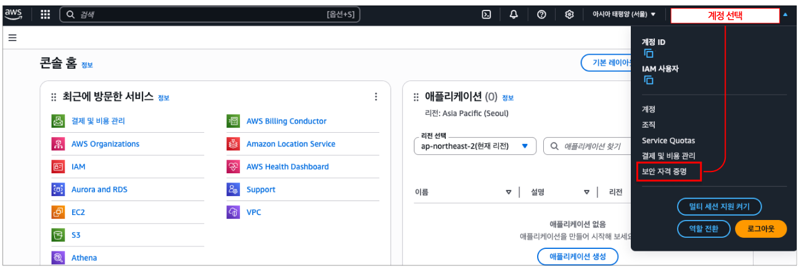

### 2) MFA 디바이스 할당

본문 내용 중 **멀티 팩터 인증(MFA)** 섹션의 [MFA 디바이스 할당] 메뉴를 선택한다.


### 3) MFA 디바이스 옵션 선택

MFA 디바이스는 3가지 옵션이 있다: 패스키 또는 보안 키, 인증 관리자 앱, 하드웨어 TOTP 토큰. 여기서는 가장 널리 쓰이는 모바일/컴퓨터 앱 기반의 **인증 관리자 앱**으로 설정을 진행한다.

- **디바이스 이름**: 각 사용자는 MFA 디바이스를 최대 8개까지 할당할 수 있다. 디바이스를 구분하기 위해 식별 가능한 이름을 입력한다.
- **디바이스 옵션**: 모바일 MFA 앱을 사용하기 위해 [인증 관리자 앱]을 선택한 후 [다음] 버튼을 클릭한다.

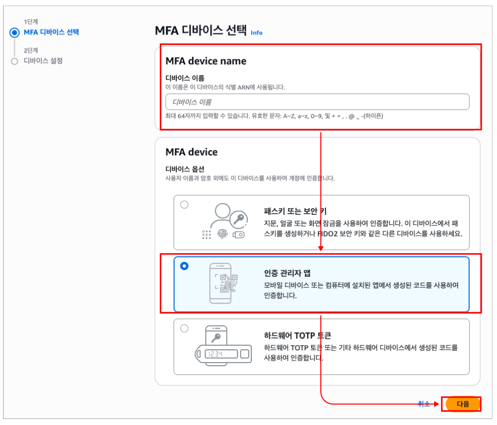

사용 중인 스마트폰 기기의 OS 유형에 따라 Google Play Store 또는 Apple App Store에서 Google OTP(Google Authenticator) 애플리케이션을 설치한다. 다른 OTP 애플리케이션도 사용 가능하다.

### 4) QR 코드 스캔 및 MFA 코드 입력

[QR 코드 표시]를 클릭한다.


Google OTP 애플리케이션의 [QR 코드 스캔] 메뉴로 PC 화면에 표시된 QR 코드를 스캔하면 MFA 코드가 생성된다. Google OTP 애플리케이션에 표시되는 연속된 MFA 코드 2개를 PC 화면의 MFA 코드 1, MFA 코드 2 입력란에 각각 입력한 후 하단의 [MFA 할당]을 클릭하면 설정이 완료된다.

- **MFA 코드 1**: 현재 확인되는 MFA 코드 6자리 입력
- **MFA 코드 2**: MFA 코드 1을 입력한 후 갱신되어 표시되는 새 MFA 코드 6자리 입력


### 5) 설정 완료 확인

설정 완료 후 AWS 콘솔 로그인 시, 기존 계정 정보로 1차 인증을 완료하면 아래와 같이 2차 인증(MFA 코드 입력) 과정이 추가되는 것을 확인할 수 있다.

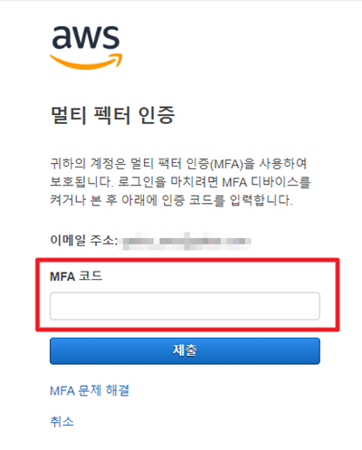

## 3. MFA 로그인을 강제할 정책 생성

MFA를 사용하여 로그인하는 경우에만 AWS 서비스에 접근할 수 있도록 아래 절차에 따라 정책을 설정한다.

1. AWS 콘솔에 관리자 자격 증명을 가진 계정으로 로그인한다.
2. IAM 콘솔(`https://console.aws.amazon.com/iam/`)을 연다.
3. 탐색 창에서 [정책]을 클릭한다.

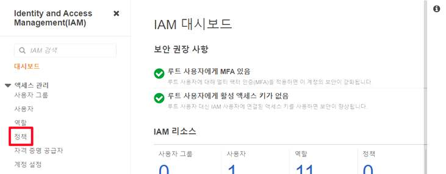

4. [정책 생성] 버튼을 클릭한다.


5. JSON 탭을 선택하고 텍스트 상자에 입력되어 있는 내용을 모두 삭제한다. 아래의 JSON 정책 텍스트를 복사하여 텍스트 상자에 붙여 넣고 [다음: 태그] 버튼을 클릭한다.


```json
{
  "Version": "2012-10-17",
  "Statement": [
    {
      "Sid": "AllowViewAccountInfo",
      "Effect": "Allow",
      "Action": [
        "iam:GetAccountPasswordPolicy",
        "iam:ListVirtualMFADevices"
      ],
      "Resource": "*"
    },
    {
      "Sid": "AllowManageOwnPasswords",
      "Effect": "Allow",
      "Action": [
        "iam:ChangePassword",
        "iam:GetUser"
      ],
      "Resource": "arn:aws:iam::*:user/${aws:username}"
    },
    {
      "Sid": "AllowManageOwnAccessKeys",
      "Effect": "Allow",
      "Action": [
        "iam:CreateAccessKey",
        "iam:DeleteAccessKey",
        "iam:ListAccessKeys",
        "iam:UpdateAccessKey"
      ],
      "Resource": "arn:aws:iam::*:user/${aws:username}"
    },
    {
      "Sid": "AllowManageOwnSigningCertificates",
      "Effect": "Allow",
      "Action": [
        "iam:DeleteSigningCertificate",
        "iam:ListSigningCertificates",
        "iam:UpdateSigningCertificate",
        "iam:UploadSigningCertificate"
      ],
      "Resource": "arn:aws:iam::*:user/${aws:username}"
    },
    {
      "Sid": "AllowManageOwnSSHPublicKeys",
      "Effect": "Allow",
      "Action": [
        "iam:DeleteSSHPublicKey",
        "iam:GetSSHPublicKey",
        "iam:ListSSHPublicKeys",
        "iam:UpdateSSHPublicKey",
        "iam:UploadSSHPublicKey"
      ],
      "Resource": "arn:aws:iam::*:user/${aws:username}"
    },
    {
      "Sid": "AllowManageOwnGitCredentials",
      "Effect": "Allow",
      "Action": [
        "iam:CreateServiceSpecificCredential",
        "iam:DeleteServiceSpecificCredential",
        "iam:ListServiceSpecificCredentials",
        "iam:ResetServiceSpecificCredential",
        "iam:UpdateServiceSpecificCredential"
      ],
      "Resource": "arn:aws:iam::*:user/${aws:username}"
    },
    {
      "Sid": "AllowManageOwnVirtualMFADevice",
      "Effect": "Allow",
      "Action": [
        "iam:CreateVirtualMFADevice",
        "iam:DeleteVirtualMFADevice"
      ],
      "Resource": "arn:aws:iam::*:mfa/${aws:username}"
    },
    {
      "Sid": "AllowManageOwnUserMFA",
      "Effect": "Allow",
      "Action": [
        "iam:DeactivateMFADevice",
        "iam:EnableMFADevice",
        "iam:ListMFADevices",
        "iam:ResyncMFADevice"
      ],
      "Resource": "arn:aws:iam::*:user/${aws:username}"
    },
    {
      "Sid": "DenyAllExceptListedIfNoMFA",
      "Effect": "Deny",
      "NotAction": [
        "iam:CreateVirtualMFADevice",
        "iam:EnableMFADevice",
        "iam:GetUser",
        "iam:ListMFADevices",
        "iam:ListVirtualMFADevices",
        "iam:ResyncMFADevice",
        "sts:GetSessionToken"
      ],
      "Resource": "*",
      "Condition": {
        "BoolIfExists": {
          "aws:MultiFactorAuthPresent": "false"
        }
      }
    }
  ]
}
```

이 정책은 두 가지 역할을 한다.

- 앞의 여러 `Allow` 구문: 사용자가 MFA 인증 여부와 무관하게 자신의 비밀번호·액세스 키·서명 인증서·SSH 키·Git 자격 증명·MFA 디바이스를 관리할 수 있도록 허용한다.
- 마지막 `DenyAllExceptListedIfNoMFA` 구문: `aws:MultiFactorAuthPresent`가 `false`인 경우(MFA로 인증하지 않은 경우), 위에서 허용한 항목을 제외한 **모든 서비스·리소스에 대한 접근을 거부**한다.

(선택 사항) 6. 태그 페이지에서 태그 키-값을 추가하고, 다음을 클릭한다.

7. 정책 검토 페이지에서 정책 이름에 `Force_MFA`을 입력한다. 정책 설명에 아래 문장을 입력한다.

```
This policy allows users to manage their own passwords and MFA devices but nothing else unless they authenticate with MFA.
```

정책 요약을 검토하여 정책이 부여한 권한을 확인한다. [정책 생성] 버튼을 선택하여 작업을 저장한다.

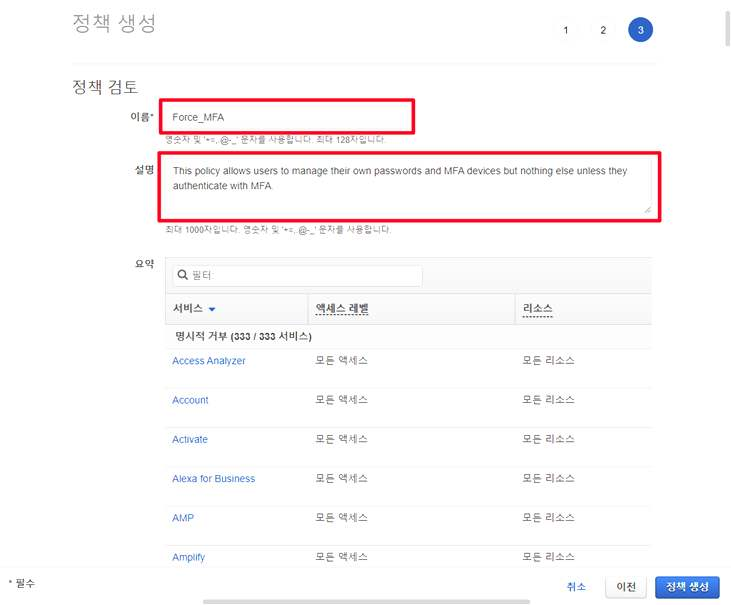

8. 새로운 정책이 관리형 정책 목록에 나타나며 연결 준비가 완료된다.


## 4. 사용자 그룹에 정책 연결

MFA 보호 권한을 부여하는 데 사용할 테스트 IAM 사용자 그룹에 두 개의 정책을 연결한다.

1. 탐색 창에서 [사용자 그룹]을 클릭한다.


2. [그룹 생성] 버튼을 클릭한다.

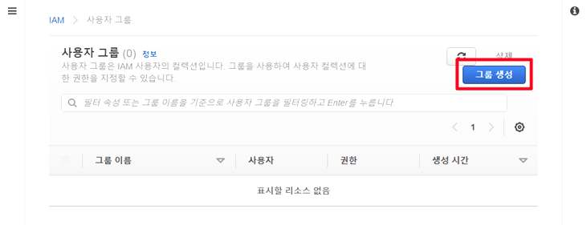

3. 사용자 그룹 생성 화면에서 그룹 이름 지정에 적절한 이름(예: `EC2MFA`)을 입력한다.

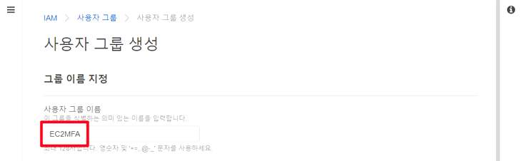

4. 권한 정책 연결 페이지의 검색 상자에 `EC2Full`을 입력한다. 목록에서 `AmazonEC2FullAccess`의 왼쪽에 있는 체크박스를 선택한다.


5. 검색 상자에 `Force`를 입력한 다음, 목록에서 `Force_MFA`의 왼쪽에 있는 체크박스를 선택한다.


6. [그룹 생성] 버튼을 클릭한다.

## 5. MFA 설정 정책을 적용한 IAM 사용자 생성

1. 탐색 창에서 [사용자]를 클릭한다.

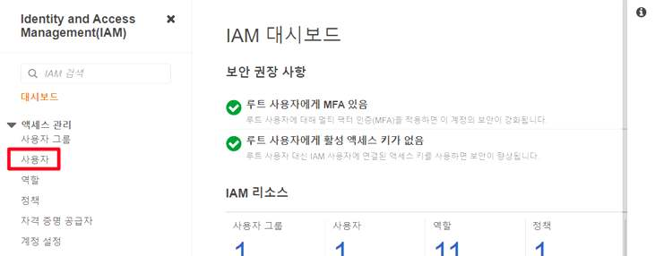

2. [사용자 추가] 버튼을 클릭한다.

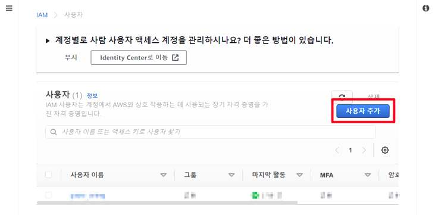

3. 적절한 사용자 이름과 액세스 유형을 선택한다.

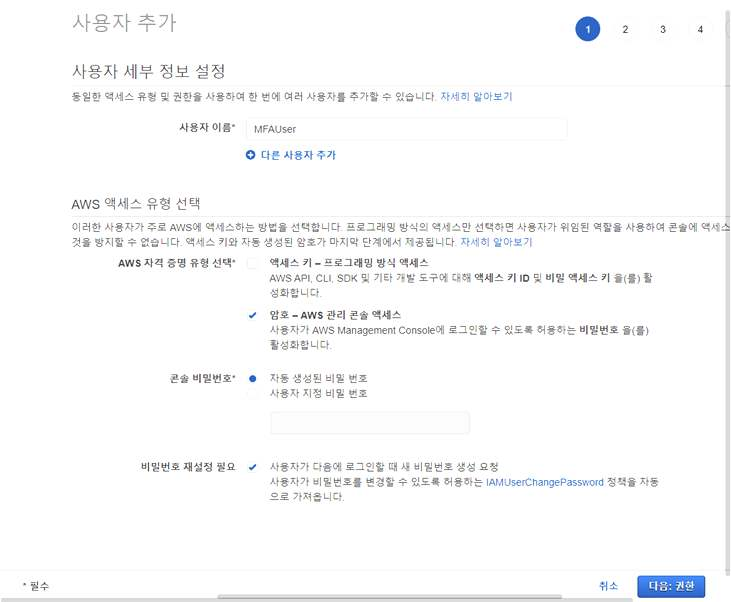

4. 권한 설정에서 [그룹에 사용자 추가] 아래의 목록을 확인한다. `EC2MFA` 왼쪽의 체크박스를 선택하고 [다음: 태그] 버튼을 클릭한다.

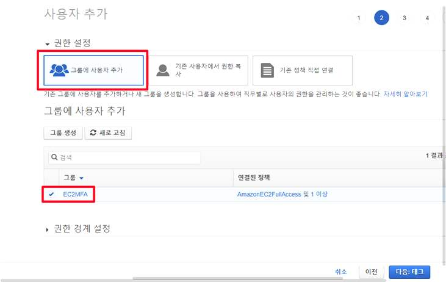

5. (선택 사항) 태그 추가 페이지에서 태그 키-값을 추가하고, 다음을 클릭한다.
6. 검토 페이지에서 입력했던 내용을 확인한 다음 [사용자 만들기]를 클릭한다.

이렇게 생성된 사용자는 `EC2MFA` 그룹에 속하며, `AmazonEC2FullAccess` 권한을 갖는 동시에 `Force_MFA` 정책에 의해 **MFA로 인증하지 않으면 자신의 자격 증명 관리 외의 어떤 작업도 수행할 수 없다.**
