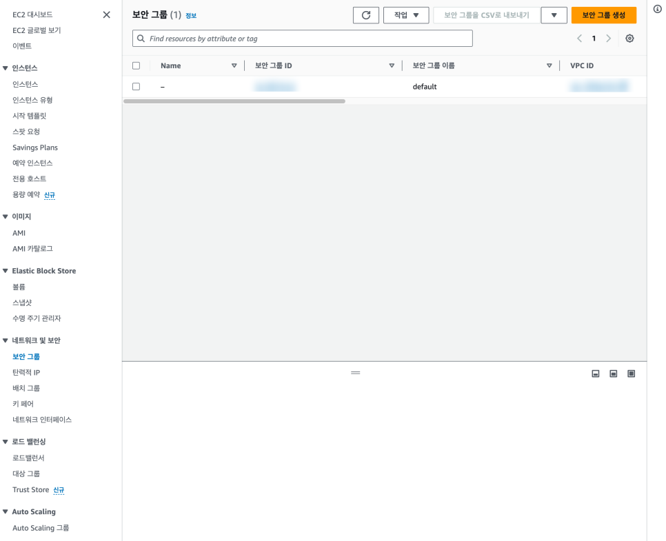
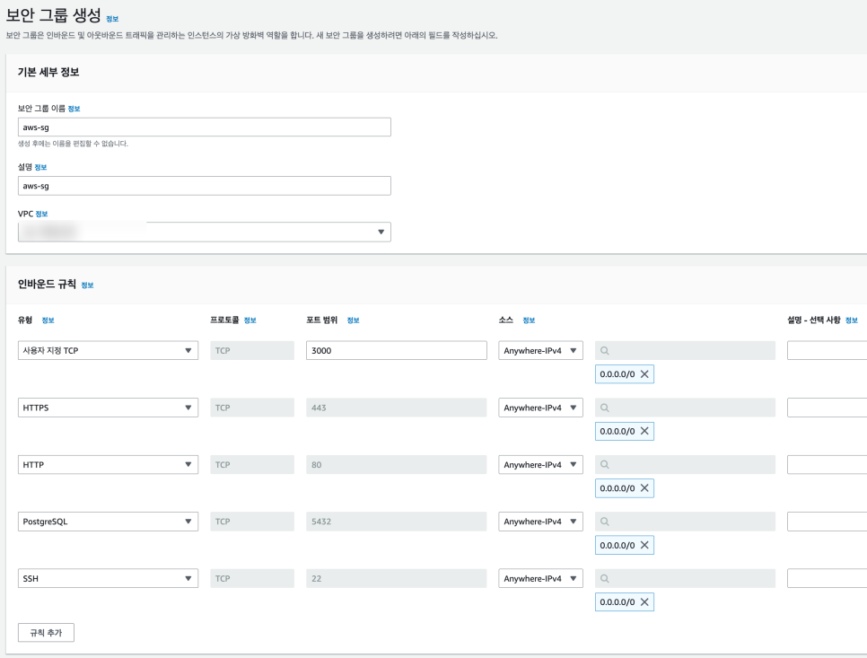
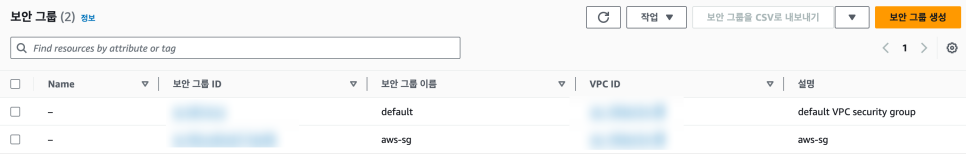
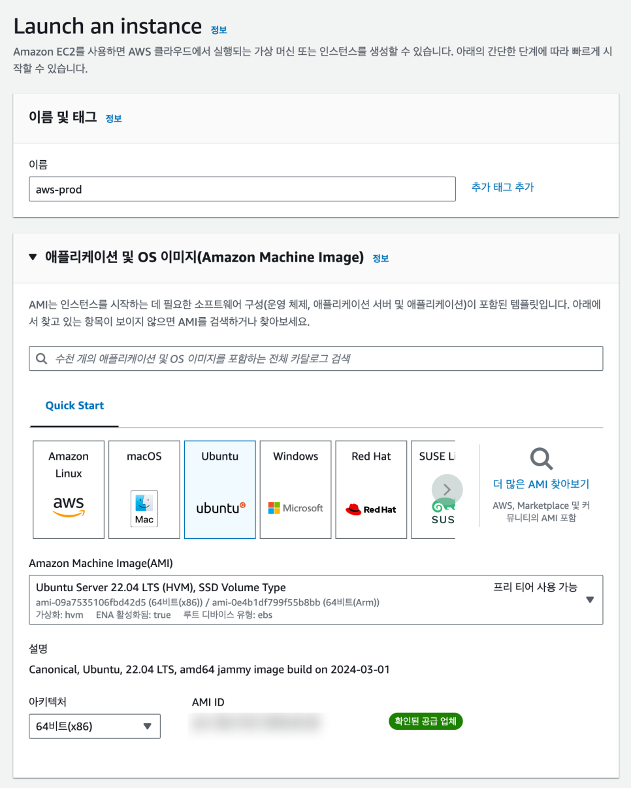
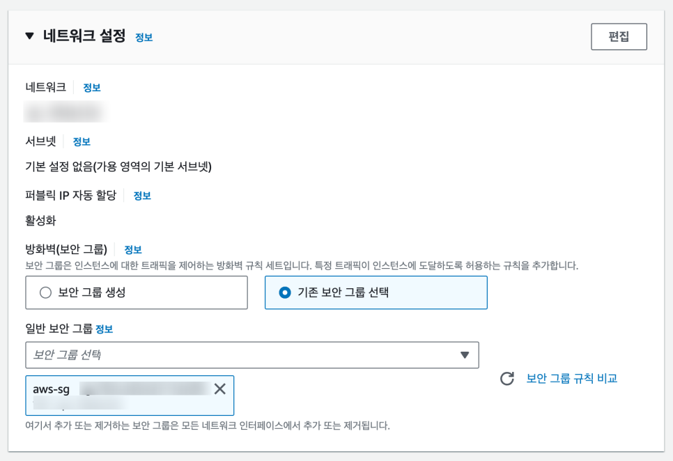
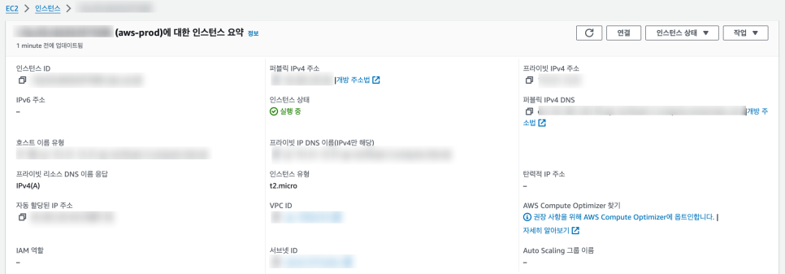
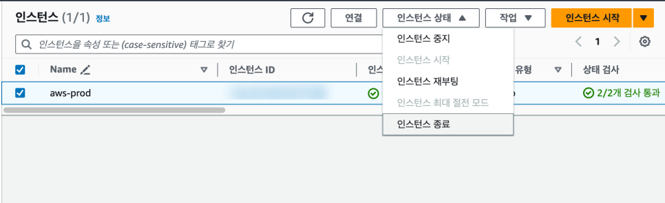

# AWS EC2 설정

## 1. EC2 소개

EC2는 Elastic Compute Cloud의 약자로, AWS에서 대여받은 컴퓨터를 원격으로 접속해 사용하는 서비스이다. EC2를 사용하면 24시간 동안 컴퓨터를 쉬지 않고 돌릴 수 있어 내가 만든 서비스를 다른 사용자가 언제든 접속하여 이용할 수 있게 된다. 이 외에도 EC2는 로드밸런서, 오토스케일링 등 다양한 기능을 제공한다. 보통 EC2는 서버를 배포할 때 주로 사용된다. 그러나 Next.js와 같은 서버 사이드로 동작하는 프론트엔드 프레임워크를 적용할 때도 활용된다.

> EC2의 인스턴스 유형·EBS·요금 모델 등 개념 전반은 [AWS-02-EC2-Deployment.md](AWS-02-EC2-Deployment) 참고. 이 문서는 실제 콘솔에서 보안 그룹을 만들고 인스턴스를 생성·종료하는 과정을 실습으로 다룬다.

## 2. 리전(Region)

리전은 지역별로 인프라를 배포한 각각의 데이터 센터를 의미한다. EC2로 빌릴 수 있는 컴퓨터는 다양한 위치에 분포되어 있으며, 이렇게 분포된 컴퓨터의 위치를 리전이라고 한다. 선택된 리전에 있는 컴퓨터와 서비스를 이용하려는 사용자의 위치가 멀수록 접속 속도가 느려진다. 그래서 서비스의 주 사용자와 가장 가까운 위치에 있는 리전을 선택하는 것이 좋다. 예를 들어 한국 사용자를 대상으로 하는 서비스라면 리전을 아시아 태평양(서울)로 선택한다.

리전은 AWS 로그인 후 오른쪽 상단의 메뉴에서 선택 가능하다.

## 3. 보안 그룹

보안 그룹은 AWS 클라우드의 네트워크 보안을 의미한다. EC2 인스턴스를 아파트로 비유하면, 보안 그룹은 아파트 차량 차단기 또는 경비실의 역할을 수행한다. 보안 그룹에서는 인바운드 규칙, 아웃바운드 규칙을 지정할 수 있다.

- **인바운드 규칙**: 외부에서 EC2 인스턴스에 접속하는 네트워크 트래픽을 제어한다.
- **아웃바운드 규칙**: EC2 인스턴스 내부에서 외부로 향하는 네트워크 트래픽을 제어한다.

EC2에 접속하여 왼쪽의 [보안 그룹]으로 이동한다. 이미 기본 보안 그룹은 생성되어 있는 상태이며, 새로운 보안 그룹을 만들어 본다. 오른쪽 상단의 [보안 그룹 생성] 버튼을 클릭한다.

보안 그룹 이름·설명은 자유롭게 작성하고, VPC는 기본값으로 세팅한다. 인바운드 규칙은 다음과 같이 작성한다.

- **사용자 지정 TCP 3000**: 3000번 포트로 접근을 허용한다.
- **HTTPS 443**: HTTPS 접속 기본 포트인 443 포트 접속을 허용한다.
- **HTTP 80**: HTTP 접속 기본 포트인 80 포트 접속을 허용한다.
- **PostgreSQL 5432**: PostgreSQL 접속을 위한 5432번 포트를 허용한다 (추후 DB를 설정할 때 사용된다).
- **SSH 22**: 서버 SSH 접속을 위한 22번 포트를 허용한다. 보안을 위해서는 Anywhere보다 작업할 사무실·집 등의 IP만 허용하는 것을 추천하지만, 여기서는 Anywhere로 설정한다.

보안 그룹의 규칙은 언제든 자유롭게 편집이 가능하다. 아웃바운드 규칙은 작성할 필요가 없다. 바로 보안 그룹을 생성하면 목록에 추가된 보안 그룹을 확인할 수 있다.

보안 그룹의 규칙을 지정할 때는 **IP**와 **Port**를 설정할 수 있다.

## 4. IP와 Port

### 1) IP

IP(Internet Protocol)는 컴퓨터 네트워크에서 장치 간에 데이터를 교환하는 데 사용되는 주소 체계이다. IP 주소는 네트워크 상의 각 기기를 식별하는 고유한 숫자이다. IPv4와 IPv6가 널리 사용되며, 각 IP 버전은 고유한 형식을 가지고 있다.

- **IPv4 (Internet Protocol version 4)**: 32비트로 구성되며, 일반적으로 `x.x.x.x` 형식으로 표현된다. 여기서 각 `x`는 0부터 255까지의 숫자이다 (예: `192.168.0.1`). IPv4 주소는 고갈되고 있어서 IPv6로의 전환 과정이 진행 중이다.
- **IPv6 (Internet Protocol version 6)**: 128비트로 구성되며, 주로 16진수로 표시된다 (예: `2001:0db8:85a3:0000:0000:8a2e:0370:7334`). IPv6는 주소 공간의 부족 문제를 해결하기 위해 도입되었으며, 더 많은 고유 주소를 제공한다.

### 2) Port

포트는 네트워크 통신에서 서비스를 식별하는 데 사용되는 숫자이다. 컴퓨터에서 실행되는 각 프로그램은 고유한 포트 번호에 바인딩될 수 있다. 예를 들어, 웹 서버는 일반적으로 TCP 포트 80에서 HTTP 요청을 수신하고 응답한다. 다음은 잘 알려진 포트와 해당 서비스 예시이다.

| 포트 | 서비스 | 설명 |
|---|---|---|
| 80 | HTTP | 웹 서버와 클라이언트 간의 HTTP(Hypertext Transfer Protocol) 통신에 사용. 웹 브라우징과 관련된 웹 페이지 요청 및 응답에 사용 |
| 443 | HTTPS | 보안된 HTTP 통신인 HTTPS(Hypertext Transfer Protocol Secure)에 사용. SSL 또는 TLS 프로토콜을 사용하여 암호화된 웹 통신을 제공 |
| 22 | SSH | 안전한 셸(SSH, Secure Shell) 통신에 사용. 원격으로 컴퓨터를 제어하고 데이터를 전송하기 위해 사용 |
| 5432 | PostgreSQL | PostgreSQL 데이터베이스 서버에 대한 표준 포트. PostgreSQL 데이터베이스에 대한 연결을 관리 |

정리하면 **IP는 네트워크 상의 기기를 식별하는 데 사용되는 주소**이고, **포트는 네트워크 서비스를 식별하는 데 사용되는 번호**이다.

## 5. EC2 세팅하기

지금 EC2에서 컴퓨터를 대여받아 본다. 여기서 말하는 컴퓨터가 AWS에서 제공하는 인스턴스라고 이해하면 된다. 왼쪽의 [인스턴스] 메뉴로 이동한다. 오른쪽 상단의 [인스턴스 시작]을 클릭한다.

대여받은 컴퓨터의 OS, 성능, 저장 용량 등을 설정한다. 이름 및 태그에서는 사용할 컴퓨터의 이름을 입력한다(`aws-prod`). 애플리케이션 및 OS 이미지는 **Ubuntu**를 선택한다. 머신 이미지는 무료 버전인 **프리 티어**를 선택한다.

**인스턴스 유형**은 일종의 하드웨어 성능이라고 보면 된다. 프리 티어에서 사용 가능한 `t2.micro`를 선택한다. 인스턴스 유형은 언제든 자유롭게 변경 가능하다.

**키 페어**는 EC2 컴퓨터에 접근할 때 사용되는 열쇠라고 생각하면 된다. 키 페어를 생성하면 파일을 다운로드받게 된다. 나중에 EC2에 접속할 때 사용되는 열쇠이니 절대 잊어버리지 않게 잘 보관해야 한다.

네트워크 설정에서는 앞에서 생성한 기존 보안 그룹(`aws-sg`)을 선택한다.

스토리지 구성에서는 컴퓨터의 저장 공간을 설정한다. 이 저장 공간을 보통 **EBS(Elastic Block Storage)**라고 얘기한다. EBS는 컴퓨터의 하드 디스크라고 생각하면 된다. EBS와 같은 저장 공간을 포괄적인 용어로 스토리지 또는 볼륨이라고 부른다. 용량은 `30GiB`로 입력한다. 참고로 스토리지는 30GiB까지 무료로 이용 가능하다.

이제 [인스턴스 시작]을 클릭하여 인스턴스를 생성하면 나만의 클라우드 컴퓨터가 생성된다.

## 6. 인스턴스 세부 내용

생성된 인스턴스에서 인스턴스 ID를 선택하면 세부 내용을 확인할 수 있다. 입문 단계에서는 퍼블릭 IPv4 주소와 인스턴스 상태만 파악하면 된다.

- **퍼블릭 IPv4 주소**: EC2 인스턴스가 생성되면서 부여받은 IP 주소이다. 해당 인스턴스에 접근하려면 이 IP 주소를 입력하면 된다.
- **인스턴스 상태**: 인스턴스의 실행 상태를 말한다.

아래 **보안** 탭에서는 해당 인스턴스의 보안 그룹과 인바운드/아웃바운드 규칙이 표기되어 있다.

**스토리지** 탭에서는 볼륨 크기를 확인할 수 있다.

## 7. 인스턴스 종료

생성된 인스턴스를 삭제하려면 [인스턴스 상태] 메뉴에서 [인스턴스 종료]를 선택한다.

종료 확인 대화상자가 뜬다. EBS가 지원하는 인스턴스의 경우, 인스턴스가 종료될 때 기본적으로 루트 EBS 볼륨이 삭제되며 로컬 드라이브의 스토리지는 모두 손실된다. 인스턴스 종료는 실행 취소할 수 없다.

시간이 지나면 인스턴스 상태가 "종료됨"으로 변경된다. 그럼 인스턴스 삭제가 완료된 상황이며, 시간이 지나면 목록에서 제거된다.

