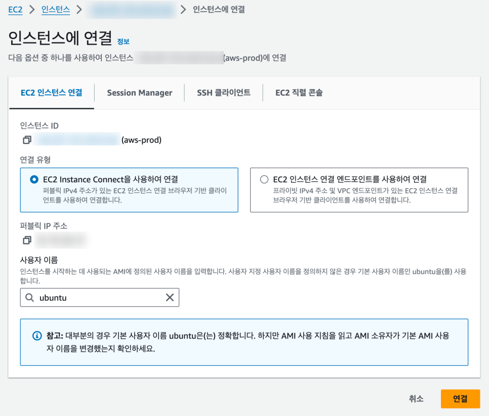
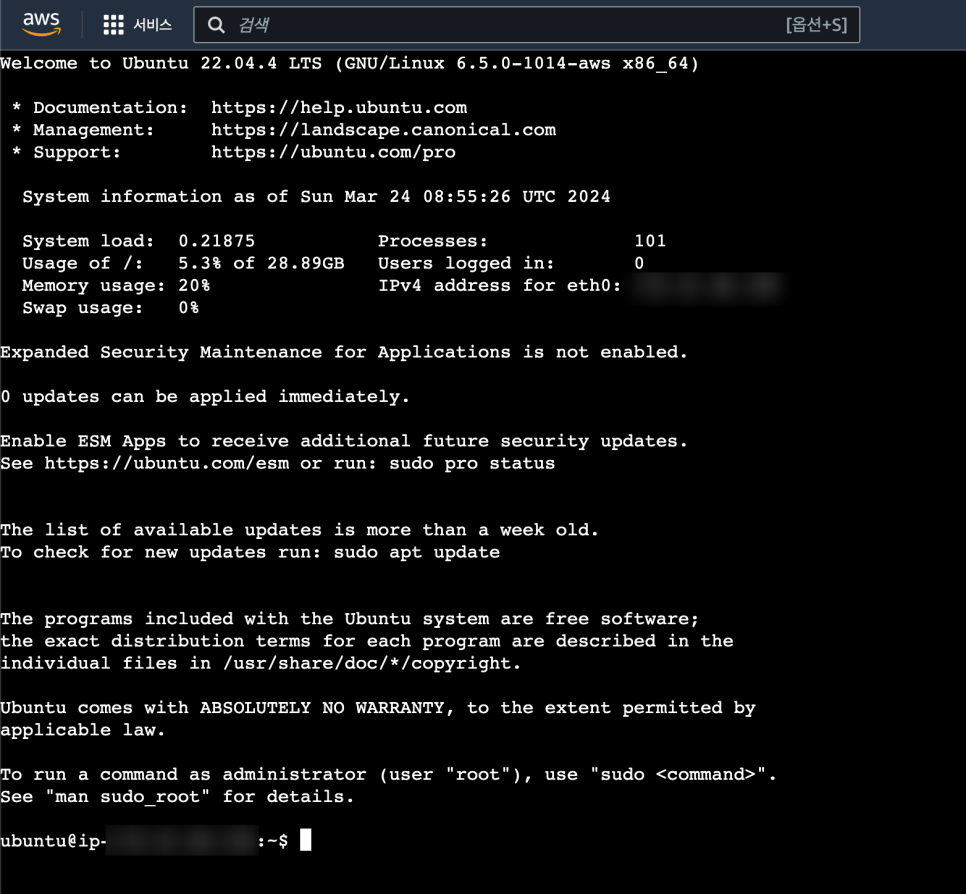
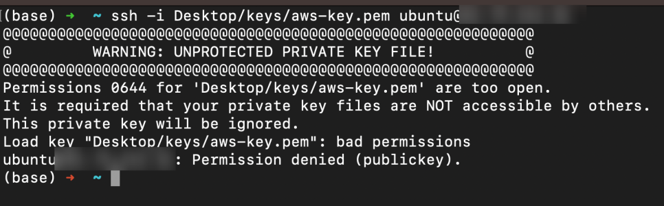

# EC2 인스턴스 접속하기

## 1. 개요

우리가 대여받은 컴퓨터(인스턴스)에 접속하는 방법은 크게 두 가지가 있다.

1. **AWS 콘솔에서 접속**: 브라우저 기반 클라이언트로 별도 프로그램 설치 없이 바로 접속
2. **터미널에서 SSH로 접속**: 키 페어(.pem)를 사용하여 로컬 터미널에서 SSH로 접속

> SSH 연결 방식·키 페어 개념·EC2 인스턴스 연결·EC2 직렬 콘솔의 차이는 [AWS-02-EC2-Deployment.md](AWS-02-EC2-Deployment)의 [8. EC2 접속 방법](AWS-02-EC2-Deployment#8-ec2-접속-방법) 섹션 참고. 이 문서에서는 실제 콘솔·터미널에서 접속하는 과정을 실습으로 다룬다.

## 2. AWS 콘솔에서 접속하기

먼저 AWS 콘솔 내에서 접속하는 방법을 알아본다. 생성한 인스턴스 상세 페이지에서 오른쪽 상단의 [연결] 버튼을 클릭한다.

**인스턴스에 연결** 화면에서 EC2 인스턴스 연결의 값은 기본값(연결 유형: EC2 Instance Connect, 사용자 이름: `ubuntu`)으로 둔 채로 하단의 [연결] 버튼을 클릭한다.



그럼 EC2 인스턴스에 브라우저 기반 터미널로 바로 접속하게 된다. 여기에서는 리눅스 명령어를 사용하여 내부 폴더를 살펴보거나 새로운 폴더를 생성할 수 있다. 외부 패키지를 설치하면 깃에 올려둔 파일을 다운로드받아 EC2 내에서 설치할 수도 있다.



## 3. 터미널에서 SSH로 접속하기

이번에는 이전에 생성한 키 페어를 사용하여 로컬 터미널에서 EC2 인스턴스에 접속하는 방법을 알아본다. `ssh` 명령어를 사용하여 키 페어 파일 경로와 함께, `x.xx.xxx.xx` 자리에는 EC2 인스턴스의 퍼블릭 IP 주소를 입력한다.

```bash
ssh -i [pem 파일 경로]/aws-prod.pem ubuntu@x.xx.xxx.xx
```

이대로 실행하면 해당 키 페어로는 접근이 안 된다는 경고가 나온다 (`UNPROTECTED PRIVATE KEY FILE`).



`chmod` 명령어를 사용하여 키 페어의 권한을 변경해야 한다. `700`은 읽기·쓰기·실행 모든 권한을 (소유자에게만) 부여한다.

```bash
chmod 700 [pem 파일 경로]/aws-prod.pem
ssh -i [pem 파일 경로]/aws-prod.pem ubuntu@x.xx.xxx.xx
```

그럼 터미널에서도 EC2 인스턴스에 정상적으로 접속할 수 있게 된다.


