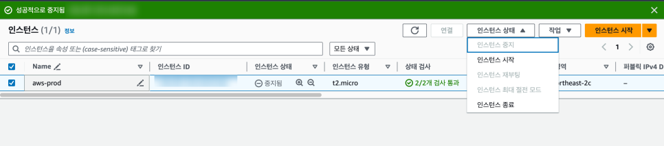
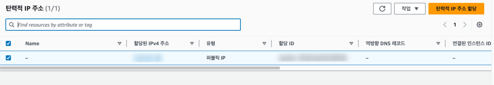
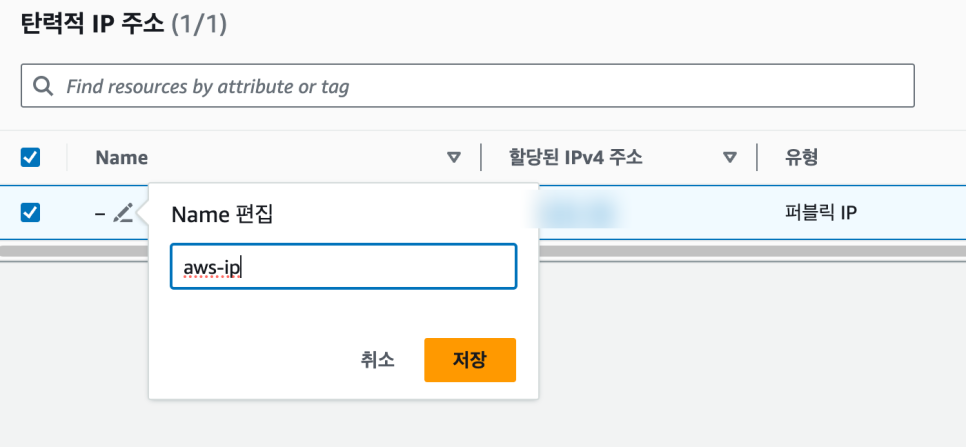
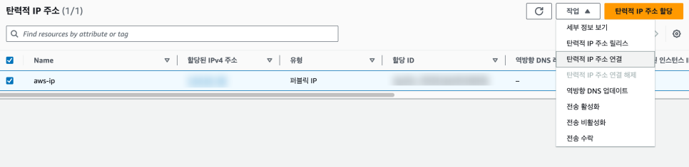
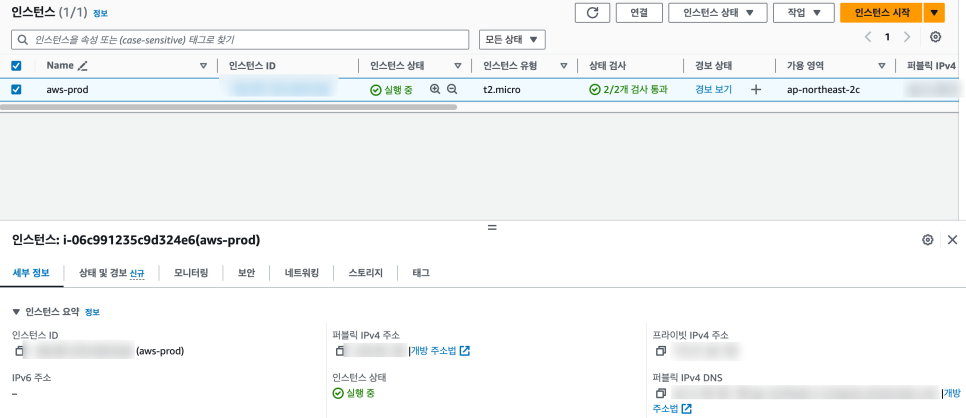

# AWS 탄력적 IP(Elastic IP) 적용하기

## 1. 탄력적 IP 소개

EC2 인스턴스를 생성하면 고유의 퍼블릭 IP를 할당받는다. 하지만 이렇게 할당받은 IP는 인스턴스를 중지하고 다시 실행시키면 다른 IP로 변경된다. 이는 사용 중인 서비스나 애플리케이션에 큰 영향을 준다.

**탄력적 IP(Elastic IP, EIP)**는 동적 클라우드 컴퓨팅 환경에서 사용할 수 있는 정적 IPv4 주소이다. 이 주소는 AWS 계정에 할당되며, 사용자가 명시적으로 해제하기 전까지 그 상태를 유지한다. 탄력적 IP를 사용하면 인스턴스의 장애 발생 시 다른 인스턴스로 IP 주소를 신속하게 재매핑하여 높은 가용성을 유지할 수 있다.

## 2. 실습: 탄력적 IP 적용

### 2.1 퍼블릭 IP가 인스턴스 재시작 시 바뀌는 것을 확인

인스턴스를 선택하여 퍼블릭 IP 주소를 확인한다. 오른쪽 상단의 [인스턴스 상태]에서 [인스턴스 중지]를 선택한다.

중지된 인스턴스를 다시 시작하면 퍼블릭 IP 주소가 변경된 것을 볼 수 있다. 이제 탄력적 IP를 사용하여 해당 인스턴스의 IP 주소를 고정한다.

### 2.2 탄력적 IP 할당

탄력적 IP 페이지로 이동하여 [탄력적 IP 주소 할당] 버튼을 클릭한다. 기본 설정은 그대로 두고 [할당]을 클릭하면 IP 주소를 할당받게 된다.

생성한 탄력적 IP의 이름을 변경한다 (예: `aws-ip`).

### 2.3 EC2 인스턴스와 탄력적 IP 연결

오른쪽 상단의 [작업]에서 [탄력적 IP 주소 연결]을 선택한다.

인스턴스에서 EC2에 생성한 인스턴스를 선택하고, 오른쪽 하단의 [연결]을 클릭하면 연결이 완료된다.

### 2.4 결과 확인

EC2 인스턴스로 이동하면 탄력적 IP에서 할당받은 주소로 퍼블릭 IP 주소가 변경된 것을 볼 수 있다. 이제 인스턴스를 중지하고 다시 시작해도 퍼블릭 IP 주소는 고정된다.

