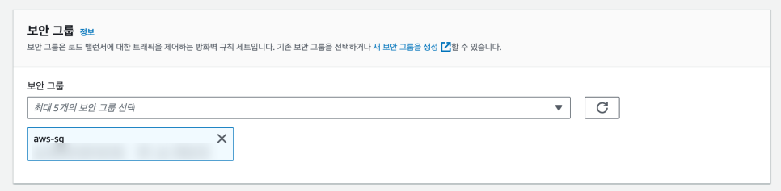
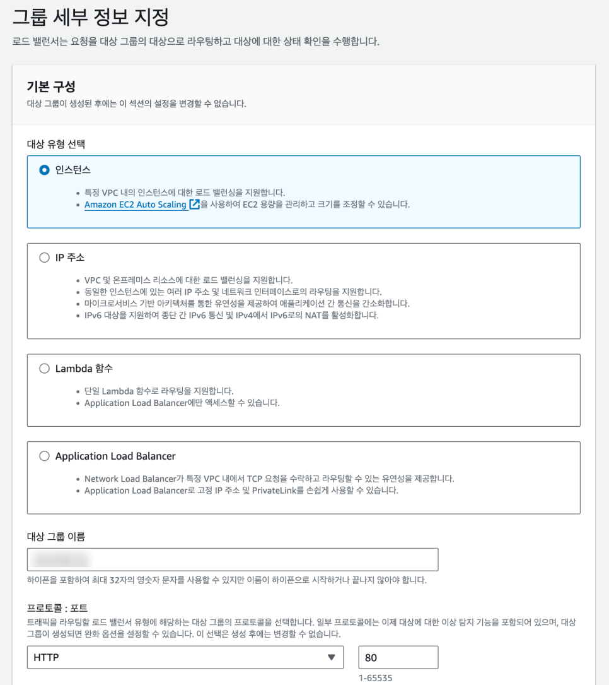
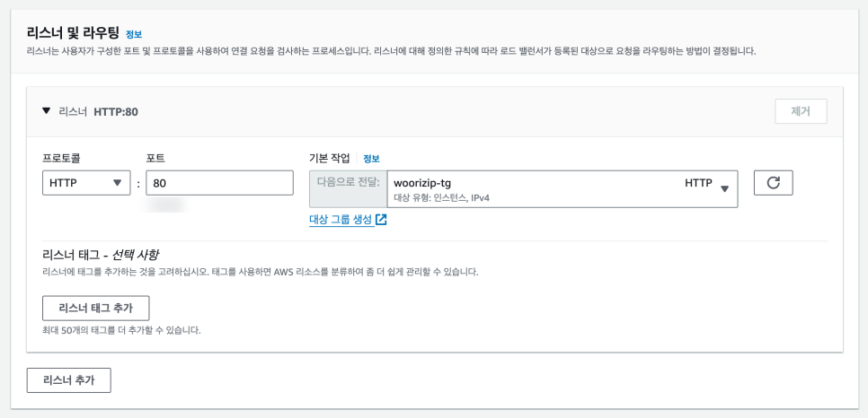
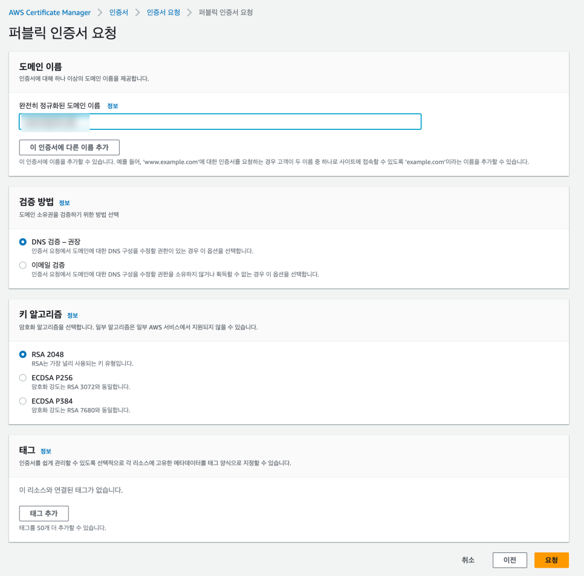
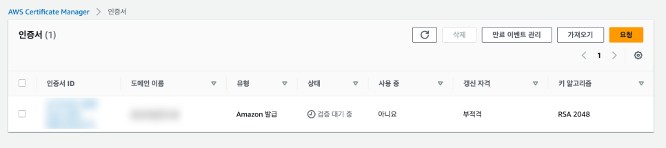
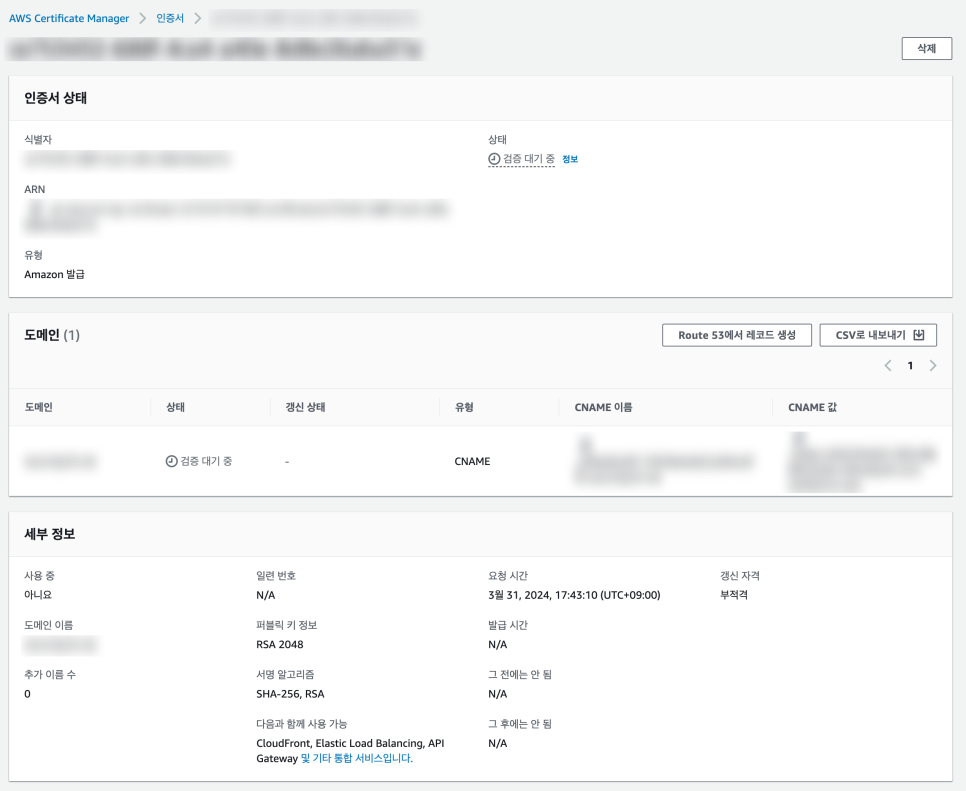
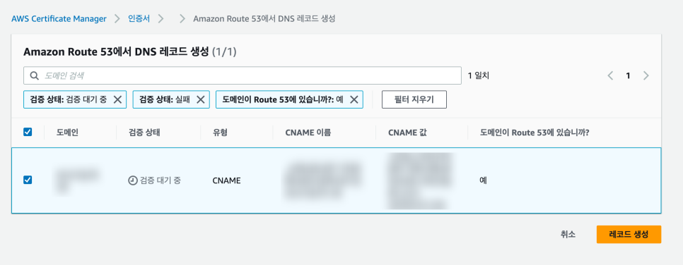
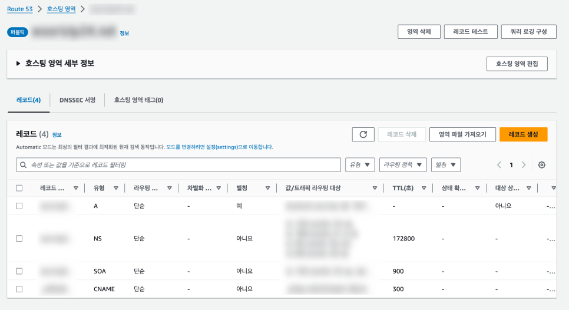
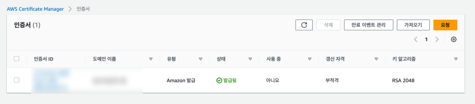

# AWS 로드 밸런서(ALB) 적용 및 HTTPS 설정

## 1. ELB (Elastic Load Balancer) 소개

ELB는 인터넷 트래픽(부하)를 여러 대의 서버(일반적으로 EC2 인스턴스)에 분산시켜 처리한다. ELB의 주요 목적은 애플리케이션의 가용성과 내구성을 높이는 것이다. ELB는 요청을 여러 서버에 분산함으로써 단일 서버에 발생할 수 있는 과부하를 방지하고, 서버 중 하나가 실패하더라도 자동으로 트래픽을 건강한 서버로 리디렉션하여 서비스 중단 시간을 최소화한다.

**AWS ELB의 세 가지 유형**

- **Application Load Balancer (ALB)**: HTTP와 HTTPS 트래픽에 최적화되어 있으며, 고급 라우팅 기능(경로 기반 라우팅, 호스트 기반 라우팅 등)을 제공한다. 애플리케이션의 특정 URL 또는 호스트 이름에 따라 트래픽을 다른 타겟 그룹으로 라우팅할 수 있다.
- **Network Load Balancer (NLB)**: TCP, UDP, TLS 트래픽에 최적화되어 있으며, 초고성능과 정적 IP 주소 할당을 필요로 하는 애플리케이션에 적합하다. 밀리초 단위의 지연 시간과 매우 높은 처리량을 제공한다.
- **Classic Load Balancer (CLB)**: 초기 ELB 서비스로, 단순한 로드 밸런싱 기능을 제공한다. 애플리케이션 계층과 네트워크 계층 모두에서 로드 밸런싱을 지원하지만, AWS는 새 애플리케이션에는 ALB나 NLB 사용을 권장한다.

이 문서에서는 ELB의 부가 기능 중 하나인 **HTTPS를 적용시키는 방법**을 실습 중심으로 다룬다.

## 2. SSL/TLS 소개

SSL(보안 소켓 계층)과 TLS(전송 계층 보안)는 인터넷 상에서 데이터를 안전하게 전송하기 위해 사용되는 암호화 프로토콜이다. 이들은 데이터의 기밀성과 무결성을 보장하며, 클라이언트와 서버 간의 통신을 암호화하여 제3자가 데이터를 도청하거나 변경하는 것을 방지한다. TLS는 SSL의 후속 버전으로 간주되며, 현재는 SSL보다는 TLS가 더 널리 사용되고 권장된다. SSL/TLS를 쉽게 표현하면 **HTTP를 HTTPS로 바꿔주는 인증서**로 보면 된다.

## 3. 사전 상황

도메인 주소에 HTTPS 없이 접속하면 "보안 연결이 사용되지 않은 사이트"로 표기된다. 이는 사용자에게 안전하지 않은 사이트라는 인식을 줄 수 있어, HTTPS 적용은 보안뿐 아니라 사용자 유입에도 영향을 미친다.

HTTPS 인증을 받은 웹 사이트가 백엔드와 API 통신을 하려면 백엔드 서버 또한 HTTPS 인증을 받아야 한다.

- 웹 서비스: `https://xxxxxx.net`
- API 주소: `https://api.xxxxx.net`

로드 밸런서를 사용하기 전에는 Route 53에 EC2 IP 주소를 직접 연결했다. 하지만 ELB를 연결하면 EC2 IP 주소가 아닌 **ELB로 경로를 변경**해야 한다.

## 4. 로드 밸런서 생성

### 4.1 로드 밸런서 생성 시작

EC2 콘솔의 [로드밸런서] 메뉴 → 오른쪽 상단의 [로드 밸런서 생성] 클릭 (리전이 서울로 설정되어 있는지 확인). 로드 밸런서 유형은 **Application Load Balancer**를 선택한다.

기본 구성에서 로드 밸런서 이름을 자유롭게 작성한다.


### 4.2 네트워크 매핑

네트워크 매핑은 사용할 VPC와 가용 영역(AZ)별 서브넷을 선택하는 단계이다. 고가용성을 위해 전부 체크한다.


### 4.3 보안 그룹

보안 그룹에서는 이전에 생성한 보안 그룹을 선택한다.



### 4.4 리스너 및 라우팅 - 대상 그룹 생성

리스너 및 라우팅은 ELB로 들어온 요청을 어떤 EC2에 전달할지 지정하는 항목이다. EC2 연결을 위해 [대상 그룹 생성]을 클릭한다.

**대상 그룹 세부 정보**: 고객이 로드 밸런서에 접속 시 EC2의 특정 인스턴스에 전달해야 하므로 대상 유형은 **인스턴스**로 지정한다. 대상 그룹 이름은 자유롭게 작성하고, 프로토콜:포트는 `HTTP : 80`으로 둔다.



나머지 IP 주소 유형·프로토콜 버전 등은 기본값(IPv4, HTTP1)으로 둔다. 이 항목들은 ELB가 사용자로부터 트래픽을 받아 대상 그룹에게 어떤 방식으로 전달할지 설정하는 부분이다.


### 4.5 상태 검사(Health Check)와 헬스 체크 API

ELB의 부가 기능으로 **상태 검사(Health Check)**가 있다. 특정 인스턴스의 서버가 예상치 못한 오류가 발생했을 때, ELB 입장에서는 해당 서버에 요청(트래픽)을 보내는 것이 비효율적이다. 이러한 상황을 방지하기 위해 ELB는 주기적으로 대상 그룹에 속해 있는 인스턴스에게 요청을 보낸다. 그 요청 상태가 200으로 전달되면 서버에 문제가 없다고 판단하며, 응답이 오지 않는다면 ELB는 해당 인스턴스에 요청을 보내지 않는다.

인스턴스에 상태 검사용 `/health` API가 필요하다. [EC2 배포](t02-ec2-deployment.md)의 [23. 실습: 웹 서버 배포 · 메타데이터 조회 · IAM 자격증명](t02-ec2-deployment.md#23-실습-웹-서버-배포-메타데이터-조회-iam-자격증명)에서 사용한 **`demo-aws-credential`** Node.js 프로젝트를 그대로 확장해서 순수 Node.js(`http` 모듈)로 헬스 체크 API를 추가한다.

```js
// demo-aws-credential/src/health.js
const http = require("http");

const server = http.createServer((req, res) => {
    if (req.url === "/health") {
        res.writeHead(200, { "Content-Type": "application/json" });
        res.end(JSON.stringify({ status: "ok" }));
        return;
    }
    res.writeHead(404);
    res.end();
});

server.listen(3000, () => console.log("Health check server running on port 3000"));
```

EC2 인스턴스에 코드를 배포한 후, 빌드 없이 바로 pm2로 데몬 실행/재시작한다.

```bash
pm2 start src/health.js --name demo-aws-credential
# 코드 수정 후 재시작
pm2 reload demo-aws-credential
```

브라우저 또는 `curl http://<EC2_PUBLIC_IP>:3000/health`로 호출하면 `{"status":"ok"}` 응답이 오는 것을 확인할 수 있다. 대상 그룹의 상태 검사 경로를 `/health`, 포트를 `3000`으로 지정하면 이 엔드포인트를 통해 ELB가 인스턴스 상태를 주기적으로 확인한다.

### 4.6 대상 등록

생성된 EC2를 선택하고 [아래에 보류 중인 것으로 포함]을 클릭한다. 그럼 대상 보기에 해당 인스턴스가 추가되며, [대상 그룹 생성]을 선택하여 완료한다.


### 4.7 로드 밸런서 생성 완료

다시 리스너 및 라우팅에서 새로 고침을 한 다음 앞에서 만든 대상 그룹을 선택한다.



[로드 밸런서 생성]을 클릭하면 목록에 로드 밸런서가 추가된다. 현재 상태는 "프로비저닝 중"으로 나오는데, 이는 생성 중이라는 의미이다.


로드 밸런서 상태가 활성으로 변경되었다면 상세 페이지로 이동한다. 여기에서 DNS 이름을 확인할 수 있는데, 해당 주소로도 사이트에 접속할 수 있다.


DNS 이름으로 접속해 정상 응답이 오면, ELB와 EC2 인스턴스가 정상적으로 연결되었다는 의미이다.


## 5. ELB에 도메인 연결

Route 53에 ELB의 DNS를 연결한다. 이전에 생성한 레코드를 편집하여 다음과 같이 수정한다.

- 레코드 유형: `A`
- 트래픽 라우팅 대상: `Application/Classic Load Balancer`, 아시아 태평양, 생성된 ELB 선택


이제 도메인 주소에 접속하면 이전과 동일한 결과가 출력되는 것을 확인할 수 있다.


## 6. HTTPS 적용하기

AWS에서 [Certificate Manager] 페이지로 이동하여 [인증서 요청]을 클릭한다. 퍼블릭 인증서 요청을 선택하고 [다음]을 클릭한다. 구입한 도메인 이름을 입력하고, 나머지 항목은 기본값(DNS 검증, RSA 2048)으로 두고 [요청]을 클릭한다.



요청 직후에는 "검증 대기 중" 상태로 표시된다.



인증서 상세에 들어가서 CNAME을 확인하고 [Route 53에서 레코드 생성]을 클릭한다.



[레코드 생성]을 클릭한다.



Route 53에 접속하면 CNAME 레코드가 추가된 것을 볼 수 있다.



다시 Certificate Manager 페이지로 이동해서 일정 시간이 지나면 인증서 상태가 "발급됨"으로 변경된다.



## 7. ALB에 HTTPS 리스너 등록

생성한 로드 밸런서의 상세 페이지로 이동해서 리스너 및 규칙 항목에 있는 [리스너 추가]를 클릭한다.


프로토콜은 `HTTPS`로 변경하고, 앞에서 생성한 대상 그룹을 선택한다. 보안 리스너 설정에서도 앞에서 발급받은 인증서를 선택하고 [추가]를 클릭한다.


이제 도메인에 `https://`를 붙여서 접속하면 경고 문구가 사라지고 "이 연결은 안전합니다"로 표시된다.


## 8. HTTP 접속시 HTTPS로 전환

현재는 HTTP, HTTPS 양쪽 모두로 접속이 가능한 상태이다. HTTP로 접속했을 때 HTTPS로 리다이렉팅 되도록 변경한다.

생성한 로드 밸런서 상세 페이지로 이동해서 리스너 및 규칙에서 `HTTP:80`을 삭제하고 [리스너 추가]를 클릭한다.


리스너 세부 정보에서 프로토콜 `HTTP : 80`으로 URL 리디렉션을 설정하여 HTTPS로 전달하도록 지정하고 [추가]를 클릭하면 리디렉션 대상 항목이 추가된다.


- `HTTPS:443` → 대상 그룹으로 전달
- `HTTP:80` → 리디렉션 대상 `HTTPS://#{host}:443/#{path}?#{query}`, 상태 코드 `HTTP_301`

이제 브라우저에서 HTTP로 도메인에 접속하면 자동으로 HTTPS로 변경되는 것을 확인할 수 있다.
