# AWS 3-Tier 워드프레스 클러스터 구성하기

## 1. 개요

**워드프레스(WordPress)**는 블로그·쇼핑몰·회사 홈페이지처럼 글이 계속 바뀌고 회원·댓글이 있는 사이트를 HTML/CSS/JavaScript/PHP/데이터베이스 지식 없이도 화면에서 버튼을 눌러 운영할 수 있게 해주는 대표적인 콘텐츠 관리 시스템(CMS)이다.

이 문서는 [ALB · Auto Scaling](g06-load-balancer-autoscaling.md), [RDS](t05-rds.md), [EC2와 S3 연동](g07-ec2-s3.md)에서 다룬 서비스를 조합해, 고가용성을 갖춘 워드프레스 클러스터를 처음부터 끝까지 구성하는 실습을 다룬다.

## 2. 3-Tier Architecture란

애플리케이션을 3가지 계층으로 나누어 구성하는 방식이다. 역할이 명확해지고 확장·유지보수가 쉬워진다.

| 계층 | 역할 | AWS 구현 |
|---|---|---|
| **Presentation Tier** | 사용자가 보는 화면(UI). 사용자 입력을 Application Tier로 전달 | ALB (Application Load Balancer) |
| **Application Tier** | 실제 비즈니스 로직 처리(로그인 검증, 게시글 등록 등) | Web EC2 인스턴스 (Auto Scaling Group) |
| **Data Tier** | 데이터 저장·관리 | Amazon RDS |

즉 ALB가 사용자 요청을 받아 EC2에 전달하고, EC2는 로직을 처리하며 RDS와 데이터를 주고받는 구조다.

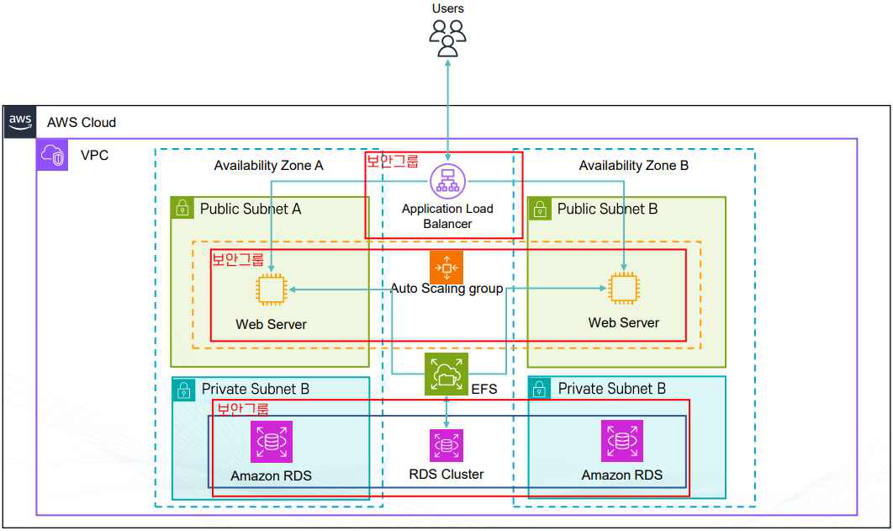

**이 실습 구성의 특징**

- **고가용성 확보**: ALB로 다수의 EC2에 트래픽 분산, Auto Scaling으로 부하에 따라 서버 수 자동 증감, Multi-AZ 배치로 AZ 장애에도 서비스 지속
- **EFS(Elastic File System) 공유 스토리지**: 여러 EC2 인스턴스가 동일한 워드프레스 파일(업로드 이미지, 플러그인 등)에 접근할 수 있도록 중앙 스토리지 역할을 하며, 웹 서버 간 데이터 일관성을 유지한다.

## 3. 구성 순서

1. IAM 역할 생성 (EC2가 S3에 접근할 수 있도록)
2. VPC 생성 (Public Subnet / Private Subnet, 2개 AZ)
3. RDS 서브넷 그룹 생성 후 데이터베이스 생성
4. EFS 생성 (소스코드·업로드 파일 공유 공간)
5. S3 버킷 생성 후 `wp-config.php` 업로드
6. EC2에 Apache·PHP 설치 후 워드프레스 설치 (User Data 자동화)
7. 설치 완료된 EC2를 AMI로 생성
8. 시작 템플릿(Launch Template) 작성 후 Auto Scaling Group·ALB 연결
9. ALB DNS 기준으로 워드프레스 사이트 주소 수정 (11장 참고)
10. 보안 그룹을 강화해 EC2 직접 접근 차단 (12장 참고)

## 4. 사전 준비: IAM 역할과 VPC

### IAM 역할 생성

EC2가 S3에서 `wp-config.php`를 가져올 수 있도록 역할을 먼저 만든다.

1. IAM → 역할 → [역할 생성]
2. **신뢰할 수 있는 엔터티 유형**: AWS 서비스, **사용 사례**: EC2
3. 권한 정책에서 `s3full` 검색 후 `AmazonS3FullAccess` 선택 (특정 버킷만 허용하려면 커스텀 정책으로 범위를 좁히는 것을 권장)
4. 역할 이름 지정 (예: `wordpress-ec2-role`)

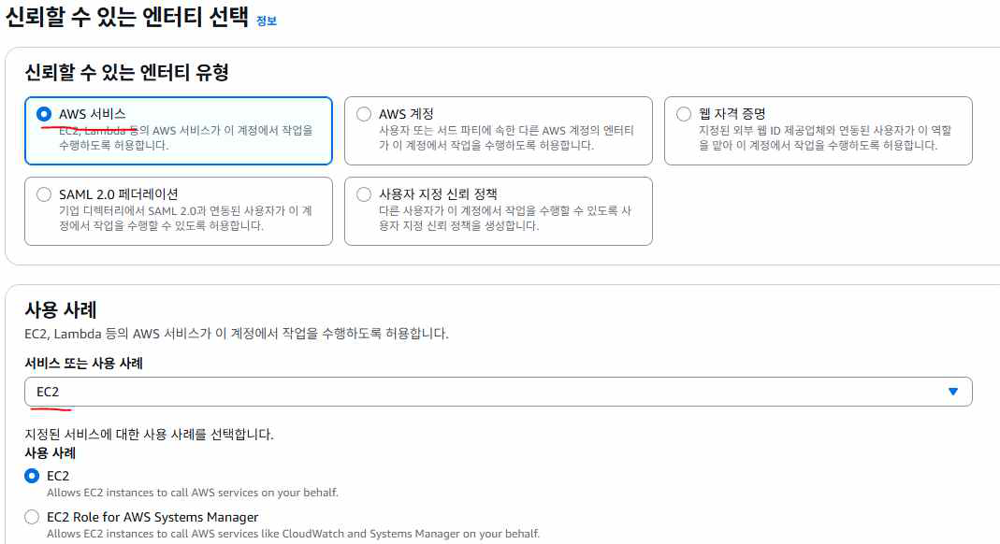

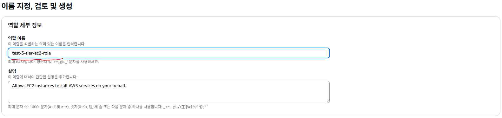

### VPC 생성

VPC 콘솔의 [VPC 생성] 마법사에서 **"VPC 등"**(VPC와 서브넷·라우팅을 한 번에 생성하는 옵션)을 선택한다.

- **가용 영역(AZ) 수**: 2
- **퍼블릭 서브넷 수**: 2, **프라이빗 서브넷 수**: 2
- **NAT 게이트웨이**: 없음 (이 실습에서는 EC2가 프라이빗 서브넷에 있지 않으므로 불필요)
- **IPv4 CIDR 블록**: `10.0.0.0/16`

생성이 끝나면 각 AZ에 퍼블릭 서브넷 1개, 프라이빗 서브넷 1개씩 총 4개의 서브넷이 만들어진다 — RDS는 이 중 **프라이빗 서브넷 2개**를 사용한다.

## 5. RDS 서브넷 그룹과 데이터베이스 생성

### DB 서브넷 그룹

RDS는 "이 서브넷 그룹 안에서만 만들어라"고 지정할 서브넷 묶음이 필요하다 — Multi-AZ 배치를 위해 최소 2개 이상의 서브넷을 지정해야 한다.

RDS 콘솔 → 서브넷 그룹 → [DB 서브넷 그룹 생성]

- **VPC**: 앞서 생성한 VPC 선택
- **가용 영역**: 2개 AZ 모두 선택
- **서브넷**: 두 AZ의 **프라이빗 서브넷**을 선택 — RDS는 중요한 데이터를 다루므로 외부 인터넷과 직접 연결되면 위험하기 때문에 프라이빗 서브넷에 두고, EC2나 Bastion Host 같은 안전한 경유지에서만 접근하도록 설계한다.

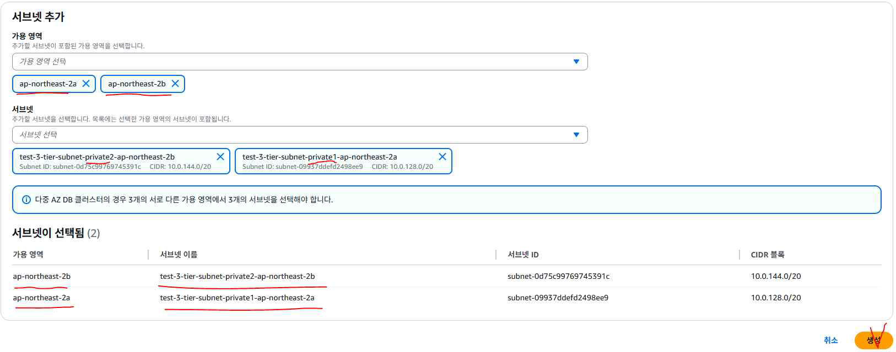

### 데이터베이스 생성

RDS 콘솔 → 데이터베이스 → [데이터베이스 생성]

- **생성 방식**: 표준 생성, **엔진 옵션**: MySQL
- **DB 인스턴스 식별자**: 자유롭게 지정 (예: `wordpress-db`)
- **마스터 사용자 이름/암호**: 자체 관리로 직접 지정
- **VPC**: 앞서 생성한 VPC, **DB 서브넷 그룹**: 위에서 만든 서브넷 그룹
- **퍼블릭 액세스**: 아니요
- **VPC 보안 그룹**: 우선 기존 default 보안 그룹 선택 (실습 마지막에 [12장](#12-보안-그룹-강화-ec2-직접-접근-차단)에서 강화)
- **추가 구성 → 초기 데이터베이스 이름**: `wordpress` (지정하지 않으면 RDS가 데이터베이스를 자동으로 만들어주지 않는다)

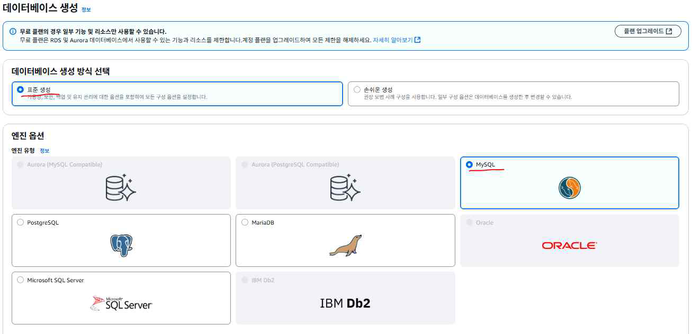

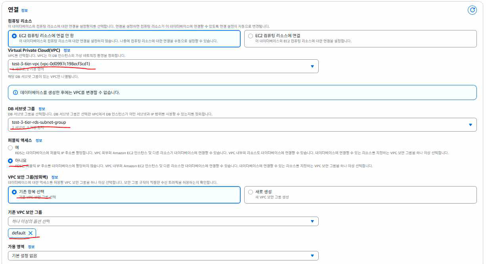

## 6. EFS와 S3 버킷 생성

### EFS(Elastic File System)

여러 대의 EC2가 동시에 접근할 수 있는 네트워크 공유 폴더다. 파일을 저장할수록 용량이 자동으로 커지므로 미리 디스크 크기를 정할 필요가 없고, 리전 내 여러 AZ에 자동 복제되어 한 곳에 장애가 나도 데이터가 안전하게 유지된다.

EFS 콘솔 → 파일시스템 → [파일시스템 생성] → **VPC**에 앞서 생성한 VPC 선택.

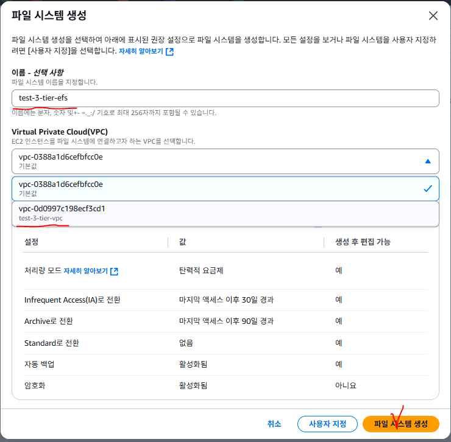

### S3 버킷 생성

S3 콘솔에서 `wp-config.php` 등 배포용 파일을 올려둘 버킷을 하나 생성한다 (버킷 이름은 전역적으로 고유해야 하므로 임의 문자열을 포함해 작성). 절차는 [EC2와 S3 연동하기](g07-ec2-s3.md)의 버킷 생성 단계를 참고한다.

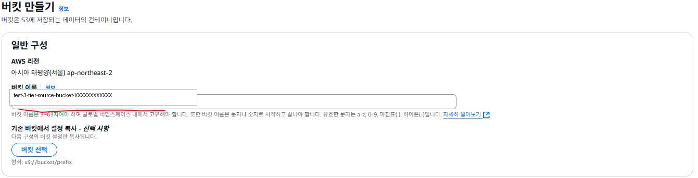

## 7. wp-config.php 설정

워드프레스는 실행될 때마다 데이터베이스에 접속해야 하는데, 프로그램 자체는 DB 위치·비밀번호를 알 수 없다. 이 정보를 미리 적어두는 설정 파일이 `wp-config.php`다.

```php
<?php

// 데이터베이스 이름
define( 'DB_NAME', '[데이터베이스 이름]' );

// 데이터베이스 사용자명
define( 'DB_USER', '[DB 사용자명]' );

// 데이터베이스 사용자 비밀번호
define( 'DB_PASSWORD', '[DB 사용자 비밀번호]' );

// 데이터베이스 호스트 (RDS 엔드포인트 주소)
define( 'DB_HOST', '[RDS 엔드포인트 주소]' );

define( 'DB_CHARSET', 'utf8' );
define( 'DB_COLLATE', '' );

// 파일 시스템 접근 방식 (direct: 워드프레스가 파일을 직접 생성/수정)
define( 'FS_METHOD', 'direct' );

// 보안 키와 솔트 값 — 실제 서비스에서는 임의의 복잡한 문자열로 반드시 교체
define( 'AUTH_KEY',         'put your unique phrase here' );
define( 'SECURE_AUTH_KEY',  'put your unique phrase here' );
define( 'LOGGED_IN_KEY',    'put your unique phrase here' );
define( 'NONCE_KEY',        'put your unique phrase here' );
define( 'AUTH_SALT',        'put your unique phrase here' );
define( 'SECURE_AUTH_SALT', 'put your unique phrase here' );
define( 'LOGGED_IN_SALT',   'put your unique phrase here' );
define( 'NONCE_SALT',       'put your unique phrase here' );

// 데이터베이스 테이블 접두사 (한 DB에 여러 워드프레스 설치 시 구분)
$table_prefix = 'wp_';

// 디버그 모드 (true: 오류/디버그 정보 표시, false: 운영 모드)
define( 'WP_DEBUG', false );

if ( ! defined( 'ABSPATH' ) ) {
	define( 'ABSPATH', __DIR__ . '/' );
}

require_once ABSPATH . 'wp-settings.php';
```

`DB_HOST`에는 RDS 콘솔에서 생성한 DB 인스턴스를 클릭해 확인할 수 있는 **엔드포인트 주소**를 입력한다 — RDS의 실제 IP는 고정되지 않으므로 반드시 DNS 엔드포인트를 사용해야 한다. 값을 채운 `wp-config.php`를 앞서 만든 S3 버킷에 업로드해 둔다.

## 8. User Data로 워드프레스 자동 배포

시작 템플릿(또는 첫 EC2의 사용자 데이터)에 아래 스크립트를 등록하면, 인스턴스가 최초 부팅될 때 워드프레스 환경이 자동으로 구성된다.

```bash
#!/bin/bash

# Apache 웹 서버 설치
dnf install httpd -y

# PHP 8.2, PHP-MySQL 모듈, MariaDB 클라이언트, wget 설치
dnf install -y php8.2 php8.2-mysqlnd mariadb105 wget

# Apache 재시작 및 부팅 시 자동 시작 설정
systemctl restart httpd
systemctl enable httpd

# /var/www/html 디렉터리 소유자를 ec2-user로 변경
chown -R ec2-user:ec2-user /var/www/html

# 워드프레스용 디렉터리 생성
mkdir -p /var/www/html/wordpress

# EFS 마운트 설정 (_netdev 옵션으로 네트워크 준비 후 마운트하도록 지정)
# {efs_id}는 실제 생성한 EFS ID로 교체
echo "{efs_id}.efs.ap-northeast-2.amazonaws.com:/ \
/var/www/html/wordpress nfs4 defaults,_netdev 0 0" >> /etc/fstab

# /etc/fstab 설정 반영해 EFS 마운트
mount -a

# 워드프레스 최신 버전 다운로드 및 배포
wget https://wordpress.org/latest.tar.gz || exit 1
tar -xzf latest.tar.gz
cp -r wordpress /var/www/html/
chown -R ec2-user:ec2-user /var/www/html/wordpress
chmod -R 755 /var/www/html/wordpress

# S3에서 wp-config.php 파일 가져오기
# {S3버킷-ID}는 실제 S3 버킷 이름으로 교체
aws s3 cp \
s3://{S3버킷-ID}/wp-config.php \
/var/www/html/wordpress \
--region ap-northeast-2
```

- 워드프레스 디렉터리 자체를 EFS 마운트 지점(`/var/www/html/wordpress`)으로 사용하므로, 모든 EC2 인스턴스가 동일한 워드프레스 소스·업로드 파일을 공유한다.
- `wp-config.php`는 DB 접속 정보를 담고 있어 AMI나 코드 저장소에 직접 포함하지 않고, S3에 별도로 올려둔 뒤 `aws s3 cp`로 배포 시점에 가져온다 — 이를 위해 EC2에는 [4장](#4-사전-준비-iam-역할과-vpc)에서 만든 IAM 역할이 연결되어 있어야 한다.

## 9. EC2 실행과 워드프레스 초기 설치

첫 EC2는 나중에 AMI로 만들 "원본"이므로 직접 하나 실행해 워드프레스 설치를 완료한다.

- **네트워크**: 앞서 만든 VPC의 **퍼블릭 서브넷**, 퍼블릭 IP 자동 할당 활성화
- **IAM 인스턴스 프로파일**: 4장에서 만든 IAM 역할
- **사용자 데이터**: 8장의 스크립트 붙여넣기 (`{efs_id}`, `{S3버킷-ID}`를 실제 값으로 교체)

인스턴스가 실행되면 퍼블릭 IPv4 주소로 워드프레스 설치 화면에 접속한다.

```
http://<EC2 퍼블릭 IP>/wordpress/
```

Site Title, Username, Password, Email을 입력해 설치를 완료한다.

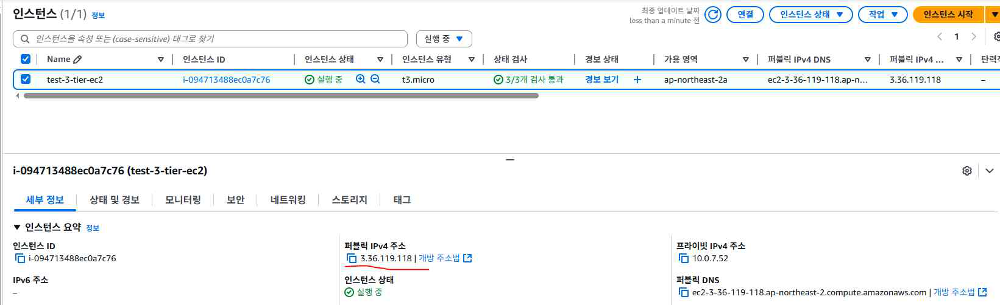

> ⚠️ **이 설치 시점에 접속한 주소가 워드프레스 DB에 "사이트 주소"로 그대로 저장된다.** 지금은 EC2의 퍼블릭 IP로 접속했으므로, 이 값도 EC2 IP로 저장된다 — 이 점이 [11장](#11-트러블슈팅-alb-환경에서-정적-리소스가-깨지는-문제)에서 다룰 문제의 원인이 된다.

## 10. AMI · 시작 템플릿 · Auto Scaling Group · ALB 구성

### 1) AMI 생성

인스턴스 → 대상 EC2 선택 → 작업 → 이미지 및 템플릿 → [이미지 생성]. 지금 인스턴스의 디스크 상태(OS + 설정 + 패키지 + 워드프레스 소스)를 스냅샷 떠서 이미지(AMI)로 만든다.

> **주의**: IP·보안 그룹·서브넷·인스턴스 ID, 그리고 EFS 같은 외부 스토리지의 데이터는 AMI에 포함되지 않는다.

### 2) 시작 템플릿(Launch Template) 작성

방금 만든 AMI를 참조해 인스턴스 타입, 보안 그룹, 서브넷 등 실행 파라미터를 저장한다. 버전 관리(v1, v2 …)가 가능해서, 나중에 설정을 바꿀 때는 새 버전을 만들어 교체할 수 있다.

### 3) 대상 그룹(Target Group) 생성

- **대상 유형**: 인스턴스
- **상태 검사 경로**: `/wordpress`
- **고급 상태 검사 설정 → 성공 코드**: `301` (워드프레스가 `/wordpress`로 접속 시 리다이렉트를 내려주는 경우가 있어, 기본값 `200` 대신 `301`도 성공으로 인식하도록 설정)

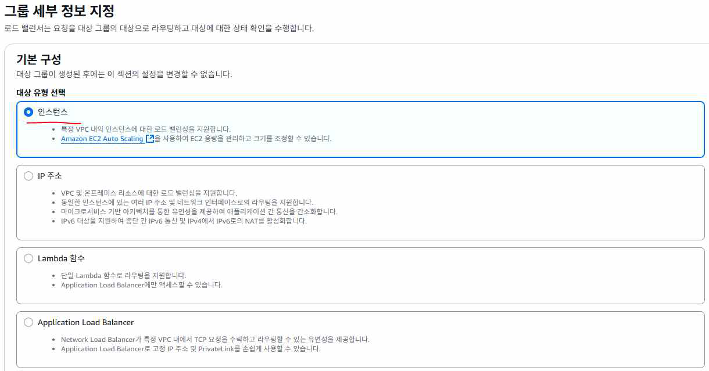

### 4) Auto Scaling Group(ASG) 생성

- 시작 템플릿(특정 버전)을 지정하고, VPC·가용 영역(서브넷)을 설정
- **로드 밸런싱**: 기존 로드 밸런서에 연결 → 위에서 만든 대상 그룹 선택
- **상태 확인**: Elastic Load Balancer 상태 확인 켜기 (ALB 헬스 체크 결과로 비정상 인스턴스를 자동 교체)
- 그룹 크기(예: 원하는 용량 2 / 최소 0 / 최대 2) 지정

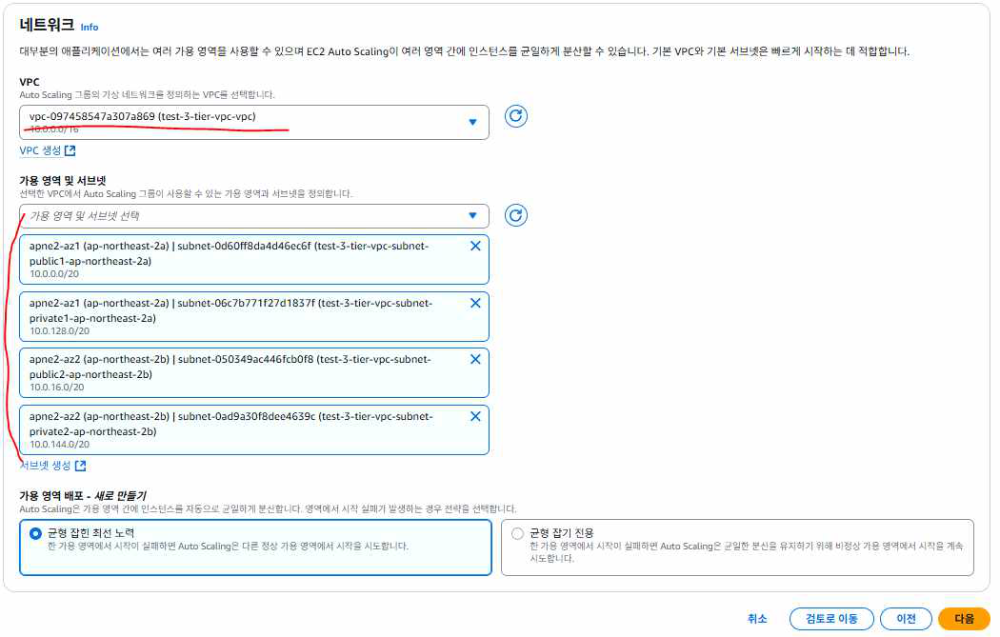

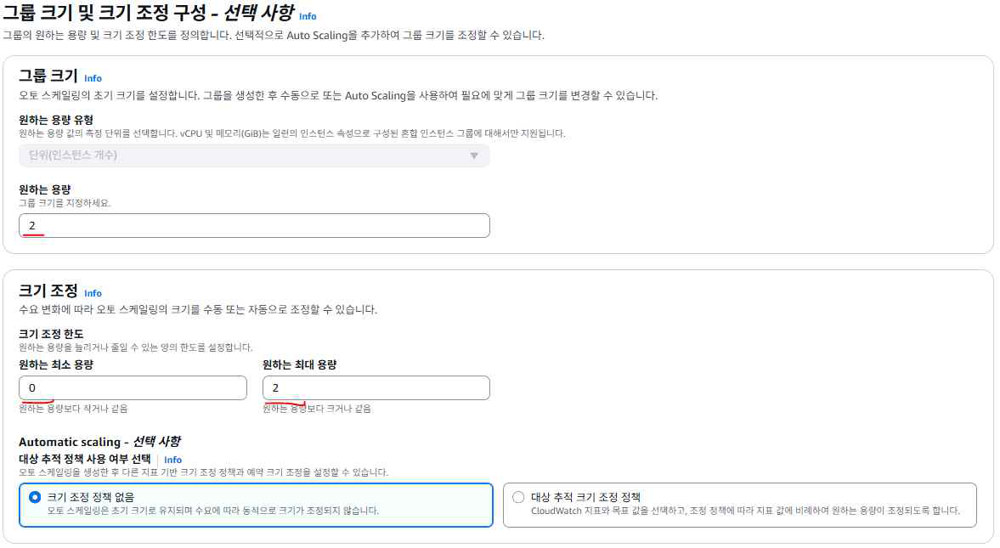

### 5) ALB(Application Load Balancer) 생성

- **네트워크 매핑**: 두 AZ의 **퍼블릭 서브넷** 선택
- **리스너**: HTTP 80, 기본 작업으로 위에서 만든 대상 그룹 지정

ALB가 활성화되면 세부 정보에서 **DNS 이름**을 확인할 수 있다. 이 주소 뒤에 `/wordpress`를 붙여 접속하면 클러스터를 통해 사이트가 열린다.

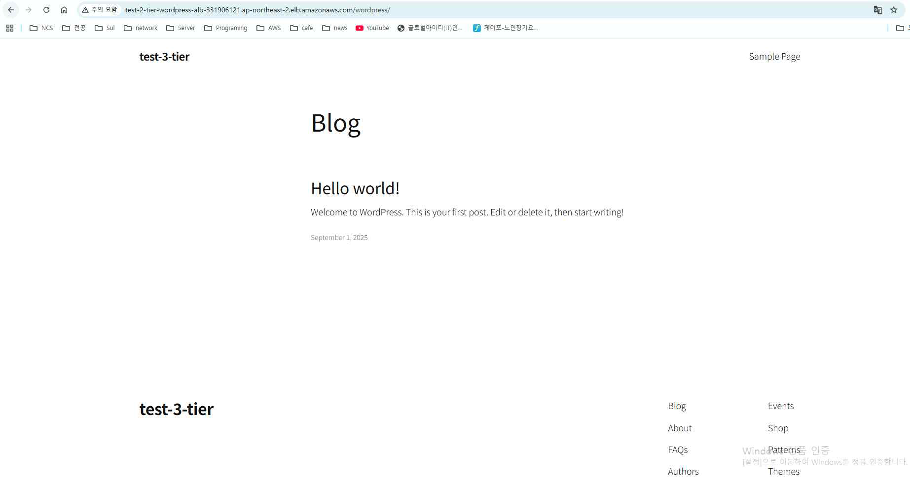

## 11. 트러블슈팅: ALB 환경에서 정적 리소스가 깨지는 문제

ALB DNS로 접속했을 때 페이지 본문(HTML)은 보이지만, 브라우저 콘솔(F12)에 아래와 같은 에러가 뜨며 CSS·JS·폰트가 깨지는 경우가 있다.

```
Access to script at 'http://<EC2 퍼블릭 IP>/wordpress/wp-includes/...' from origin
'http://<ALB DNS 주소>' has been blocked by CORS policy: No 'Access-Control-Allow-Origin'
header is present on the requested resource.
Failed to load resource: net::ERR_FAILED
```

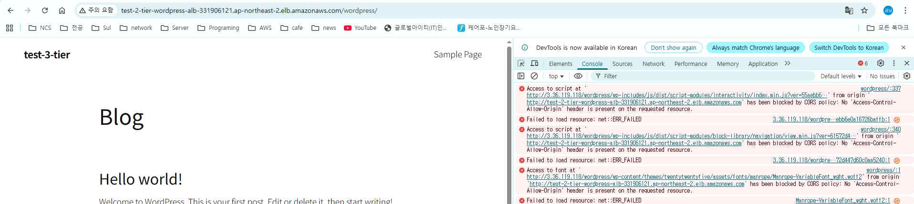

### 원인

1. 워드프레스는 **설치가 완료되는 순간** 접속했던 주소를 "사이트 주소"(`WordPress Address` / `Site Address`, DB의 `wp_options` 테이블에 저장)로 기록하고, 이후 자동으로 바뀌지 않는다.
2. [9장](#9-ec2-실행과-워드프레스-초기-설치)에서 EC2의 퍼블릭 IP로 접속해 설치를 완료했으므로, 이 값이 **EC2 IP**로 저장돼 있다.
3. AMI는 서버 상태(프로그램, 설정 파일, 마운트된 데이터 포함)를 그대로 복사하므로, 이 잘못된 사이트 주소도 그대로 복제되어 Auto Scaling으로 생성되는 모든 서버에 동일하게 적용된다.
4. 사용자는 **ALB 주소**로 접속했는데, 워드프레스는 CSS·JS·폰트 같은 정적 리소스를 여전히 **EC2 IP**에서 불러오려고 한다 — 브라우저 입장에서는 HTML을 받은 출처(ALB)와 리소스를 요청하는 출처(EC2 IP)가 다르므로 CORS 정책 위반으로 차단한다. HTML 본문 자체는 ALB에서 정상적으로 오기 때문에 페이지 골격은 보이지만, 부가 리소스만 막혀 화면이 깨진다.

### 해결

워드프레스 관리자(`/wp-admin`)에 로그인해 **설정 → 일반(General Settings)**에서 `WordPress Address (URL)`과 `Site Address (URL)` 두 값을 EC2 IP에서 **ALB DNS 주소**로 수정하고 저장한다.

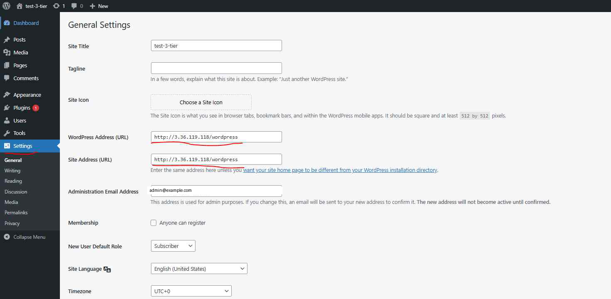

```
WordPress Address (URL): http://<ALB DNS 주소>/wordpress
Site Address (URL):      http://<ALB DNS 주소>/wordpress
```

이 값은 RDS(모든 EC2가 공유하는 데이터베이스)에 저장되므로, **한 번만** 수정하면 이후 Auto Scaling으로 새로 생성되는 인스턴스에도 즉시 동일하게 적용된다. 관리자 화면 접근이 어려운 경우, [RDS](t05-rds.md)에 직접 접속해 SQL로 같은 값을 수정할 수도 있다.

```sql
-- Bastion Host 등을 통해 RDS 접속 후
USE wordpress;

SELECT option_name, option_value FROM wp_options WHERE option_name IN ('siteurl','home');

UPDATE wp_options SET option_value='http://<ALB DNS 주소>/wordpress' WHERE option_name='home';
UPDATE wp_options SET option_value='http://<ALB DNS 주소>/wordpress' WHERE option_name='siteurl';
```

> **예방하는 방법**: 애초에 AMI를 만들기 **전에** 사이트 주소를 ALB DNS로 먼저 맞춰두거나, AMI 생성 전 마지막 단계로 이 설정을 확인하는 습관을 들이면 이 문제 자체를 피할 수 있다.

## 12. 보안 그룹 강화: EC2 직접 접근 차단

지금까지는 편의상 EC2·RDS·ALB 모두 기존 `default` 보안 그룹(모든 트래픽 허용)을 사용했다. 실습 마지막 단계로 **ALB를 거치지 않은 EC2 직접 접근을 차단**하도록 3-tier 패턴으로 정리한다. 기본 개념은 [ALB · Auto Scaling 문서의 보안 그룹 구성](g06-load-balancer-autoscaling.md#2-vpc-보안-그룹-구성-3-tier)과 동일하다.

### 1) ALB용 보안 그룹

- **인바운드**: 없음 (또는 필요한 경우만 추가)
- **아웃바운드**: HTTP, `0.0.0.0/0`

### 2) EC2용 보안 그룹

- **인바운드**: 모든 트래픽 — Source를 **ALB 보안 그룹**으로 지정 (ALB를 거친 트래픽만 허용), SSH(22) — 관리 목적일 때만 필요한 범위로 허용
- 이렇게 Source를 보안 그룹으로 지정하면, Auto Scaling으로 EC2가 늘어나거나 줄어도 규칙을 다시 설정할 필요가 없다.

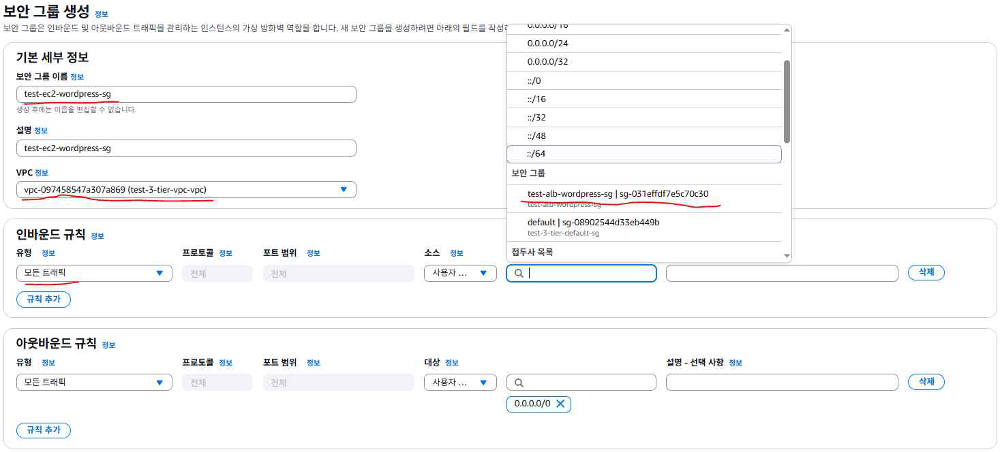

### 3) 적용

1. **첫 EC2 인스턴스**의 보안 그룹을 위에서 만든 EC2용 보안 그룹으로 교체하고, 기존 `default`는 제거한다.
2. **시작 템플릿**을 새 버전으로 수정해 EC2용 보안 그룹을 반영하고, **Auto Scaling Group**이 이 최신 버전을 사용하도록 설정한다 — 이후 스케일 아웃으로 생성되는 인스턴스부터 새 보안 그룹이 자동 적용된다.
3. **ALB**에는 ALB용 보안 그룹을 적용하고 기존 `default`는 제거한다.

적용 후에는 EC2의 퍼블릭 DNS로 직접 접속을 시도하면 연결이 거부되고, 반드시 ALB DNS를 통해서만 사이트에 접속할 수 있게 된다.

## 13. 리소스 삭제 체크리스트

실습이 끝나면 아래 순서로 리소스를 정리해 불필요한 과금을 막는다. 의존 관계가 있는 리소스(ASG → ALB → 대상 그룹 등)부터 먼저 지워야 삭제가 막히지 않는다.

1. Auto Scaling 그룹 삭제
2. 로드 밸런서(ALB) 삭제
3. 대상 그룹 삭제
4. RDS 데이터베이스 삭제
5. S3 버킷 삭제
6. EC2 인스턴스 삭제 (수동으로 만든 원본 EC2 — ASG가 만든 인스턴스는 1번에서 함께 정리됨)
7. EFS 파일 시스템 삭제
8. AMI 등록 취소 (이미지 삭제)
9. AMI에 연결된 EBS 스냅샷 삭제
