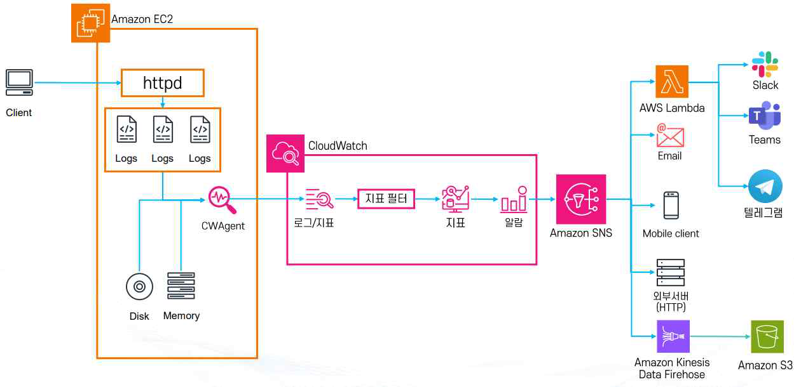

# AWS CloudWatch 모니터링 실습


## 1. 개요

CloudWatch·CloudTrail의 개념(지표·로그·경보·Trail·Event 종류 등)은 [모니터링](t06-monitoring.md)에 정리되어 있다. 이 문서에서는 그 개념을 실제 EC2 환경에 적용해 웹 서버 로그를 커스텀 지표로 변환하고 알람까지 연결하는 실습(실습 1), 그리고 CloudTrail로 계정 활동을 직접 추적해보는 실습(실습 2)을 다룬다.



## 2. 실습 1: EC2 커스텀 지표 수집 및 404 에러 알람

**목표**: EC2에 웹 서버를 올리고, CloudWatch Agent로 OS 수준 지표(메모리·디스크)를 수집하며, Apache 로그에서 404 에러를 지표로 뽑아 알람까지 연결하는 전체 흐름을 실습한다.

**1) EC2 환경 준비 (웹 서버 설치)**

```bash
# 1) 권한 상승
sudo -s

# 2) Apache HTTP Server 설치 및 기동
dnf install httpd -y
service httpd start          # AL2023에서는 systemctl start httpd 권장
chkconfig httpd on           # AL2023에서는 systemctl enable httpd 권장

# 3) 로그 디렉터리 준비 (Access/Error 로그를 분리해서 관리)
mkdir -p /var/log/www/error
mkdir -p /var/log/www/access

# 4) Apache 설정 반영 (로그 경로가 위 디렉터리를 가리키도록 httpd.conf 수정)
cp httpd.conf /etc/httpd/conf/
service httpd restart
```

클라이언트에서 요청이 들어오면 웹 서버는 Access Log·Error Log 같은 로그 파일을 남기며, 이 로그가 CloudWatch Agent 수집 대상이 된다.

**2) CloudWatch Agent 설치 및 설정 적용**

```bash
# 5) CloudWatch Agent 설치
dnf install -y amazon-cloudwatch-agent

# 6) 에이전트 설정 적용 및 시작
/opt/aws/amazon-cloudwatch-agent/bin/amazon-cloudwatch-agent-ctl \
  -a fetch-config -m ec2 -s -c file:/home/ec2-user/EnablePHPCloudwatchlog.json

# -a fetch-config : 설정을 가져오거나 로컬 파일을 읽어 반영하는 액션
# -m ec2          : 실행 환경이 EC2임을 지정
# -s               : 설정 적용 후 서비스를 즉시 시작
# -c file:...json  : 업로드해 둔 에이전트 설정 JSON을 사용

# 7) 서비스 상태 보장 (-s가 시작까지 해주지만, 확실히 하기 위해 한 번 더 실행)
systemctl start amazon-cloudwatch-agent
```

CloudWatch Agent는 두 가지 역할을 동시에 한다.

- EC2의 메모리 사용량, 디스크 사용량, CPU, 네트워크 등 **OS 수준의 지표 수집** (EC2 기본 지표에는 메모리·디스크 사용량이 포함되지 않으므로, Agent를 통해 `MemoryUtilization`(% 단위 메모리 사용률), `DiskUsedPercent`(디스크 사용률) 같은 Custom Metric으로 생성된다 — 이 지표들은 CloudWatch 콘솔에서 별도의 Custom Namespace로 확인할 수 있다.)
- EC2 내부 로그 파일(Apache Access Log, Error Log 등)을 CloudWatch Logs로 전송

**3) 로그 지표화(Log to Metric) — 404 에러 카운트**

CloudWatch Logs에 전송된 Apache Access Log를 Metric Filter로 변환해, 404 에러 로그만 필터링한 `404ErrorCount` 지표를 생성한다.

```text
# status 값이 문자열 "404"인 로그만 매칭
{ $.status = "404" }

# status 값이 400, 404, 500 중 하나라도 맞으면 매칭
{ $.status = 400 || $.status = 404 || $.status = 500 }

# status 값이 4xx 전 범위 매칭 (숫자로 기록될 때만 가능)
{ $.status >= 400 && $.status < 500 }

# status 값이 500이면서 메서드가 GET인 로그만
{ $.status = 500 && $.method = "GET" }
```

Metric Filter를 만들 때 지정하는 세 항목의 역할이 서로 다르다는 점에 유의한다.

| 항목 | 예시 | 의미 |
|---|---|---|
| 필터 이름 | `My-WEB-404-FILTER` | CloudWatch Logs에서 이 Metric Filter 자체를 구분하기 위한 관리용 이름 (실제 지표 이름 아님) |
| 지표 네임스페이스 | `MyApp/Web` | 생성되는 Custom Metric이 들어갈 분류. CloudWatch → Metrics에서 이 네임스페이스 아래에 지표가 생성된다 |
| 지표 이름 | `WEB-404` | 실제로 생성되는 CloudWatch Metric의 이름. 이후 Alarm을 만들 때 이 지표를 선택한다 |
| 지표 값 | `1` | 필터 패턴과 일치하는 로그 1건마다 지표에 더할 값 |

즉 404 로그가 5건 발생하면 `+1`씩 다섯 번 누적되어 해당 기간의 `WEB-404` 지표 값은 `5`가 된다.

**4) 알람 생성 (Alarm)**

`WEB-404` 지표를 기준으로, 특정 기간 동안 404 발생 횟수가 임계치(N) 이상이면 경보가 발생하도록 CloudWatch 콘솔에서 알람을 생성한다 — [모니터링](t06-monitoring.md)의 "CloudWatch 경보" 절에서 다룬 개념이 여기서 그대로 적용된다. 같은 방식으로 메모리 사용량이 80% 이상일 때 알람이 발생하도록 `MemoryUtilization` 지표에도 알람을 걸 수 있다.

**5) 알람 후 처리 (SNS 연동)**

알람이 발생하면 **Amazon SNS**를 통해 알림을 전달한다. SNS 구독 대상으로 자주 쓰이는 예시는 다음과 같다.

- Email: 운영자에게 메일 발송
- Slack, Teams, Telegram: 협업 툴로 실시간 알림
- AWS Lambda: 자동 대응 스크립트 실행(예: 서버 확장)
- Mobile Client: 모바일 푸시 알림
- 외부 HTTP 서버: 서드파티 모니터링 시스템 연동
- Amazon Kinesis Data Firehose: 로그/지표를 S3로 적재해 장기 분석에 활용

**정리**: 이 실습의 흐름은 "웹 서버 로그 발생 → CloudWatch Agent가 로그·OS 지표 수집 → Metric Filter로 404 로그를 지표화 → 지표 기준 Alarm 생성 → SNS로 알림 전달"로 이어지며, 이 5단계 파이프라인이 CloudWatch 기반 모니터링·알림 자동화의 표준적인 형태다.

## 3. 실습 2: CloudTrail로 계정 활동 추적

**1) CloudTrail Trail 생성 및 모니터링 확인**

- 새로운 Trail을 만들어서 로그를 S3 버킷에 저장한다.
- 이때 **Data Event 수집**을 활성화하면 S3 객체 단위 동작이나 Lambda 호출 같은 세부 이벤트도 함께 기록된다.
- 생성된 Trail이 정상적으로 로그를 남기고 있는지 확인한다.

**2) CloudShell에서 EC2 정보 조회 테스트**

```bash
aws ec2 describe-instances
```

AWS CloudShell에서 EC2 인스턴스 정보를 조회하는 API를 호출하면, 이 호출 자체가 CloudTrail에 기록된다. 이벤트 기록에는 호출한 시간, 호출자, API 이름(`DescribeInstances`), 실행 결과 등이 남는다.

**3) S3 Object 생성 및 요청 이벤트 확인**

```bash
aws s3 cp file.txt s3://mybucket/
```

S3 버킷에 객체를 업로드한 뒤 다운로드(Get) 또는 삭제(Delete) 같은 요청을 실행하면, Data Event가 활성화되어 있을 경우 S3 객체 단위의 동작이 CloudTrail에 기록된다. 이벤트 세부 정보로는 요청한 사용자/서비스 정보, 요청 시간 및 리전, 동작 종류(`PutObject`, `GetObject`, `DeleteObject` 등), 요청 결과(성공/실패)가 남는다.

**정리**: 이 실습은 "인프라 조회(Management Event)"와 "데이터 접근(Data Event)"이 각각 어떻게 CloudTrail에 기록되는지 직접 비교해보는 데 목적이 있다 — `describe-instances`처럼 리소스를 조회만 해도 Management Event로 기록되고, S3 객체를 업로드/삭제하면 Data Event로 별도 기록된다는 차이를 실습으로 확인한다.
