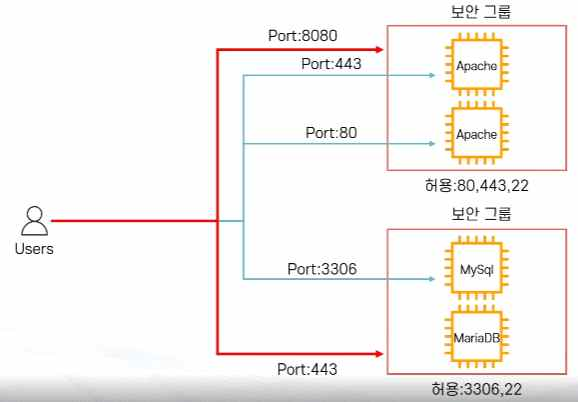
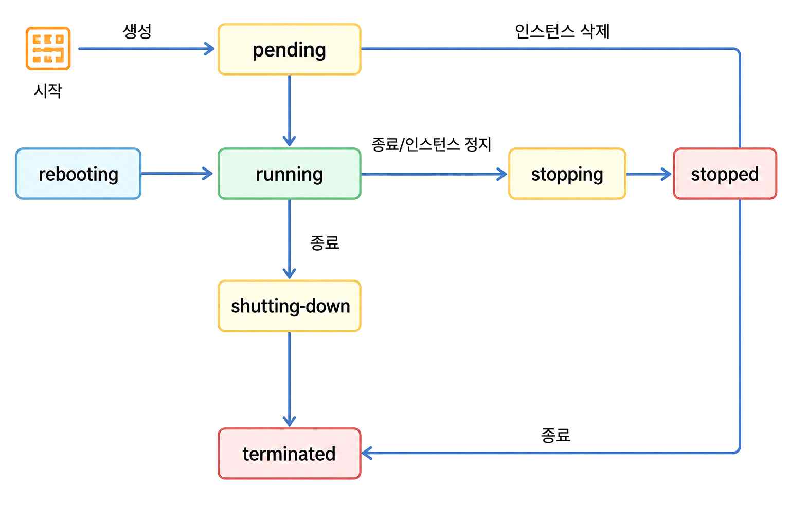
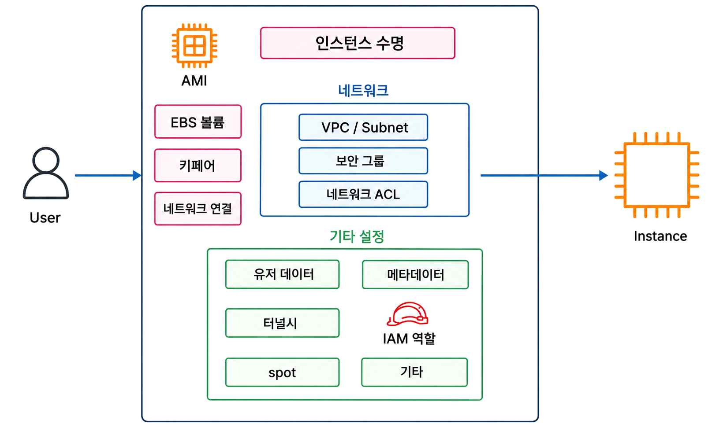
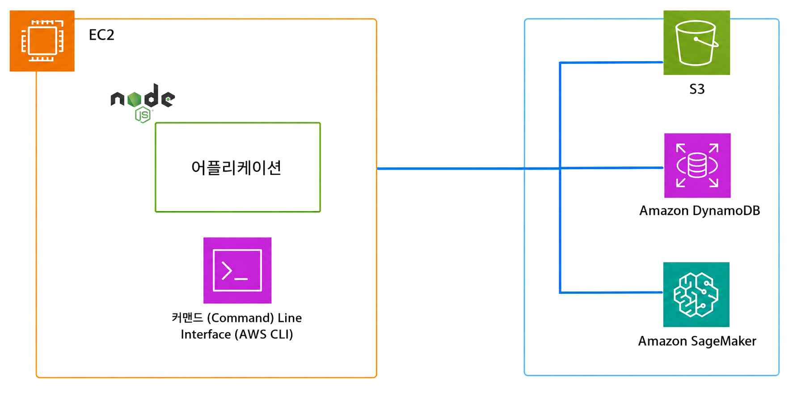
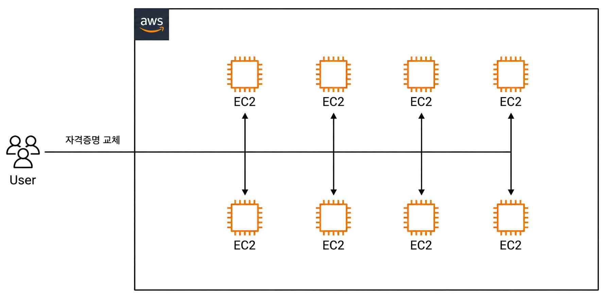
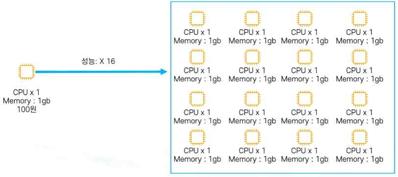

# AWS EC2 배포

## 1. EC2(Elastic Compute Cloud) 개요

- EC2는 안전하고 크기 조정이 가능한 컴퓨팅 파워를 클라우드에서 제공하는 웹 서비스이다.
- 개발자가 더 쉽게 웹 규모의 클라우드 컴퓨팅 작업을 할 수 있도록 설계되었다.
- 클라우드 = 빌려쓰기, 클라우드 컴퓨팅 = 컴퓨팅 빌려쓰기, EC2 = 컴퓨팅을 빌려쓰는 AWS 서비스

**특징**
- **초 단위 온디맨드 가격 모델**: 가격이 초 단위로 결정, 선입금·약정 불필요, 사용한 만큼만 과금
- **빠른 구축 속도와 확장성**: 몇 분이면 전 세계에 인스턴스 수백여대를 구축, 트래픽 증감에 따라 유연한 확장/축소
- **다양한 구성방법 지원**: 머신러닝·웹서버·게임서버·이미지처리 등 다양한 용도에 최적화된 서버 구성, 요구사항에 따라 인스턴스 타입·스토리지·네트워크 자유 선택
- **다른 AWS 서비스와 연동**: 오토스케일링, ELB, CloudWatch, RDS, S3 등과 원활하게 통합

## 2. EC2 인스턴스

- EC2에서 컴퓨팅을 담당하며, 다양한 유형과 크기로 구성 가능
- 저장을 담당하는 EBS와 네트워크로 연결, 필요에 따라 CPU·메모리·스토리지·네트워크 성능 조정 가능

**저장 방법에 따른 분류**
- **EBS 연동**: 인스턴스를 종료해도 데이터가 유지됨
- **인스턴스 스토어**: 인스턴스 종료 시 데이터가 삭제되며, 고속 임시 저장소 용도로 사용

**하나의 가용영역(AZ)에 존재**
- 특정 AZ 내에서 실행되며, 고가용성을 위해 여러 AZ에 분산 배치 가능
- 다른 AZ로의 이전을 위해 스냅샷 생성 후 복원 가능

**용도별 인스턴스 유형 예시 (총 $10 사용 시)**

| 용도 | CPU | RAM | 그래픽카드 |
|---|---|---|---|
| CPU가 중요한 알고리즘 처리 | $7 | $2 | $1 |
| 메모리 DB | $2 | $7 | $1 |
| 비트코인 채굴 | $4 | $1 | $5 |

이렇게 필요에 따라 각기 다른 인스턴스를 만들 수 있는데, 이것을 **인스턴스 유형**이라고 한다.

## 3. 인스턴스 유형(패밀리)

- 인스턴스의 역할에 따라 CPU, 메모리, 스토리지, 네트워크 등을 조합한 구성이며, 각 유형별로 사용 목적에 따라 최적화된다. (예: 메모리 위주, CPU 위주, 그래픽카드 위주)
- 유형별로 이름이 존재하며(t유형, m유형, inf유형 등), 같은 유형의 인스턴스들을 **인스턴스 패밀리**라 부른다.
- 타입별 세대별로 숫자 부여 (예: m5 = m 인스턴스의 5번째 세대)
- 아키텍처 및 프로세서/추가기술에 따라 접미사 (예: c7gn = c 인스턴스 중 AWS Graviton 프로세서(g) + Network Optimized(n))

| 타입 | 범주 | 설명 | 예시 |
|---|---|---|---|
| t | 범용 | 저렴한 범용 | 웹서버, DB |
| m | 범용 | 범용 | 애플리케이션 서버 |
| A1 | 범용 | ARM 기반 | ARM 기반 테스트 및 워크로드/웹서버 등 |
| Mac | 범용 | 맥 기반 | macOS 기반 빌드/테스트 |
| c | 컴퓨팅 최적화 | 컴퓨팅 최적화 | CPU 성능이 중요한 어플리케이션/DB |
| f | 컴퓨팅 최적화 | 하드웨어 가속 | 유전자 연구, 금융 분석, 빅데이터 분석 |
| Inf | 컴퓨팅 최적화 | 머신러닝 | 머신러닝 |
| g | 컴퓨팅 최적화 | 그래픽 최적화 | 3D 모델링/인코딩 |
| r | 메모리 최적화 | 메모리 최적화 | 메모리 성능이 중요한 어플리케이션/DB |
| x | 메모리 최적화 | 메모리 최적화 | Spark |
| p | 메모리 최적화 | 그래픽 최적화 | 머신러닝, 비디오 코딩 |
| z | 메모리 최적화 | 고주파수 싱글 스레드 워크로드 | EDA 회로 설계 예측 |
| u-6tb1 | 메모리 최적화 | 대용량 메모리 인스턴스 | 가상화, 인메모리 데이터베이스 |
| h | 저장 최적화 | 디스크 쓰루풋 최적화 | 하둡, 멀티미디어 뉴스 |
| i | 저장 최적화 | 디스크 속도 최적화 | NoSQL, 데이터웨어하우스 |
| d | 저장 최적화 | 디스크 최적화 | 파일 서버, 데이터웨어하우스/하둡 |

**제품 세부 정보 예시 (t2 시리즈)**

| 이름 | vCPU | RAM(GiB) | CPU 크레딧/시간 | 온디맨드 요금/시간 | 1년 약정 예약 인스턴스 실질 시간당 |
|---|---|---|---|---|---|
| t2.nano | 1 | 0.5 | 3 | 0.0058 USD | 0.003 USD |
| t2.micro | 1 | 1.0 | 6 | 0.0116 USD | 0.007 USD |
| t2.small | 1 | 2.0 | 12 | 0.023 USD | 0.014 USD |
| t2.medium | 2 | 4.0 | 24 | 0.0464 USD | 0.031 USD |
| t2.large | 2 | 8.0 | 36 | 0.0928 USD | 0.055 USD |
| t2.xlarge | 4 | 16.0 | 54 | 0.1856 USD | 0.110 USD |
| t2.2xlarge | 8 | 32.0 | 81 | 0.3712 USD | 0.219 USD |

## 4. Amazon EBS

EC2 인스턴스 저장에는 크게 **EBS(Elastic Block Store)**와 **인스턴스 스토어(Instance Store)** 두 가지 방식이 있다.


**기본 개념 비교**

| 구분 | EBS (Elastic Block Store) | 인스턴스 스토어 (Instance Store) |
|---|---|---|
| 저장 위치 | 네트워크 기반 블록 스토리지 | EC2 호스트 서버의 로컬 디스크 (EC2와 네트워크로 연결) |
| 데이터 지속성 | 인스턴스 종료/중지 후에도 데이터 유지 | 인스턴스 중지·종료 시 데이터 삭제 |
| 크기 변경 | 실행 중에도 확장 가능 | 불가능 (인스턴스 생성 시 고정) |
| 스냅샷 | S3에 스냅샷 생성 가능 | 불가능 |
| 사용 가능 인스턴스 | 대부분의 EC2 인스턴스 유형 | 일부 인스턴스 유형만 지원 |

- Amazon EBS는 AWS 클라우드의 EC2 인스턴스에서 사용할 영구 블록 스토리지 볼륨을 제공한다.
- 각 EBS 볼륨은 가용 영역(AZ) 내에서 자동으로 복제되어 하드웨어 장애로부터 데이터를 보호하며, 고가용성과 내구성을 제공한다.

**EBS란?**
- AWS에서 제공하는 가상 하드드라이브로, EC2 인스턴스에 연결해 사용할 수 있는 영구 블록 스토리지
- 인스턴스와 독립적으로 존재하므로, 인스턴스를 중지하거나 종료해도 데이터 유지 가능
- 단, 루트 볼륨으로 사용 시 인스턴스 종료와 함께 삭제되지만, 설정을 통해 EBS만 존속 가능
- 용량과 성능을 자유롭게 조정 가능 (확장/축소 및 IOPS 조정 가능)
- SSD 기반: 고성능 IOPS 제공 / HDD 기반: 저비용 대용량 저장
- EBS Multi Attach 기능을 통해 하나의 EBS를 여러 EC2 인스턴스에 장착 가능 (특정 유형에 한함)
- EC2 인스턴스와 같은 가용영역(AZ) 내에서만 존재하며, 다른 AZ로 직접 이동 불가 (스냅샷을 통해 복제 가능)
- 가용영역 내 자동 분산 저장으로 99.999%의 가용성을 목표로 설계됨
- 인스턴스와 EBS는 네트워크로 연결되어있기 때문에 다른 인스턴스로 교체가 가능하다.

**EBS의 유형**
- **범용(General Purpose, GP) - SSD**: 가장 일반적으로 사용되는 SSD 타입. 가격과 성능의 균형이 좋으며 대부분의 워크로드에 적합 (예: 웹 서버, 개발/테스트 환경, 소규모 데이터베이스)
- **프로비저닝 된 IOPS(Provisioned IOPS, io) - SSD**: 높은 IOPS가 필요한 워크로드에 최적화. 대규모 트랜잭션 처리 DB나 미션 크리티컬 애플리케이션에 적합 (예: Oracle, SQL Server, MySQL 등 OLTP 환경)
- **쓰루풋 최적화(Throughput Optimized HDD, st) - HDD**: 대규모 순차적 데이터 처리에 유리 (예: 빅데이터 분석, 데이터 웨어하우스, 로그 처리)
- **콜드 HDD(SC) - HDD**: 접근 빈도가 낮은 데이터를 장기 저장할 때 사용. 저비용이 장점이지만 성능은 낮음 (예: 백업, 아카이브 데이터)
- **마그네틱(Standard) - HDD**: 구형 표준 HDD 타입으로 현재는 잘 사용되지 않음. 저비용이지만 성능이 낮아 특정 레거시 환경에서만 사용

**Snapshot**
- 스냅샷: EBS의 특정 시점을 저장한 이미지. 이후 EBS로 다시 복구 가능하며 EBS의 백업 용도로 활용 가능
- 증분식: 바뀐 부분만 저장 (예: 100GB 볼륨의 스냅샷을 5번 찍어도 500GB가 아닌 100GB + 4번의 변경 부분만 저장, 비용도 최적화)
- S3에 저장: 99.999999999%(11 nines) 내구성
- 자동화 생성 가능: Data Lifecycle Manager / AWS Backup 등을 통해 자동화 가능

## 5. AMI (Amazon Machine Image)

- AMI: EC2 인스턴스를 실행하기 위해 필요한 정보를 모아 둔 템플릿
- 운영체제(OS), 애플리케이션 서버, 애플리케이션, 설정 파일 등이 포함됨
- 동일한 환경의 EC2 인스턴스를 여러 개 생성할 때 사용

**구성 요소**
- 1개 이상의 EBS 스냅샷 (루트 볼륨 포함)
- 사용 권한 (어떤 AWS 계정이 사용할 수 있는지 정의)
- 블록 디바이스 매핑 (EC2 인스턴스를 위한 볼륨 정보 – EBS 용량, 개수, 연결 위치 등)

**특징**
- 필요에 따라 Private으로 설정하거나 Public으로 공개 가능
- 사용자 지정(Custom AMI) 생성 가능 → 특정 설정이나 애플리케이션이 사전 설치된 상태로 배포 가능
- AWS Marketplace에서 제공하는 다양한 AMI 사용 가능 (상용/무료 포함)
- AMI를 이용하면 배포 시간 단축, 환경 표준화, 확장성 향상 가능

**AMI를 사용한 인스턴스 생성 흐름**

Amazon EC2 프로비전(t3.micro, 프리티어) → AMI 선택(Amazon Linux) → 보안그룹 설정(80, 22 포트 허용) → 아파치 설치 및 설정 → 웹 서버 확인 → AMI 생성 → 기존 인스턴스 종료 → AMI로부터 새로운 EC2 인스턴스 생성 → 신규 인스턴스 확인 및 종료

## 6. EC2 요금 모델

AWS의 가격 정책은 **"미리 내지 않고, 사용한 만큼 내고, 많이 쓸수록 적게 내고, 예약할수록 더 적게 낸다"**로 요약할 수 있다.

**AWS의 가격 정책**
- "미리 내지 않고, 사용한 만큼 내고" → 예치금 없이 사용한 만큼(On-Demand)만 요금 지불
- "많이 쓸수록 적게 내고" → 사용하면 할수록 단위 가격이 더 저렴해짐
- "예약할수록 더 적게 낸다" → 미리 요금을 낼 필요는 없지만, 미리 예약하면 더 저렴함
- 즉 "OnDemand는 유용하지만 비싸다" (약정을 통해 많은 할인 혜택 적용 가능)

**EC2 요금 구성**: 인스턴스 요금 / 데이터 전송 / Public IPv4 (ELB, CloudWatch, EBS 등)

**EC2 요금 모델 종류**

| 모델 | 설명 |
|---|---|
| On-Demand | 사용한 시간만큼만 요금 지불, 약정 불필요 |
| Spot Instances | 남는 인스턴스를 저렴하게 사용 |
| Reserved Instances | 인스턴스 사용 기간을 약정 |
| Dedicated | 물리적인 전용 인스턴스 임대 (Dedicated Instance/Dedicated Host) |
| Savings Plan | AWS의 컴퓨팅 사용량을 약정 |

### On-Demand
- 실행하는 인스턴스에 따라 초당 혹은 시간당 컴퓨팅 파워로 측정된 가격을 지불, 약정 필요 없음
- 수요 예측이 힘들거나 유연하게 EC2를 사용하고 싶을 때, 개발/테스트 용도로 사용하고 싶을 때 적합

### 예약 인스턴스 (Reserved Instances)
- EC2 인스턴스를 일정 기간 약정하여 온디맨드 요금을 할인 받는 방식 (같은 리전·유형 구매 필요)
- 약정 기간이 길수록 더 큰 할인율 적용 (1년 또는 3년 선택, 최대 72% 저렴) — 수요 예측이 가능할 때 사용

### Savings Plan
- 컴퓨팅 파워의 사용량을 일정 기간(1년 또는 3년) 약정하여 할인받는 요금 모델. 온디맨드 대비 최대 72%까지 저렴
- 약정은 시간당 일정 금액(예: $10/hour) 형태로 설정되며, 약정 사용량 이내에서는 할인 적용, 초과분은 온디맨드 요금으로 청구
- **Compute Savings Plans**: 특정 인스턴스 유형·리전에 종속되지 않으며 EC2, Lambda, Fargate 등 다양한 서비스에서 유연하게 사용 가능
- **EC2 Instance Savings Plans**: 특정 리전과 인스턴스 패밀리를 지정하여 약정, 해당 패밀리 내 인스턴스 크기 변경 가능(예: m5.large → m5.xlarge), 특정 워크로드에 장기적으로 동일 인스턴스를 사용할 때 유리

### 스팟 인스턴스 (Spot Instances)
- AWS에서 사용하지 않고 남아 있는 컴퓨팅 용량을 경매 방식으로 매우 저렴하게 제공하는 요금 모델
- 가용영역(AZ)별, 인스턴스 유형별로 별도의 풀(Pool)로 관리
- 온디맨드 대비 최대 90%까지 절약 가능, 가격은 수요·공급에 따라 실시간 변동하지만 항상 On-Demand 가격 이하 보장
- **주의점**: AWS가 리소스를 회수해야 하는 경우 예고 없이 종료될 수 있음(Spot Instance Interruption). 종료 2분 전 알림이 오며, 이 시간에 작업 저장 또는 종료 절차 수행 가능
- **적합한 사용 사례**: 중단되어도 무방한 작업(대규모 데이터 분석, 머신러닝 학습, 분산 처리), 유연한 스케줄이 가능한 백그라운드 작업, 단기적인 대규모 처리량이 필요한 경우

### 전용 인스턴스 (Dedicated Instance)


- AWS가 제공하는 물리적 서버를 다른 고객과 공유하지 않고 특정 고객 전용으로 할당하여 EC2 인스턴스를 실행하는 방식
- 인스턴스/호스트 단위로 격리된 환경 제공. 물리적 하드웨어는 단일 고객 전용이지만, 그 위에서 여러 개의 가상 CPU(vCPU) 인스턴스를 실행 가능
- 구성: 실제 물리 CPU 위에 가상 CPU(vCPU)를 여러 개 할당, 각 vCPU 위에는 OS와 APP이 독립적으로 실행, 모든 vCPU는 동일 물리 CPU 자원을 사용하지만 다른 AWS 고객의 vCPU는 섞이지 않음
- **특징**: 라이선스 이슈 해결(Oracle, Windows Server 등 물리 하드웨어 단위 라이선스), 성능 안정성(다른 고객 워크로드 영향 없음), 보안/규제 준수(금융·의료·공공기관 등)
- **활용 사례**: 하드웨어 종속성이 있는 레거시 시스템, 고성능 연산을 위한 전용 환경, 라이선스 비용 최적화를 위한 배포

## 7. 보안 그룹

- EC2 인스턴스에 대한 인바운드(외부→인스턴스)와 아웃바운드(인스턴스→외부) 트래픽을 제어하는 가상 방화벽 역할
- **상태 저장(Stateful)** 방식으로 동작하여, 인바운드에서 허용한 연결은 아웃바운드에서 자동 허용됨
- 네트워크 ACL과 달리 보안 그룹은 **인스턴스 단위**에서 적용됨

**Port 허용**
- 기본적으로 모든 포트는 비활성화되어 있어, 명시적으로 허용 규칙을 추가해야 트래픽 통과 가능
- 트래픽이 지나갈 수 있는 Port(예: 22, 80, 443)와 Source(IP 주소, CIDR, 다른 보안 그룹)를 선택적으로 설정 가능
- **Deny(차단) 규칙은 불가능**하며, 허용(Allow) 규칙만 설정 가능

**인스턴스 단위**
- 하나의 인스턴스에 하나 이상의 보안 그룹을 설정 가능하여, 복합적인 보안 규칙 적용 가능
- 인스턴스에 여러 보안 그룹이 적용될 경우 모든 보안 그룹의 허용 규칙이 합산되어 적용됨 (가장 개방적인 규칙이 우선)



## 8. EC2 접속 방법

EC2로 접속하는 방법은 여러 가지가 있지만 가장 대표적인 방법 3가지: **SSH 연결(PuTTY)**, **EC2 인스턴스 연결**, **EC2 직렬 콘솔**

### SSH 연결

| 구분 | 내용 |
|---|---|
| 연결 방법 | SSH 연결 |
| 동작방식 | SSH |
| 연결 인증 방식 | SSH 키 페어로 인증 |
| 감사 방법 | 직접 로깅 혹은 기타 3rd Party 애플리케이션 필요 |
| 연결 요구사항 | 인터넷 연결 필요(Security Group, Public Subnet, Bastion Host 등) |
| 주요 기능 | 기본적인 SSH 통신 |

**SSH 키 페어**
- AWS EC2 인스턴스에 SSH 또는 FTP로 접속할 때 사용하는 보안 자격 증명 집합
- 프라이빗 키(Private Key)와 퍼블릭 키(Public Key)로 구성
  - 퍼블릭 키: AWS에 저장되어 인스턴스와 연동
  - 프라이빗 키: 로컬 PC에 저장, 실제 접속 시 인증에 사용
- **다시 발급 불가** (프라이빗 키를 분실하면 복구 불가능)
  - 복구하려면 해당 인스턴스의 EBS 볼륨을 분리하여 다른 인스턴스에 연결 후 `authorized_keys` 파일을 수정하거나, 스냅샷 생성 후 새 인스턴스에 복원 방식으로 재구성 필요
- **리전 단위 관리**: 키 페어는 생성한 리전에서만 유효하며, 다른 리전에서 사용하려면 export/import 필요
- 프라이빗 키는 생성 시 1회만 다운로드 가능 (반드시 안전한 위치에 백업)
- 키 분실 시 AWS는 재발급 불가하므로, 키 관리 정책을 사전에 수립해야 함

**AMI별 기본 유저 이름**

| AMI | 기본 유저 이름 |
|---|---|
| Amazon Linux | ec2-user |
| CentOS | centos or ec2-user |
| Debian | admin |
| Fedora | fedora or ec2-user |
| RHEL | ec2-user or root |
| SUSE | ec2-user or root |
| Ubuntu | ubuntu |
| Oracle Linux | ec2-user |
| Bitnami | bitnami |

### EC2 인스턴스 연결

| 구분 | 내용 |
|---|---|
| 연결 방법 | EC2 인스턴스 연결 |
| 동작방식 | 임시 SSH키를 생성해서 EC2로 밀어 넣어 연결하는 방식 |
| 연결 인증 방식 | IAM 인증 |
| 감사 방법 | 연결 기록만 감사 가능(CloudTrail) |
| 연결 요구사항 | 인터넷 연결 필요, EC2-instance-connect 에이전트 설치 필요 |
| 주요 기능 | 기본적인 SSH 통신 |

### EC2 직렬 콘솔

| 구분 | 내용 |
|---|---|
| 연결 방법 | EC2 직렬 콘솔 |
| 동작방식 | EC2 시리얼 포트로 연결 |
| 연결 인증 방식 | IAM 인증 + Root Password |
| 감사 방법 | 연결 기록만 감사 가능(CloudTrail) |
| 연결 요구사항 | 계정 단위 활성화, OS Password 설정, 특정 인스턴스 타입/리전에서만 사용 가능 (예: t2 시리즈 사용 불가능) |
| 주요 기능 | 직접 컴퓨터에 모니터와 키보드를 붙인 것 같이 동작, 부팅 및 네트워크 문제 해결 |

**EC2 직렬 콘솔이 필요한 상황**: 보안 그룹에서 포트를 막아버린 경우, 방화벽 설정 잘못으로 SSH/RDP 차단된 경우, 네트워크 인터페이스(ENI) 설정 오류, OS 설정을 잘못 변경해서 부팅 불가 상태에 빠진 경우 — 이럴 때 직렬 콘솔을 사용하면 네트워크 연결 없이도 인스턴스에 직접 접속해서 문제를 수정할 수 있다.

**SSH/FTP 클라이언트**
- FileZilla (FTP): https://filezilla-project.org/
- PuTTY (SSH): https://www.chiark.greenend.org.uk/~sgtatham/putty/latest.html

**PuTTYgen / 키 형식**
- **PuTTYgen(PUTTYGEN.EXE)**: SSH 접속에 사용할 공개키/개인키를 생성하는 프로그램. AWS에서 다운로드한 `.pem` 형식의 프라이빗 키를 PuTTY에서 사용할 수 있는 `.ppk` 형식으로 변환할 때 사용
  - 주요 기능: SSH 키 생성, `.pem` 키 불러오기, `.ppk` 형식 변환·저장, Public Key 확인, Private Key 관리
- **PEM(.pem)**: Privacy Enhanced Mail 형식에서 시작된 텍스트 기반 인증서/키 저장 형식. AWS EC2 키 페어 생성 시 다운로드. OpenSSH, Linux, macOS 등에서 SSH 접속 시 주로 사용 (예: `ssh -i mykey.pem ec2-user@EC2_PUBLIC_IP`). 파일 내부는 Base64 형태의 텍스트로 저장됨
- **PPK(.ppk)**: PuTTY Private Key의 약자. PuTTY 프로그램에서 사용하는 프라이빗 키 파일 형식. Windows에서 PuTTY로 SSH 접속할 때 주로 사용. AWS에서 받은 `.pem` 파일을 PuTTYgen으로 변환해서 사용 가능

**직렬 콘솔**
- EC2 직렬 콘솔(AWS EC2 Serial Console)은 네트워크 연결이 불가능한 상황에서도 EC2 인스턴스에 접속할 수 있는 콘솔 환경을 제공하는 기능
- 쉽게 말해 "가상 머신의 모니터와 키보드에 직접 연결하는 것"과 비슷한 역할

## 9. EC2 생명주기



### 중지(Stop)
- **요금 청구**: 중지 상태에서는 인스턴스 사용 요금은 부과되지 않음. 단, EBS 요금과 Elastic IP 등 다른 리소스 요금은 계속 부과됨 (예: EBS 스토리지 용량, 연결된 Elastic IP 미사용 시에도 비용 발생)
- **IP 변경**: 퍼블릭 IP를 사용 중인 경우, 중지 후 다시 시작하면 퍼블릭 IP가 변경됨 (탄력적 IP를 사용하면 IP 고정 가능)
- **중지 가능 조건**: EBS 기반 인스턴스만 중지가 가능. 인스턴스 스토어 기반 인스턴스는 중지 불가(중지 대신 종료만 가능)
- **데이터 보존**: EBS 루트 볼륨과 연결된 추가 EBS 볼륨의 데이터는 유지됨. 단, 인스턴스 스토어는 휘발성이므로 중지/종료 시 데이터가 삭제된다.

### 인스턴스 상태

| 인스턴스 상태 | 설명 | 인스턴스 사용 요금 |
|---|---|---|
| pending | 인스턴스가 running 상태로 될 준비 | 미청구 |
| running | 인스턴스 사용 중 | 청구 |
| stopping | 인스턴스가 중지 또는 최대 절전 모드로 전환 중 | 미청구 / 최대절전시 청구 |
| stopped | 인스턴스가 중지 상태, 재시작 가능 | 미청구 |
| shutting-down | 인스턴스가 종료 중 | 미청구 |
| terminated | 인스턴스가 영구적으로 삭제됨 | 미청구 |

## 10. ENI와 Elastic IP

### ENI (Elastic Network Interface)
- EC2 인스턴스에 연결되는 가상 네트워크 카드 (물리 서버의 LAN 카드와 비슷한 역할)
- 하나의 인스턴스에 여러 개의 ENI를 붙일 수도 있다 (하나의 인스턴스에 한 개 이상의 IP를 보유 가능)
- 인스턴스 유형 및 사이즈에 따라 최대 보유 가능한 IP주소가 변동
- 내부적으로 보안 그룹은 ENI에 부착

**주요 특징 및 고유 속성**
- MAC 주소, 프라이빗 IPv4 주소(기본 1개, 추가 가능), 하나 이상의 보안 그룹, Elastic IP(있다면 연결 가능)
- 인스턴스를 중지/재시작해도 ENI 자체는 유지, 다른 인스턴스로 이동 가능(IP 주소 변경 없이 서버 이전 가능)

**사용 예**: 이중화(HA) 구성 시 장애 인스턴스에서 예비 인스턴스로 ENI를 옮겨 서비스 중단 최소화, 하나의 인스턴스에 여러 네트워크 인터페이스 연결해서 서로 다른 서브넷/보안그룹 사용

### Elastic IP (탄력적 IP)
- 사용자가 1.1.1.1로 서비스를 받고 있다가, EC2 인스턴스를 Stop 후 다시 Start 상태로 변경하면 공인 IP 주소가 2.2.2.2로 변경된다.
- 기존 유저는 원래 IP 주소(1.1.1.1)로 접속해도 서비스를 받을 수 없게 된다.
- **Elastic IP**를 사용하면 인스턴스를 중지 후 다시 시작해도 퍼블릭 IP 주소가 변경되지 않기 때문에 공인 IP 주소를 그대로 사용할 수 있다.

**Elastic IPv4 주소**
- AWS에서 소유하고, 계정에 할당하여 EC2 인스턴스나 ENI에 연결 가능
- 인스턴스를 중지/재시작해도 IP 주소가 변하지 않음. EC2 이외의 다른 서비스에서도 사용 가능(예: NLB)
- 연결하지 않고 보유하기만 해도 비용이 발생한다.

**사용 예**: 고정 IP가 필요한 서비스(도메인 고정, 방화벽 화이트리스트 등록 등), EC2 인스턴스 교체 시에도 동일한 IP 유지

## 11. 유저 데이터와 메타 데이터

유저 데이터(User Data)와 메타 데이터(Meta Data)는 AWS EC2에서 인스턴스를 설정하거나 정보를 얻을 때 자주 쓰이는 기능이다.
- **User Data**: 인스턴스에게 "처음 실행할 작업"을 전달
- **Meta Data**: 인스턴스가 "자기 자신의 정보"를 조회



### 유저 데이터 (User Data)
- EC2 인스턴스를 생성할 때 자동으로 실행할 스크립트나 설정 정보를 전달하는 기능
- 주로 인스턴스 초기 환경 구성을 자동화할 때 사용, 기본적으로 인스턴스를 처음 시작할 때 한 번 실행
- Linux에서는 Bash Script, cloud-init 등을 사용, Windows에서는 PowerShell 등을 사용

**특징**
- 보통 초기 환경 구성 자동화에 사용
- 예: 필요한 패키지 설치, 애플리케이션 코드 배포, 설정 파일 자동 작성, 초기 웹 페이지 생성 및 웹 서버 자동 시작

**User Data 실행 흐름**

EC2 생성 → 인스턴스 부팅 → User Data 실행 → 패키지 설치/환경 설정/서비스 시작 → EC2 사용 준비

```bash
#!/bin/bash
dnf update -y
dnf install -y httpd
systemctl start httpd
systemctl enable httpd
echo "Hello AWS" > /var/www/html/index.html
```

### 메타 데이터 (Meta Data)
- 실행 중인 EC2 인스턴스가 자기 자신의 정보를 조회할 수 있도록 AWS가 제공하는 정보
- **IMDS(Instance Metadata Service)**를 사용하여 조회, 별도의 AWS CLI 명령 없이 HTTP 요청으로 조회 가능
  - IPv4 주소: `169.254.169.254` (일반 인터넷을 통해 외부에서 직접 접근하는 주소가 아님)
  - 일반적으로 해당 EC2 인스턴스 내부에서 IMDS에 접근하여 사용 (`http://169.254.169.254/latest/meta-data/`)

**메타 데이터에서 확인 가능한 대표적인 정보**: Instance ID, AMI ID, Instance Type, Private IP, Public IPv4 주소(있는 경우), Hostname, MAC 주소, 네트워크 인터페이스 관련 정보, Security Group 정보, IAM Role 관련 정보, Availability Zone, Region 관련 정보, Block Device Mapping 정보

### IMDS(Instance Metadata Service)

두 가지 방식이 존재: **IMDSv1**, **IMDSv2**

**IMDSv1**
- 별도의 세션 토큰 없이 HTTP 요청으로 메타데이터 조회 (Request/Response 방식)
- 사용 방법이 간단하지만 IMDSv2보다 보안 수준이 낮음

```bash
# Instance ID 조회
curl http://169.254.169.254/latest/meta-data/instance-id
# Private IP 조회
curl http://169.254.169.254/latest/meta-data/local-ipv4
# Public IPv4 조회
curl http://169.254.169.254/latest/meta-data/public-ipv4
# AMI ID 조회
curl http://169.254.169.254/latest/meta-data/ami-id
# Instance Type 조회
curl http://169.254.169.254/latest/meta-data/instance-type
# 사용 가능한 메타데이터 목록 확인
curl http://169.254.169.254/latest/meta-data/
```

**IMDSv2**
- IMDSv1보다 보안이 강화된 방식으로, 먼저 세션 토큰을 발급받은 후 해당 토큰을 이용하여 메타데이터를 조회 (Token 기반 Session 방식)
- 토큰의 유효시간(TTL)은 1초 ~ 최대 6시간(21,600초)까지 지정 가능
- IMDSv1보다 SSRF 등의 공격에 대한 방어 기능이 강화됨 (보안을 위해 IMDSv2 사용을 권장)
- 계정, AMI, 인스턴스 설정 등에 따라 IMDSv2 사용을 강제할 수 있음 (`HttpTokens = required`로 설정하면 IMDSv2만 사용 가능)
- EC2 콘솔의 [인스턴스 시작] 마법사는 2023년 11월부터 신규 인스턴스에 기본적으로 IMDSv2만 허용(`V2 only (token required)`)하도록 설정되어 있으며, [고급 세부 정보] > [메타데이터 버전]에서 변경 가능하다. 2024년 3월부터는 계정 단위로 "이후 모든 신규 인스턴스는 IMDSv2만 사용"하도록 리전별 기본값을 설정할 수도 있다(기존 인스턴스에는 영향 없음).

**IMDSv2 조회 과정**

```bash
# STEP 1. Token 발급
TOKEN=$(curl -X PUT "http://169.254.169.254/latest/api/token" \
-H "X-aws-ec2-metadata-token-ttl-seconds: 21600")

# STEP 2. 발급받은 Token을 사용하여 메타데이터 조회
curl -H "X-aws-ec2-metadata-token: $TOKEN" http://169.254.169.254/latest/meta-data/instance-id
```

- `TOKEN=`: TOKEN이라는 Shell 변수에 값을 저장
- `$( ... )`: 괄호 안의 명령어 실행 결과를 변수에 저장 (curl 명령의 결과인 "토큰 문자열"을 TOKEN 변수에 저장)
- `curl`: HTTP 요청을 보내는 명령어
- `-X PUT`: HTTP 요청 방식을 PUT으로 지정 (IMDSv2에서는 토큰을 발급받을 때 PUT 요청을 사용)
- `-H`: HTTP Header를 추가하는 curl 옵션
- `"X-aws-ec2-metadata-token-ttl-seconds: 21600"`: 발급받을 토큰의 유효시간을 21600초(6시간)로 지정

```bash
# IMDSv2 Public IPv4 조회
curl -H "X-aws-ec2-metadata-token: $TOKEN" http://169.254.169.254/latest/meta-data/public-ipv4
# IMDSv2 Private IPv4 조회
curl -H "X-aws-ec2-metadata-token: $TOKEN" http://169.254.169.254/latest/meta-data/local-ipv4
# Instance Name 태그 조회 (Instance Metadata에서 Tag 조회 기능이 활성화되어 있어야 함)
curl -H "X-aws-ec2-metadata-token: $TOKEN" http://169.254.169.254/latest/meta-data/tags/instance/Name
```

## 12. EC2 권한 부여

### 1) IAM 자격 증명을 등록



- IAM 사용자를 생성하고, 해당 사용자에 대한 IAM 자격 증명을 발급받아 EC2 인스턴스에 직접 등록
- AWS CLI의 `aws configure` 명령어를 통해 자격 증명을 `~/.aws/credentials` 파일에 저장
- **단점**: 관리가 어렵고, 변경이 번거로움



예: EC2 100대에 등록된 자격 증명을 모두 교체해야 하는 상황이라면, 각 인스턴스마다 수동으로 변경해야 함

### 2) IAM 역할을 부여


- 필요한 권한이 포함된 IAM 역할(Role)을 생성하고 이를 EC2 인스턴스에 부여
- **장점**: 관리와 교체가 간편함
- 인스턴스에 연결된 역할을 변경하면, 인스턴스 내부에서 자동으로 새로운 자격 증명을 사용
- 내부적으로 AWS가 주기적으로 자격 증명을 자동 갱신하므로 별도 관리 필요 없음
- **보안성 향상**: 자격 증명이 코드나 파일로 저장되지 않으므로 유출 위험이 크게 줄어든다.

### 역할(Role)


- IAM 역할(Role)은 AWS 리소스에 임시로 권한을 부여하기 위한 AWS의 보안 주체(Security Principal)
- 사용자(User)와 비슷하게 권한을 가질 수 있지만, 장기 자격 증명(Access Key, Secret Key)을 사용하지 않고, 필요할 때만 임시 자격 증명을 발급받아 사용한다.

**역할(Role)의 특징**
- **장기 자격 증명 없음**: IAM 사용자와 달리 Access Key나 Secret Key를 발급받아 보관하지 않고, 대신 AWS에서 필요할 때 임시 자격 증명을 자동 발급
- **권한 부여 방식**: 역할에는 정책(Policy)을 연결해 권한 범위를 정의, 해당 역할을 누가/무엇이 사용할 수 있는지 신뢰 정책(Trust Policy)으로 지정
- **사용 주체**: AWS 서비스(EC2, Lambda 등), 다른 AWS 계정의 사용자, AWS SSO 사용자
- **자동 만료**: 발급된 임시 자격 증명은 지정된 시간이 지나면 자동 만료, 재발급은 AWS에서 자동 처리

**역할(Role)의 활용 예시**

| 활용 시나리오 | 설명 |
|---|---|
| EC2에서 S3 접근 | EC2 인스턴스에 역할을 부여하면, 인스턴스 내부 애플리케이션이 Access Key 없이 S3에 접근 가능 |
| 계정 간 접근 | 다른 AWS 계정의 리소스에 접근할 때, 해당 계정에서 역할을 만들고 권한 부여 후, 내 계정에서 AssumeRole 사용 |
| AWS 서비스 권한 위임 | Lambda 함수가 DynamoDB나 SQS에 접근할 수 있도록 역할을 부여 |
| 임시 작업자 계정 | 외부 협력업체에 장기 사용자 계정 대신 기간 한정 역할 제공 |

**사용자(User)와 역할(Role)의 차이**

| 구분 | IAM 사용자(User) | IAM 역할(Role) |
|---|---|---|
| 자격 증명 | 장기 Access Key / Secret Key | 임시 자격 증명 |
| 대상 | 사람 또는 애플리케이션(고정) | AWS 서비스, 다른 계정 사용자, 임시 작업자 |
| 만료 | 없음 (직접 삭제 전까지 유지) | 있음 (자동 만료, 재발급 가능) |
| 보안성 | 키 유출 시 위험 | 유출 위험 낮음 (임시 발급) |
| 관리 | 직접 키 관리 필요 | AWS에서 자동 관리 |

## 13. 클라우드 환경의 EC2 활용 (확장 전략)

### 수직 확장 (Vertical Scale, Scale Up)


- 하나의 서버(인스턴스)의 성능을 높이는 방식으로 시스템 용량을 확장하는 방법
- 즉, 서버 자체의 CPU, 메모리, 디스크 속도 등을 업그레이드해서 처리 능력을 높이는 것을 의미
- 예: CPU 1개, RAM 1GB인 서버 → CPU 16개, RAM 16GB 서버로 업그레이드

**장점**
- 구성 단순: 서버 개수 변화 없이 기존 시스템을 업그레이드하므로 아키텍처 변경이 거의 없음
- 관리 편리: 서버가 한 대이므로 관리·모니터링이 쉬움
- 적은 변경으로 성능 향상: 애플리케이션 수정 없이 자원 업그레이드만으로 성능 개선 가능

**단점**
- 비용 증가 폭 큼: 성능이 16배 늘어도 비용은 30배 오를 수 있음 (예: CPU×16, 메모리 16GB → 3000원, 100원 대비 30배)
- 한계 존재: 서버 하드웨어 사양에는 물리적 한계가 있어 무한 확장 불가능
- 장애 시 전체 서비스 중단: 서버가 하나이므로 해당 서버 장애 시 서비스 전체가 중단됨

**활용 예시**: 초기 트래픽이 적고 단일 서버로도 충분히 서비스가 가능한 스타트업, 복잡한 분산 구조 없이 빠르게 성능을 높여야 하는 경우, 데이터베이스 서버(MySQL, PostgreSQL) 등에서 성능 병목을 줄이기 위해 고성능 인스턴스로 교체할 때

### 수평 확장 (Horizontal Scale, Scale Out)



- 서버(혹은 인스턴스)의 개수를 늘려서 전체 시스템 성능과 처리량을 향상시키는 방식
- 즉, 한 대의 서버를 업그레이드하는 대신 여러 대의 서버를 병렬로 운영해 부하를 분산하는 구조
- 예: CPU 1개, RAM 1GB 서버 1대를 → 동일 사양 서버 16대 운영, 주로 로드 밸런서(Load Balancer)를 사용하여 요청을 여러 서버로 분산

**장점**
- 확장성 우수: 서버 개수를 늘리기만 하면 성능 확장 가능
- 비용 효율성: 소형 인스턴스를 여러 대 사용하는 것이, 대형 인스턴스 1대보다 비용 대비 성능이 나은 경우가 많음
- 장애 대응성: 일부 서버가 장애를 일으켜도 나머지 서버가 서비스 유지 가능 (고가용성)
- 무중단 확장 가능: 서버 추가·제거가 비교적 쉬움

**단점**
- 아키텍처 복잡도 증가: 로드 밸런싱, 데이터 동기화, 세션 관리 등 추가 설계 필요
- 데이터베이스 병목: 서버가 늘어나도 DB가 단일 인스턴스면 병목 발생 가능
- 애플리케이션 설계 요구: 서버 간 상태 공유가 최소화된(Stateless) 구조가 필요

**활용 예시**: 웹 서비스 트래픽이 급증하는 경우(쇼핑몰, 뉴스 사이트), 마이크로서비스 아키텍처(MSA) 기반 서비스, CDN·API 서버·채팅 서버 등 대규모 동시 접속이 필요한 환경

- 수평 확장은 로드 분산과 관리가 복잡해지는 단점이 있지만, 비용 대비 성능 확장성이 뛰어나며 필요 시 서버 수를 무한히 늘릴 수 있다. 예를 들어 성능이 100만 배 필요하다면 100만 개의 인스턴스를 배포하면 된다.
- 클라우드 환경에서는 이러한 수평 확장이 기본 전략이며, 하나의 대형 서버로 처리하는 방식보다 다수의 소형 서버로 나누어 처리하는 것이 확장성과 안정성 측면에서 유리하다. 따라서 수평 확장은 대규모 트래픽 처리와 안정적인 서비스 운영을 위한 클라우드 환경의 핵심 철학이다.

### 클라우드 환경에서 고려해야 할 주요 요소

- **탄력성**: 수요에 따라 컴퓨팅 파워/용량을 확장하거나 축소할 수 있는 능력. 사람이 수동으로 조절하는 것이 아니라 자동화된 환경에서 통제되어야 한다.
- **안정성**: 클라우드 환경에서는 장애가 언제든 발생할 수 있기 때문에 이를 대비한 설계가 필요하다. 이는 클라우드의 단점이 아니라, 그 상황을 대비하여 구조를 설계해야 한다는 의미다.

**온프레미스와의 차이**
- 온프레미스 환경과 달리 클라우드에서는 각 인스턴스를 소모품처럼 다루어야 하며, 장애나 통제에 의해 인스턴스가 종료되는 것은 정상적인 상황이다. 따라서 예고 없이 인스턴스가 종료될 수 있다는 전제로 아키텍처를 설계해야 한다.
- 온프레미스에서 클라우드로 이전할 때는 리소스를 이전하는 것뿐 아니라, 필요에 따라 자원을 쉽게 늘리고 줄일 수 있는 환경을 직접 구축해야 한다.

**두 가지 환경 구축이 중요**
1. **스테이트리스(Stateless) 환경 구축**: 인스턴스가 상태에 의존하지 않도록 설계
2. **고가용성(High Availability) 환경 구축**: 일부 인스턴스가 장애를 일으켜도 서비스가 지속되도록 설계

- Stateless 환경은 인스턴스의 특정 상태나 데이터를 로컬에 저장하지 않고, 외부 저장소나 다른 서비스에 상태를 보관하는 방식이다. 이를 통해 인스턴스가 종료되거나 교체되어도 서비스가 지속적으로 운영될 수 있다.
- 결론적으로, 클라우드 환경에서는 탄력성과 안정성을 기본 전제로 하고, 인스턴스가 언제든 종료될 수 있다는 가정하에 고가용성과 스테이트리스 구조를 갖춘 설계를 하는 것이 필수적이다.

EC2를 잘 활용하려면 언제나 인스턴스가 떨어질 수 있다는 전제하에 다음과 같은 방법이 필요하다.
- 인스턴스를 자동으로 프로비저닝할 수 있는 방법
- 인스턴스를 가용 영역별로 분산할 수 있는 방법
- 인스턴스 클러스터에 트래픽을 분산할 수 있는 방법
- 인스턴스가 상태를 저장하지 않도록 하여 언제든 삭제되거나 추가되어도 무방한 구조를 만드는 방법

관련 서비스 예시: Auto Scaling, Elastic Load Balancer, RDS, S3

## 14. EC2 Auto Scaling

- AWS EC2 Auto Scaling은 애플리케이션을 모니터링하여 트래픽 변화나 부하 상황에 맞춰 EC2 인스턴스 수를 자동으로 조정하는 서비스이다.
- 필요 시 서버를 자동으로 추가하고, 부하가 줄면 불필요한 서버를 종료해 비용을 절감하면서 예측 가능한 성능을 유지한다.

**목적**
- 정확한 수의 EC2 인스턴스를 유지하도록 보장 (최소 인스턴스 수 이하로 내려가지 않도록 인스턴스 추가, 최대 인스턴스 수 이상으로 늘어나지 않도록 인스턴스 삭제)
- 다양한 스케일링 정책 적용 (CPU 부하, 네트워크 트래픽, 요청량 등에 따라 인스턴스 크기 및 개수 조정, 특정 시간에 인스턴스 개수를 늘리고 다른 시간에 줄이기, 여러 가용 영역(AZ)에 인스턴스를 분산 배치하여 안정성 확보)

**주요 기능**
- **자동 확장(Scale Out)**: CPU 사용률, 네트워크 트래픽, 요청 수 등 지정 지표가 기준 이상이면 인스턴스를 자동으로 추가
- **자동 축소(Scale In)**: 부하가 줄어 지정 지표가 기준 이하이면 인스턴스를 자동으로 종료
- **예측 스케일링(Predictive Scaling)**: 과거 트래픽 패턴을 학습해 미래 부하를 예측하고 사전에 인스턴스를 확장
- **고가용성 보장**: 장애 발생 시 인스턴스를 자동으로 교체해 서비스 중단 최소화
- **다중 가용 영역 지원**: 여러 AZ에 인스턴스를 분산 배치하여 장애에 강한 구조 제공

**장점**
- 비용 최적화: 필요한 만큼만 인스턴스를 운영하여 불필요한 비용 절감
- 유연성: 갑작스러운 트래픽 증가나 감소에 실시간 대응 가능
- 안정성: 인스턴스 장애 시 자동 복구
- 운영 효율성: 정책 기반 자동 실행으로 수동 관리 부담 감소

**구성 요소 및 동작 구조**
1. **Auto Scaling Group(ASG) 생성**: 관리할 인스턴스 집합 정의
2. **시작 템플릿(Launch Template) 또는 시작 구성(Launch Configuration) 설정**: 인스턴스 타입, AMI, 보안 그룹, 키 페어, IAM 역할, 유저 데이터(자동 스크립트) 등 정의
3. **스케일링 정책 설정**: 예) CPU 사용률이 70% 이상이면 2대 추가, 30% 이하이면 1대 축소
4. **모니터링 및 상태 확인**: CloudWatch 및 ELB와 연계하여 지표 기반 정책 자동 실행

**종료 정책 (Scale-In 시 인스턴스 종료 순서)**
- 인스턴스가 2개 이상인 AZ에서 가장 오래된 시작 템플릿(동일하면 과금 종료 시간이 가장 가까운 인스턴스 종료)
- 커스텀 종료 정책: 가장 예전 시작 템플릿부터 / 가장 오래된 인스턴스부터 / 가장 최근 인스턴스부터

**예시 시나리오**: 온라인 쇼핑몰에서 세일 이벤트 시작 → 트래픽 급증 → 인스턴스 5대에서 20대로 자동 확장 → 세일 종료 후 트래픽 감소 → 불필요한 인스턴스 자동 종료 → 다시 5대로 축소

## 15. ELB (Elastic Load Balancer)

### ELB를 사용하지 않은 경우


- 사용자(User)는 직접 Auto Scaling Group 내부의 EC2 인스턴스들에 개별 접속하게 된다.
- 각 인스턴스는 고유한 퍼블릭 IP를 가지며, 클라이언트가 어떤 서버에 접속할지는 사용자가 직접 선택해야 한다.
- 서버 부하 분산이 자동으로 이뤄지지 않으며, 특정 서버에만 접속자가 몰릴 수 있다.
- 특정 인스턴스가 장애가 나면, 해당 IP를 접속하던 사용자는 서비스 이용이 불가능하다.

### ELB를 사용한 경우


- 사용자(User)는 개별 EC2 인스턴스의 IP로 접속하지 않고, 로드 밸런서의 도메인 주소로 접속
- 로드 밸런서(ELB)는 들어오는 요청을 Auto Scaling Group 내의 모든 EC2 인스턴스에 자동으로 분산한다.
- 트래픽이 균등하게 분배되어 특정 서버에 과부하가 걸리는 것을 방지, 장애가 발생한 인스턴스는 자동으로 연결 대상에서 제외
- Auto Scaling과 연동되어, 서버가 자동으로 늘어나거나 줄어들어도 로드 밸런서 주소 하나로 서비스 이용이 가능

### ELB란?
- 다수의 EC2에 트래픽을 분산시켜주는 서비스
- **Health Check**: 직접 트래픽을 발생시켜 인스턴스가 살아있는지 체크
- Autoscaling과 연동 가능
- 지속적으로 IP 주소가 바뀌며 IP 고정 불가능 (항상 도메인 기반으로 사용)

**ELB 4가지 종류**

1. **Application Load Balancer (ALB)**
   - HTTP/HTTPS 트래픽에 최적화된 7계층(L7) 로드 밸런서
   - URL 경로 기반, 호스트 기반 라우팅 가능. 트래픽을 모니터링하여 라우팅 가능
   - 예: `image.sample.com` → 이미지 서버, `web.sample.com` → 웹 서버
   - 웹 애플리케이션, 마이크로서비스 구조에 주로 사용
   - 장점: 세밀한 라우팅 규칙, 다양한 HTTP 기능 지원
2. **Network Load Balancer (NLB)**
   - TCP/UDP 트래픽 처리에 최적화된 4계층(L4) 로드 밸런서
   - 매우 빠른 트래픽 분산, 초고성능 처리 가능. Elastic IP 할당 가능 → IP 고정 가능
   - 금융, 게임 서버 등 대규모 네트워크 처리에 적합
   - 장점: 저지연, 고성능, 대규모 연결 처리
3. **Classic Load Balancer (CLB)**
   - L4/L7 혼합 지원하는 구형 로드 밸런서. 예전에 사용되던 타입으로 현재는 신규 구축에 잘 사용하지 않음
   - 기능 제한적, 레거시 환경 유지 보수 시 사용
   - 장점: 오래된 AWS 환경과의 호환성
4. **Gateway Load Balancer (GWLB)**
   - 네트워크 트래픽을 제3자 보안 장비(방화벽, IDS/IPS 등)에 전달
   - 3계층(L3) 기반, 패킷 단위 트래픽 처리 가능. 보안 어플라이언스 통합 및 확장성 제공
   - 가상 어플라이언스 배포·확장 관리에 적합
   - 장점: 보안 및 트래픽 검사에 특화

### ELB + Auto Scaling


- Auto Scaling을 통해 EC2 인스턴스의 개수를 자동으로 조정하고, ELB를 사용해 각 인스턴스로 트래픽을 고르게 분산 처리한다.
- Auto Scaling으로 인스턴스가 증가하거나 감소하면, 해당 인스턴스가 자동으로 ELB에 등록되거나 해제되어 무중단 서비스 운영이 가능하다.
- 이를 통해 트래픽 급증 시에도 안정적인 서비스 제공이 가능하며, 트래픽이 줄면 불필요한 인스턴스를 줄여 비용을 절감
- ELB와 Auto Scaling의 연동은 고가용성과 확장성을 동시에 확보하는 핵심적인 클라우드 아키텍처 패턴이다.

## 16. 대상 그룹과 리스너

### 대상 그룹(Target Group)
- 대상 그룹(Target Group)은 ELB(ALB/NLB)가 트래픽을 실제로 전달할 서버나 서비스들을 묶어놓은 논리적인 묶음
- 로드밸런서는 요청이 들어오면, 바로 서버로 보내지 않고 먼저 어떤 대상 그룹으로 보낼지를 결정한 뒤, 그 대상 그룹 안에 있는 대상 중 하나에게 요청을 전달한다.
- 흐름: 로드밸런서 → 대상 그룹 → 실제 서버

**대상 유형(Target Type)**

1. **Instance 타입**: EC2 인스턴스를 직접 대상으로 등록하는 방식. EC2 인스턴스 ID 기준으로 관리, Auto Scaling Group과 함께 사용하기 가장 좋음. 서버가 늘어나거나 줄어들면 자동 반영
2. **IP 타입**: 특정 IP 주소를 대상으로 등록하는 방식 (온프레미스 서버, 다른 VPC 서버, 외부 서버). EC2가 아닌 서버를 연결할 때 사용, 하이브리드 환경에서 자주 사용
3. **Lambda 타입**: 대상으로 Lambda 함수를 지정하는 방식 (ALB → Lambda 직접 호출). 서버 없이 API 구성 가능, 서버리스 API 구조에서 활용
4. **ALB 타입**: 다른 Application Load Balancer를 대상으로 연결하는 방식(ALB → ALB → 서버). 다단계 구조를 만들 수 있으며, 대규모 시스템에서 계층 분리할 때 사용

**프로토콜 및 포트 설정**
- 대상 그룹은 반드시 통신 방식과 포트를 함께 설정해야 한다.
- 설정 항목: 프로토콜(HTTP, HTTPS, TCP, gRPC 등), 포트(80, 443, 8080 등) — 예) HTTP + 80, HTTPS + 443, TCP + 3306
- 로드밸런서는 이 설정에 맞춰서 대상 서버로 요청을 전달한다.

**트래픽 분산 방식**
1. **라운드 로빈(Round Robin)**: 가장 기본적인 방식. 요청을 순서대로 나눠서 전달 (예: A → B → C → A → B → C)
2. **고정 세션(Sticky Session)**: 한 사용자를 특정 서버에 계속 연결시키는 방식. 쇼핑몰 장바구니, 로그인 유지 같은 서비스에서 자주 사용

**헬스 체크(Health Check)**
- 대상 그룹의 가장 중요한 기능 중 하나. "이 서버 살아 있나?"를 자동으로 확인하는 기능
- 로드밸런서는 일정 시간마다 대상 서버에 요청을 보내서 상태를 검사한다.

**대상 그룹 라우팅 예시**


### 리스너(Listener)란?
- **정의**: ALB(Application Load Balancer)로 들어오는 요청을 처리하는 주체로, 트래픽의 프로토콜 + 포트 단위로 구성됨
- **역할**: 로드 밸런서가 어떤 요청을 받을지, 받은 요청을 어떻게 처리할지 규칙(rule)으로 결정

**규칙(Rule) 기능**: ALB가 특정 프로토콜과 포트로 들어온 요청을 어떻게 처리할지 정의
- 예: `http:8080` 요청 → A 대상 그룹의 80번 포트로 전달 / `https:443` 요청 → B 대상 그룹의 80번 포트로 전달 / POST 요청 → 지정된 응답(에러 페이지 등) 반환

**규칙 조건**: 요청의 세부 요소를 조건으로 활용 가능 — Header, QueryString, Source IP, HTTP Method 등

**요청 처리 방식**: Forward(대상 그룹으로 요청 전달), Redirect(다른 URL로 리다이렉트), Fixed Response(지정된 응답 반환)

### ALB 규칙 (Rules)

**1) 조건 (Conditions, 모두 만족 필요)**
- ALB는 요청이 특정 규칙과 일치하는지 확인 후 동작을 결정함
- 주요 조건 요소: 호스트 헤더(Host Header), HTTP 메서드(Method: GET, POST 등), Source IP(요청자의 IP 주소), HTTP Header(요청 헤더 값), QueryString(쿼리 파라미터)

**2) 작업 유형 (Actions)**
- 규칙이 만족될 경우 ALB가 수행하는 동작
- 대표적인 작업: 대상 그룹(Target Group) 전달(최대 5개 그룹까지 전달 가능, 각 그룹에 가중치(0~999) 부여하여 트래픽 비율 조정 가능), URL Redirection, 고정 응답(Fixed Response, 예: 404 — ALB가 직접 지정된 메시지를 반환, 예: "서비스 점검 중")

**3) 규칙 순위 (Priority)**
- 규칙은 1~50,000 범위 내의 우선순위 번호를 가짐. 낮은 숫자일수록 우선순위가 높음
- 요청이 들어오면 순서대로 평가하며, 가장 먼저 일치하는 규칙이 적용됨

**리스너 규칙 예시**


## 17. EC2 모니터링과 CloudWatch

### Amazon CloudWatch와 EC2

- Amazon CloudWatch는 DevOps 엔지니어, 개발자, SRE(사이트 안정성 엔지니어) 및 IT 관리자를 위해 구축된 모니터링 및 관찰 기능 서비스이다.
- 애플리케이션을 모니터링하고, 시스템 전반의 성능 변경 사항에 대응하며, 리소스 사용률을 최적화하고, 운영 상태에 대한 통합된 보기를 확보하는 데 필요한 데이터와 실행 가능한 통찰력을 제공한다.
- **AWS 통합 모니터링 서비스**: CloudWatch는 AWS에서 제공하는 클라우드 네이티브 모니터링 서비스로, EC2를 비롯한 다양한 AWS 서비스 및 애플리케이션의 상태와 성능을 관찰하고 로그와 지표를 수집할 수 있다.
- **EC2 기본 모니터링 지원**: EC2 인스턴스를 실행하면 CloudWatch에서 별도 설정 없이도 기본적인 지표들을 자동으로 수집한다. (무료 제공, 단 세부 모니터링은 유료 옵션 필요)

**EC2의 주요 지표 (시간 순서로 수집된 데이터 집합)**

| 지표 | 설명 |
|---|---|
| CPU 사용량 | 인스턴스의 CPU 활용도를 확인해 과부하 여부를 파악 |
| 디스크 I/O | 디스크 읽기(Read), 쓰기(Write) 성능 모니터링 |
| 네트워크 트래픽 | In/Out/Packet 단위 네트워크 흐름 확인 |
| CPU Credit 관련 지표 | T 시리즈 버스트 성능 인스턴스의 크레딧 소모량 및 잔여량 추적 |

**비용**
- EC2 기본 모니터링: 무료, 5분 단위 데이터 제공
- 상세 모니터링(Detailed Monitoring) 활성화 시: 1분 단위 데이터 수집 가능 (유료)

### Amazon CloudWatch와 Auto Scaling

- **Auto Scaling 지표 수집**: Auto Scaling 그룹에 대한 지표는 CloudWatch에서 확인 가능하지만, 일부 세부 지표(예: 스케일링 이벤트 추적, 정책 기반 동작 로그 등)는 별도 활성화가 필요하다.

**주요 지표**

| 지표 | 설명 |
|---|---|
| 용량(Capacity) | Min(최소), Max(최대), Desired(희망 용량) 인스턴스 개수 추적 |
| 인스턴스 상태 | 서비스 중(Running), 종료(Terminated), 중지(Stopped) 등 상태 모니터링 |
| 그룹 내 모든 인스턴스의 통합 지표 | 그룹 단위로 평균 CPU 사용률, 네트워크 트래픽 등 집계된 정보 제공 |

**활용 방식**
- CloudWatch 경보(Alarm)와 연동하여 Auto Scaling 그룹의 동작을 자동화할 수 있다.
  - 예: CPU 사용률이 70% 이상 → 인스턴스 1대 추가 (Scale Out)
  - 예: CPU 사용률이 30% 이하 → 인스턴스 1대 축소 (Scale In)
- 단계적(Step) 스케일링: 조건에 따라 점진적으로 인스턴스 수를 늘리거나 줄임
- 타겟 추적(Target Tracking) 스케일링: 특정 지표(CPU 사용률 50% 유지 등)를 목표로 자동 조정

**추가 기능**
- Auto Scaling 이벤트 로그 및 알람을 CloudWatch Logs에 기록 가능
- CloudWatch 대시보드에서 Auto Scaling 그룹과 EC2 지표를 통합적으로 시각화 가능

### Amazon CloudWatch와 ELB

- **ELB 지표는 기본 제공**: 별도 설정을 하지 않아도 CloudWatch에서 ELB(Elastic Load Balancer) 관련 지표가 자동으로 수집된다.

**주요 지표**
- 요청/연결: 로드 밸런서를 통해 들어오는 요청 수, 연결 수
- 상태 코드별 요청 수: 3xx(리다이렉트), 4xx(클라이언트 오류, 예: 잘못된 요청), 5xx(서버 오류, 예: 대상 인스턴스 문제)
- IPv6 처리: IPv6 트래픽이 얼마나 처리되고 있는지 확인
- 네트워크 지표: 로드 밸런서를 거쳐 처리된 네트워크 트래픽 양

즉, CloudWatch를 통해 ELB가 얼마나 많은 요청을 처리했는지, 오류는 얼마나 발생했는지, 트래픽이 얼마나 오가는지를 손쉽게 확인할 수 있다.

## 18. Auto Scaling 정책

### AutoScale Scaling 정책

- Autoscale에서 관리하고 있는 인스턴스의 숫자를 조절하는 방식이다.

**크게 네 가지 분류**

| 분류 | 설명 |
|---|---|
| 수동 스케일 | 수동으로 직접 인스턴스 숫자를 증감 |
| 스케줄 기반 스케일 | 특정 시점에 인스턴스 숫자를 증감 (주요 예측 가능한 시점의 부하 처리 목적으로 활용) |
| 동적 스케일 | 특정 기준을 두고 기준치에 따라 인스턴스 숫자를 증감 (예: CPU 사용률 기반, 요청 숫자 기반, 판매량 기반 등) |
| 예측 기반 스케일 | 과거의 기록과 패턴을 기반으로 수요량을 예측해서 인스턴스 숫자를 증감 |

### (1) 수동 스케일링

- 관리자가 직접 EC2 인스턴스 수를 조정한다.
- 자동이 아니므로 돌발적인 상황에 대응 불가능하다. (예: 새벽 3시에 사용자 급증)
- 다른 정책을 적용하기 전 테스트용으로 활용 가능하다.

### (2) 스케줄 기반 스케일링

- 예측 가능한 시점의 변동사항에 대비해서 인스턴스 숫자를 조절하는 방식이다.
- 특정 시점에 맞춰 인스턴스 수를 조정한다.
  - 예: 매주 수요일마다 주간 이벤트가 있는 게임의 경우
  - 예: 매일 새벽 특정 시간에 하루동안 모인 데이터를 분석

**활용 상황**
- 트래픽 패턴이 뻔한 서비스: 쇼핑몰, 배달앱, 예약시스템, 교육사이트
- 이벤트 대비 (CPU 기다리면 늦는다): 수강신청, 콘서트 예매, 세일
- 비용 절감 목적: 야간 서버 줄이기

**적용 방식**
- 특정 시점을 정해서 해당 시점 or Cron으로 표현하는 반복 시점에 적용
- 범위 지정 (Min, Max, Desired 셋 중 최소 한 가지)
  - 지정한 범위보다 인스턴스가 작다면 Scale Out
  - 지정한 범위보다 인스턴스가 크다면 Scale In

**Cron Expression**
- 특정 작업을 주기적으로 실행하기 위해 사용하는 표현식이다.
- AWS CloudWatch Events, Kubernetes CronJob 등에서 일정 예약 작업을 지정할 때 활용한다.
- 크론 표현식은 보통 5자리 또는 6자리로 구성된다. (AWS 같은 일부 서비스에서는 6자리 이상 사용)
- 순서: 분(Minute) 시(Hour) 일(Day of Month) 월(Month) 요일(Day of Week) [연도(Year)]
- 각 자리는 실행 주기를 의미하며, 숫자 또는 기호를 조합해서 원하는 시점을 지정할 수 있다.

**자주 쓰이는 기호**

| 기호 | 의미 |
|---|---|
| `*` | 모든 값 (예: 매분, 매일) |
| `,` | 여러 값 지정 (예: `1,15` → 1일과 15일) |
| `-` | 범위 지정 (예: `1-5` → 월~금) |
| `/` | 주기 설정 (예: `*/10` → 10분마다) |
| `?` | 특정하지 않음 (일/요일 칸에서만 사용, 예: 요일은 신경 안 쓰고 날짜 기준 실행) |

**크론 표현식 예시**

| 표현식 | 의미 |
|---|---|
| `0 9 * * *` | 매일 오전 9시에 실행 |
| `*/5 * * * *` | 5분마다 실행 |
| `0 0 * * 0` | 매주 일요일 0시(자정)에 실행 |
| `0 3 * * 1-5` | 월~금 새벽 3시에 실행 |
| `30 2 1 * *` | 매달 1일 새벽 2시 30분에 실행 |

즉, 크론 표현식을 사용하면 정해진 패턴에 맞춰 반복적인 작업을 자동화할 수 있다.

### (3) 동적 스케일링

- 지표에 반응해서 인스턴스 숫자를 조절하는 방식이다.
- 주로 CloudWatch의 지표를 활용하거나, 혹은 자신만의 기준으로 스케일링 정책 조절이 가능하다.
- 주로 Autoscale에서 지원하는 추적 조정 정책(Target Tracking Policy)을 활용한다.
  - 내부적으로 CloudWatch 경보(Alarm)를 생성해서 경보에 반응하여 자동으로 증감 (CPU, 네트워크 등의 사용량 기반)
  - 경보: CloudWatch 지표에 반응하여 트리거되는 이벤트
  - 지표 증감에 따라 얼마나 민감하게 반응할 것인지 결정 가능

**동적 스케일링 실습 흐름**
1. Autoscale Group에서 인스턴스 프로비전 (모니터링 활성화)
2. 동적 스케일링 정책 중 타겟 추적 정책 활성화 (CPU Utilization 추적)
3. 인스턴스에 강제로 부하를 발생시켜 CPU 사용량을 100%로 유지
4. 이후 스케일링 확인

> 주의사항: Scale Out은 3분 정도이지만 Scale In은 15분 이상 소요된다.

### (4) 예측 기반 스케일링

- 사용 패턴의 히스토리를 기반으로 인스턴스 수요량을 예측하여 인스턴스 숫자를 조절하는 방식이다.
- 주로 반복되는 패턴이 명확한 경우, 혹은 인스턴스 준비가 오래 걸리는 경우 사용한다. (예: 매일 오후 2시에 레이드 이벤트가 열리는 게임 서비스의 서버)
- CloudWatch 지표를 14일간 분석하여 패턴을 만들고 다음 48시간의 사용 패턴을 분석한다.
- 수요량에 따라 증가만 가능하다. 즉, 인스턴스 숫자를 감소시키려면 동적 스케일링 정책이 별도로 필요하다.

**주의사항**
- Autoscale Group에 다양한 인스턴스 종류가 섞여있을 경우 효율성이 매우 떨어진다.
- 다양한 스케일링 정책이 공존할 경우 효율성이 떨어진다.
- Autoscale Group에 충분한 데이터가 쌓일 때까지(2주) 기다릴 필요가 있다.

## 19. Auto Scaling의 기타 기능

### Health Check (헬스 체크)

- 인스턴스나 리소스의 상태를 주기적으로 점검하여 정상적으로 동작하는지 확인하는 기능이다.

**상태 확인 소스(Health Check Source)**

| 소스 | 설명 |
|---|---|
| EC2 | 인스턴스가 실행 중인지, 하드웨어 상태가 정상인지, 네트워크 응답이 정상인지 확인 |
| ELB | 클라이언트 요청 트래픽을 발생시켜 해당 인스턴스가 요청을 정상적으로 처리할 수 있는지 검사 |
| VPC Lattice | 서비스 간 통신이 정상적으로 이뤄지는지 확인 |
| 커스텀(Custom) | 사용자가 직접 정의한 커스텀 로직을 통해 애플리케이션 특화 상태를 확인 |

**상태 확인 동작 원리**
- Health Check는 정상일 경우 인스턴스를 Healthy 상태로 유지한다.
- 상태 확인에 여러 번 실패하면 Unhealthy 상태로 변경된다.
- Auto Scaling 그룹에 속한 경우 Unhealthy 인스턴스는 자동으로 종료되고, 새 인스턴스로 교체된다.
- 이를 통해 애플리케이션 가용성과 안정성을 자동으로 보장한다.
- 단순 실행 여부(EC2 상태)뿐 아니라 실제 애플리케이션 응답 여부(ELB, Custom)까지 확인 가능하며, 비정상 인스턴스를 자동으로 교체하므로 장애 복구 속도가 빨라진다. 고가용성(High Availability) 아키텍처 구현에 필수적인 기능이다.

**Health Check Grace Period**
- 새로 추가된 인스턴스가 Health Check 검사를 시작하기 전에 기다려주는 준비 시간이다. (새 인스턴스가 부팅 중일 때 헬스체크 실패했다고 바로 불량 처리하지 않는 옵션)
- 기본값은 300초(콘솔 기준)이며, CLI/SDK로 생성할 경우 기본값은 0초이다.
- 인스턴스가 부팅 후 애플리케이션 구동까지 시간이 오래 걸리는 경우에 유용하다.
- Grace Period 동안은 Health Check 실패로 인한 Unhealthy 판정이 발생하지 않는다. (인스턴스가 안정적으로 기동 완료될 때까지 교체되지 않도록 보장)

**인스턴스 Warm Up**
- 새로 생성된 인스턴스가 트래픽을 받기 전에 일정 시간 동안 준비할 수 있도록 하는 대기 기간이다. (인스턴스가 막 생겼을 때 나오는 지표를 스케일링 판단에 쓰지 말라는 옵션)
- 이 기간 동안은 CloudWatch 모니터링 지표(CPU 사용률, 네트워크 트래픽 등)가 수집되더라도 Auto Scaling 정책에 바로 반영되지 않는다.
- 목적: 인스턴스가 부팅 중이거나 애플리케이션 초기화 작업 때문에 순간적으로 높은 부하가 발생하더라도 불필요한 스케일링을 방지한다.
- 설정 예시: Warm Up 시간을 300초로 지정하면, 인스턴스가 기동 후 5분 동안 수집된 지표는 스케일링 조건에서 제외된다.

### Instance Scale-In Protection (인스턴스 축소 보호)

- Auto Scaling 그룹이나 개별 인스턴스에서 Scale-In(축소) 동작으로 인해 인스턴스가 종료되지 않도록 보호하는 기능이다.
- 특정 인스턴스가 중요한 작업을 수행 중일 때, 해당 작업이 끝나기 전까지 인스턴스가 강제로 종료되지 않도록 보장한다.
- **주요 목적**: 대규모 목적 처리나 특정 로직 수행을 안정적으로 완료하기 위해 사용한다. 예: SQS 큐에서 메시지를 받아 데이터를 처리하는 작업이 진행 중일 때, 작업이 끝나기 전에 인스턴스가 Scale-In으로 종료되면 데이터 손실이 발생할 수 있다. 따라서 해당 로직이 끝날 때까지 Instance Protection을 활성화해 종료되지 않도록 설정한다.

**Protection이 있어도 종료되는 예외 상황**
- Health Check Fail: 인스턴스가 Unhealthy 상태로 판정되면 보호와 관계없이 교체된다.
- Spot 인스턴스: AWS가 자원을 회수할 경우 강제로 종료된다.
- 수동 삭제: 콘솔, CLI, SDK 등에서 관리자가 직접 종료 명령을 내리면 보호와 상관없이 종료 가능하다.

> SQS(Simple Queue Service)는 AWS에서 제공하는 메시지 큐 서비스로, 한쪽에서 메시지를 보내면 다른 쪽에서 그 메시지를 꺼내 처리할 수 있도록 중간에 저장해두는 공간이다. 즉, 보낸 쪽과 받는 쪽이 동시에 실행되지 않아도 안전하게 데이터를 주고받을 수 있다.

### 인스턴스 Lifetime 관리

- 인스턴스가 최대 얼마 동안 실행될 수 있는지(초 단위)를 설정할 수 있는 기능이다.
- 설정된 기간이 지나면 해당 인스턴스는 자동으로 교체(Replace)되어 새로운 인스턴스로 대체된다.
- 최소 설정 가능 값은 86,400초(1일)이다.
- **설정 방식**: Lifetime 값을 입력하면 인스턴스가 해당 시간만큼 동작한 후 자동 교체된다. 설정을 취소하려면 Lifetime 값을 0으로 입력한다. (이 경우 모든 인스턴스에 설정이 즉시 적용)
- **Scale-In Protection과의 관계**: 인스턴스에 Scale-In Protection이 설정되어 있는 경우, Lifetime이 도래해도 보호 기능이 우선한다. 즉, 보호가 걸려 있다면 인스턴스가 교체되지 않고 유지될 수 있다.
- **교체 방식**: 기본 동작은 기존 인스턴스를 종료한 후 새로운 인스턴스를 생성하는 방식이다. 이 과정에서 일시적으로 인스턴스 수가 줄어들 수 있으므로, 고가용성이 중요한 서비스에서는 적절한 배치/롤링 교체 전략을 고려해야 한다.

### 인스턴스 유지 관리 기본 정책

| 이벤트 | 설명 | 동작 방식 |
|---|---|---|
| Health Check 실패 | Health Check 실패에 따른 인스턴스 종료/프로비전 | 종료 후 신규 실행 |
| 인스턴스 교체 | 인스턴스 교체 (AMI 교체, 설정 업데이트 등) | 종료 후 신규 실행 |
| 인스턴스 Lifetime | 인스턴스가 설정한 Lifetime을 넘어서 교체가 필요한 경우 | 종료 후 신규 실행 |
| Rebalance | 가용영역 간의 불균형, Capacity Rebalance 등의 이유로 리밸런싱 | 실행 후 종료 (최대 10% 단위) |

**Rebalance**
- Auto Scaling 그룹에서는 여러 가용영역(AZ, Availability Zone)에 인스턴스를 분산해서 배치한다.
- 시간이 지나면서 특정 AZ에 인스턴스가 더 많이 몰리거나, AWS 내부 사정으로 특정 AZ에서 인스턴스를 줄여야 하는 상황이 생길 수 있다.
- 이런 경우 Auto Scaling은 Rebalance(리밸런싱) 동작을 통해 인스턴스 수를 균형 있게 맞추는 작업을 수행한다.
- **최대 10% 단위 의미**: 한 번에 너무 많은 인스턴스를 종료해버리면 서비스가 불안정해질 수 있기 때문에 전체 인스턴스 수의 최대 10%만 한 번에 조정하도록 제한이 걸려 있다. 예) 인스턴스가 100대라면, 한 번의 Rebalance에서 최대 10대까지만 조정한다. 만약 1000대라면 100대를 늘린 후(1100대가 생성) Rebalancing 하게 되므로 안정성은 좋아지지만 더 많은 과금이 발생할 수 있다.
- **동작 방식**: 새로운 인스턴스를 먼저 실행해서 여유분을 확보하고, 여유 인스턴스가 준비되면 기존에 과도하게 몰려 있던 AZ의 인스턴스를 종료한다. 이 과정을 반복해서 AZ 간 인스턴스 수를 균형 있게 유지한다.

### 인스턴스 유지 관리 커스텀 정책

| 방식 | 설명 |
|---|---|
| Launch before terminating | 우선 프로비전 후 종료할 인스턴스 종료 (최대로 몇 퍼센트를 프로비전할지 설정) |
| Terminate and launch | 종료할 인스턴스 종료와 프로비전 동시 수행 (최대 몇 퍼센트까지 종료할지 설정) |
| Custom behavior | 종료할 인스턴스를 종료하고 교체 비율 설정 (최대 몇 퍼센트까지 종료할지, 최대 몇 퍼센트를 프로비전할지 설정) |

- **Launch before terminating** (먼저 새로 만들고, 그 다음에 종료): 새로운 인스턴스를 먼저 띄운 다음 기존 인스턴스를 종료하는 방식이다. 장점은 서비스가 끊기지 않고 안정적이라는 점이며, 단점은 잠시 동안 인스턴스 수가 많아져서 비용이 늘어날 수 있다는 점이다.
- **Terminate and launch** (종료와 생성 동시에 진행): 기존 인스턴스를 종료하면서 동시에 새 인스턴스를 띄우는 방식이다. 장점은 인스턴스 수가 크게 늘지 않아 비용 관리에 좋다는 점이며, 단점은 교체 과정에서 순간적으로 서비스 영향이 있을 수 있다는 점이다. (10대 중 5대를 교체할 때 종료가 먼저 되면 새 인스턴스가 준비될 때까지는 5대만 운용되며, 이 시간 동안 접속 불가나 지연이 발생할 수 있다)
- **Custom behavior** (사용자 지정 방식): 종료와 생성을 몇 % 단위로 조정할지 직접 설정 가능하다. 예: "한 번에 최대 20%까지만 종료" 또는 "한 번에 최대 30%까지만 새로 생성" 같은 식으로 세밀하게 제어한다. 장점은 상황에 맞게 유연하게 조정 가능하다는 점이며, 단점은 잘못 설정하면 서비스 안정성에 문제가 생길 수 있다는 점이다.

### Autoscale 기능 임시 비활성화

- Autoscale은 원래 상황에 맞게 인스턴스를 자동으로 늘리고 줄이는 기능이지만, 디버깅(테스트)이나 특별한 상황에서는 이 기능을 잠깐 꺼둘 수 있다.

**비활성화할 수 있는 기능들**

| 기능 | 설명 |
|---|---|
| Launch (새 인스턴스 시작 막기) | 원래는 부하가 늘어나면 새 인스턴스를 자동으로 띄우는데, 그걸 잠시 중지 |
| Terminate (인스턴스 종료 막기) | 부하가 줄거나 Health Check 실패 시 원래는 인스턴스를 종료하는데, 그걸 중지 |
| AddToLoadBalancer (로드밸런서 등록 막기) | 인스턴스를 로드밸런서에 붙이는 걸 막음 |
| AZRebalance (가용영역 간 균형 맞추기 중지) | 원래는 인스턴스를 여러 가용영역에 골고루 분산시키는데, 그 기능을 멈춤 |
| HealthCheck (상태 확인 중지) | 인스턴스가 정상인지 확인하는 기능을 끔 |
| ReplaceUnhealthy (비정상 인스턴스 교체 중지) | Health Check에 실패해도 인스턴스를 교체하지 않음 |

### Autoscale 관리 임시 해제

- 특정 인스턴스를 잠시 Autoscale 관리에서 빼내어 StandBy 상태로 전환할 수 있다.
- StandBy 상태에서는 ELB 트래픽을 받지 않고, Health Check도 하지 않는다.
- **활용 목적**: 주로 업데이트, 디버깅, 점검 등의 작업을 하기 위해 사용한다. (예: 인스턴스를 StandBy로 두고 소프트웨어를 업데이트한 뒤 다시 복구)

**StandBy와 용량(Desired Capacity) 관계**
- StandBy 설정 시, 그룹의 인스턴스 개수를 어떻게 유지할지 선택 가능하다.
  - Desired Capacity 낮춤: StandBy 상태로 빼도 그룹 내 총 인스턴스 수는 줄지 않는다.
  - Desired Capacity 변경 안 함: StandBy로 빼면, Autoscale이 새 인스턴스를 추가해서 개수를 맞춘다.

**AZRebalance와의 관계**
- AZRebalance 기능이 꺼져 있지 않다면, StandBy 해제 시 인스턴스가 다시 그룹에 들어가면서 자동으로 균형 조정된다.

## 20. Amazon EFS (Elastic File System)

### 온 프레미스와 클라우드 환경의 차이

- 웹 서비스에서 사용자가 로그인하면, 서버는 로그인 정보를 세션(Session)이라는 형태로 저장한다.
- **온 프레미스 환경**: 온프레미스(회사 서버실) 환경에서는 보통 서버가 몇 대 안 되고, 잘 바뀌지도 않는다. 예를 들어 온 프레미스는 웹 서버 2대를 1년 동안 그대로 사용하며, 로그인 정보(세션)를 그냥 서버 안에 저장해도 문제가 없다. 항상 같은 서버로 접속되기 때문이다.
- **AWS 클라우드 환경**: 클라우드 환경에서는 Auto Scaling을 사용하여 서버 개수가 계속 변한다. (평소 EC2 2대 → 트래픽 증가 시 EC2 10대 → 트래픽 감소 시 EC2 1대) 이처럼 서버가 자동으로 늘고 줄어든다.

**서버에 데이터를 저장할 때 발생하는 문제**
- 클라우드 환경에서 세션을 서버 내부에 저장하면 다음과 같은 문제가 발생한다.
  1. 사용자가 EC2-1 서버에 접속하여 로그인
  2. 세션 정보는 EC2-1에 저장
  3. 다음 요청이 EC2-2로 전달
  4. EC2-2에는 유저의 세션 정보가 없음
  5. EC2-2는 다시 유저에게 로그인 요구 발생
- 이로 인해 페이지 이동 시마다 로그아웃, 새로고침 시 로그인 해제, 장바구니·사용자 정보 초기화, 사용자 불만 증가 등의 문제가 생긴다. 이 구조는 실제 서비스에서 사용하기 어렵다.

### 클라우드 환경에서의 기본 해결 전략

- 클라우드 환경에서는 중요한 데이터를 서버 내부에 저장하지 않는다.
- 대신, 서버 외부에 중앙 저장소를 구축하여 모든 서버가 공통으로 접근하도록 설계한다.
- 이 방식의 목적은 서버 수 변화와 무관한 데이터 유지, 장애 발생 시 데이터 보호, 서비스 연속성 확보이다.
- 이 구조에서 핵심 역할을 하는 서비스가 Amazon EFS이다.

### Amazon EFS의 기본 개념

- Amazon EFS는 여러 EC2 인스턴스가 동시에 접근할 수 있는 공유 파일 시스템이다.
- 기술적으로는 네트워크를 통해 연결되는 파일 서버이며, 사용자 입장에서는 하나의 공용 폴더처럼 사용된다.
- 모든 EC2 인스턴스는 동일한 EFS 파일 시스템을 마운트하여 사용한다. (예: EC2-1, EC2-2, EC2-3 모두 `/mnt/efs`로 마운트)
- 모든 인스턴스가 동일한 디렉터리를 공유하므로, 어느 서버에 접속하더라도 동일한 데이터를 사용할 수 있다.

### EFS의 동작 방식 (NFS 기반)

- EFS는 NFS(Network File System) 프로토콜을 기반으로 동작한다.
- NFS는 원격 서버의 파일 시스템을 로컬 디렉터리처럼 사용하는 기술이다.
- EC2에서는 EFS를 네트워크 드라이브처럼 마운트하여 사용하며, 마운트 이후에는 일반 디렉터리와 동일한 방식으로 파일을 읽고 쓸 수 있다.

### 자동 확장 구조

- EFS는 스토리지 용량을 미리 지정할 필요 없이, 데이터를 저장하는 만큼 자동으로 늘어나고 줄어든다.
- 페타바이트 단위까지 확장 가능하며, 몇 천 개의 인스턴스가 동시에 접속할 수 있다.
- 파일이 저장되면 자동으로 용량이 증가하고, 파일이 삭제되면 자동으로 용량이 감소한다.
- 운영자는 용량 관리 작업을 수행할 필요가 없기 때문에 대규모 서비스 운영 시 관리 부담을 크게 줄여준다.

### 고가용성과 내구성 구조

- EFS의 데이터는 하나의 서버나 하나의 가용 영역에만 저장되지 않는다.
- 여러 가용 영역에 분산 저장되어 자동으로 복제된다.
- 이 구조를 통해 특정 서버 장애 시 데이터 유지, 특정 AZ 장애 시 데이터 보호, 서비스 연속성 유지가 보장되므로 운영 환경에서 안정적으로 사용할 수 있다.

### 데이터 일관성 보장

- EFS는 Read After Write 일관성을 제공한다. 이는 파일이 저장된 직후, 다른 서버에서 즉시 최신 데이터로 읽을 수 있음을 의미한다.
- 로그인 세션, 사용자 데이터 관리에 필수적인 기능이다.

### 보안 구조와 접근 방식

- EFS는 Private 서비스로 제공된다. 인터넷을 통한 직접 접근은 불가능하며, VPC 내부 리소스만 접근할 수 있다.
- 외부 환경에서 접근하려면 VPN 또는 Direct Connect와 같은 별도 연결 구성이 필요하며, 이를 통해 데이터 보안을 강화한다.

### Mount Target의 역할

- EFS는 각 가용 영역마다 Mount Target을 생성한다.
- Mount Target은 EC2 인스턴스와 EFS 간의 연결 지점 역할을 한다.
- 각 AZ의 인스턴스는 가장 가까운 Mount Target을 통해 파일 시스템에 접근하며, 이를 통해 네트워크 지연과 장애 위험을 최소화한다.

### EFS 유형(Type)

- **Regional EFS**: 여러 가용 영역에 자동으로 데이터를 복제한다. 고가용성과 내구성이 뛰어나며, 운영 환경에서 기본적으로 사용된다. 웹 서비스, 세션 관리 시스템 등에 적합하다.
- **One-Zone EFS**: 하나의 가용 영역에만 저장된다. 비용이 저렴하지만 장애에 취약하며, 테스트·실습·임시 데이터 저장 용도로 주로 사용된다.

**퍼포먼스 모드**
- **General Purpose**: 낮은 지연 시간에 최적화된 기본 모드이다. 대부분의 웹 서비스와 업무 시스템에서 사용된다.
- **Max I/O**: 대규모 병렬 작업과 높은 처리량이 필요한 환경에 적합하다. 빅데이터 처리, 미디어 렌더링 등에 활용된다.

**주요 활용 사례**: 로그인 세션 저장소, 파일 업로드 저장 공간, 로그 파일 저장, 공용 설정 파일 관리, 컨테이너 볼륨 공유

## 21. EC2 인스턴스 T 타입의 활용

### T 인스턴스란?

- 보통은 적당한 성능으로 동작하지만, 필요할 때 잠깐 성능을 확 높일 수 있는 인스턴스이다.
- 마치 일반 자동차가 평소엔 천천히 달리다가, 가속이 필요할 때 순간적으로 속도를 내는 것과 같다.

**CPU 크레딧 제도**
- CPU 사용량이 낮을 때 → 크레딧이 쌓인다. (저축하는 느낌)
- CPU 사용량이 많을 때 → 크레딧을 꺼내 써서 성능을 높인다. (Burst)
- 즉, 크레딧은 성능을 순간적으로 끌어올리는 연료에 해당한다.

**Baseline(기본 성능)**
- 인스턴스마다 정해진 최소 성능 수준이다.
- Baseline보다 적게 쓰면 크레딧이 쌓이고, Baseline보다 많이 쓰면 크레딧을 사용하게 된다.

**중요한 특징**
- 평소에는 저전력으로 운영하여 비용 절감이 가능하다.
- 필요할 때만 성능을 높여서 효율적인 사용이 가능하다.
- 크레딧이 다 떨어지면 CPU 성능이 크게 줄어들어 5% 미만으로 제한되기 때문에 문제가 발생할 수 있다.

## 22. EC2 사이즈 변경

- AWS EC2 인스턴스는 한 번 생성하면 끝나는 서버가 아니다.
- EC2 생성 이후에도 서비스 상황과 업무 부하에 맞게 인스턴스 타입과 크기를 자유롭게 변경할 수 있으며, 이는 클라우드 환경의 가장 큰 장점 중 하나이다.
- 온프레미스 환경에서는 서버 성능을 변경하려면 장비를 교체하거나 증설해야 했지만, 클라우드에서는 몇 번의 클릭만으로 서버 성능을 조절할 수 있다. 이를 통해 비용 절감과 성능 향상을 동시에 달성할 수 있다.

### EC2 사이즈 변경이 필요한 상황

- 서비스 이용자가 증가한 경우
- 애플리케이션 성능이 부족한 경우
- 테스트 환경에서 운영 환경으로 전환하는 경우
- 서버 자원이 낭비되고 있는 경우

예를 들어, 초기에는 t3.micro로 충분했지만 트래픽이 증가하면서 성능이 부족해질 경우 더 큰 인스턴스로 변경해야 한다. 반대로, 서버 사용량이 줄어들면 작은 인스턴스로 줄여 비용을 절감할 수도 있다.

### EC2 인스턴스 변경 방식

**1) 사이즈 변경 (Size Scaling)**
- 같은 인스턴스 패밀리 안에서 크기만 조절하는 방식이다. 즉, 성격은 그대로 두고 성능만 바꾸는 방법이다.
- 예시: t3.micro → t3.small, t3.small → t3.medium
- 구조 변화가 거의 없기 때문에 가장 안전하고 많이 사용된다.
- 워크로드(작업량)가 증가하면 상향 조정하고, 감소하면 하향 조정하는 형태로 유연하게 사용한다.

**2) 패밀리 변경 (Family Scaling)**
- 인스턴스의 성격 자체를 바꾸는 방식이다. 워크로드 특성에 따라 적합한 패밀리로 이동한다.
- 예시: t3.micro → m5.large, m5.large → c6i.large, r5.large → m5.large

| 패밀리 | 특징 |
|---|---|
| T 계열 | 저비용, 저부하 |
| M 계열 | 범용 서버 |
| C 계열 | CPU 집중형 |
| R 계열 | 메모리 집중형 |
| I/D 계열 | 스토리지 집중형 |

- 서비스 성격에 따라 적절한 패밀리를 선택해야 한다.

### 변경 전 반드시 확인해야 할 호환성 조건

모든 인스턴스 타입이 서로 자유롭게 변경되는 것은 아니므로, 변경 전에는 반드시 다음 항목을 확인해야 한다.

1. **가상화 방식**: HVM(대부분 최신 인스턴스에서 사용) / PV(구형 인스턴스에서 사용) — 서로 다른 가상화 방식 간에는 변경이 제한된다.
2. **CPU 아키텍처**: x86_64(Intel/AMD) / ARM(Graviton) — 예: t3 → m5(가능), t3 → t4g(불가능, ARM 기반). 아키텍처가 다르면 변경할 수 없다.
3. **운영체제 비트 구조**: 32bit / 64bit — 대부분 최신 서버는 64bit이지만, 구형 OS는 제한될 수 있다.
4. **EBS 볼륨 및 네트워크 호환성**: 일부 인스턴스 타입은 연결 가능한 EBS 개수와 네트워크 성능이 다르며, 기존 설정이 새 인스턴스 타입에서 지원되지 않으면 변경할 수 없다.

### 인스턴스 정지(Stop)가 필요한 이유

- EC2 인스턴스 타입 변경은 실행 중에는 불가능하기 때문에 반드시 인스턴스를 중지한 상태에서만 변경할 수 있다.
- **절차**: 인스턴스 중지(Stop) → 타입 변경(Modify Instance Type) → 인스턴스 시작(Start)
- 이 과정에서 서버는 일시적으로 중단된다.

### 서비스 운영 시 주의사항

인스턴스 타입 변경은 서비스에 직접적인 영향을 주므로 다음 사항을 반드시 고려해야 한다.

1. **서비스 중단 가능성**: Stop/Start 과정에서 서비스가 중단되므로, 운영 환경에서는 점검 시간에 수행해야 한다.
2. **Auto Scaling 영향**: Auto Scaling Group에 포함된 인스턴스는 직접 변경하면 정책에 의해 교체될 수 있다. ASG 환경에서는 Launch Template을 수정해야 한다.
3. **Health Check 영향**: 변경 후 애플리케이션이 정상 기동되지 않으면 Health Check 실패로 자동 종료될 수 있다.

### 변경 후 유지되는 정보와 변경되는 정보

인스턴스 타입을 변경해도 일부 정보는 유지된다.

| 구분 | 항목 |
|---|---|
| 유지되는 항목 | Instance ID, Private IP, 연결된 EBS 볼륨, 보안 그룹, IAM Role |
| 변경되는 항목 | Public IP(Elastic IP 미사용 시), 임시 스토리지, 일부 네트워크 성능 |

- Elastic IP를 사용하면 Public IP는 유지된다.

## 23. 실습: 웹 서버 배포 · 메타데이터 조회 · IAM 자격증명

### IMDSv2로 인스턴스 메타데이터 조회

```bash
sudo -s

# 토큰 발급
TOKEN=$(curl -X PUT "http://169.254.169.254/latest/api/token" \
-H "X-aws-ec2-metadata-token-ttl-seconds: 21600")
echo $TOKEN

# 인스턴스 ID 조회
curl -s -H "X-aws-ec2-metadata-token: $TOKEN" http://169.254.169.254/latest/meta-data/instance-id
# 예: i-078dae3d648fcbac9

# AMI ID 조회 (해당 인스턴스를 생성할 때 사용한 AMI의 ID 반환)
curl -s -H "X-aws-ec2-metadata-token: $TOKEN" http://169.254.169.254/latest/meta-data/ami-id
# 예: ami-00b5b2470beafd65f

# Name 태그 값 조회 (EC2 콘솔에서 Name 태그가 설정되어 있고
# 메타데이터 옵션에서 "인스턴스 메타데이터 태그"가 활성화돼 있어야 정상 반환)
curl -s -H "X-aws-ec2-metadata-token: $TOKEN" http://169.254.169.254/latest/meta-data/tags/instance/Name
# 예: My-EC2-Metadata

# Public IPv4 조회
curl -s -H "X-aws-ec2-metadata-token: $TOKEN" http://169.254.169.254/latest/meta-data/public-ipv4
```

### User Data로 웹서버 자동 배포 + 메타데이터를 index.html에 표시

EC2 인스턴스가 부팅될 때 자동으로 웹 서버를 설치하고, 해당 인스턴스의 고유 식별자(인스턴스 ID)를 웹 페이지(`index.html`)에 표시하여 접속 시 자신의 인스턴스를 바로 확인할 수 있도록 구성한다.

```bash
#!/bin/bash
sudo -s

# Apache 웹서버 설치 및 실행
dnf install -y httpd
service httpd start
chkconfig httpd on

# 토큰 발급
TOKEN=$(curl -X PUT "http://169.254.169.254/latest/api/token" \
-H "X-aws-ec2-metadata-token-ttl-seconds: 21600")

# 메타데이터 조회
INSTANCE_ID=$(curl -s -H "X-aws-ec2-metadata-token: $TOKEN" http://169.254.169.254/latest/meta-data/instance-id)
AMI_ID=$(curl -s -H "X-aws-ec2-metadata-token: $TOKEN" http://169.254.169.254/latest/meta-data/ami-id)
TAG_NAME=$(curl -s -H "X-aws-ec2-metadata-token: $TOKEN" http://169.254.169.254/latest/meta-data/tags/instance/Name)
Pub_IPv4=$(curl -s -H "X-aws-ec2-metadata-token: $TOKEN" http://169.254.169.254/latest/meta-data/public-ipv4)

# index.html 작성
echo "<h1>INSTANCE-ID : $INSTANCE_ID</h1>" > /var/www/html/index.html
echo "<h1>AMI-ID : $AMI_ID</h1>" >> /var/www/html/index.html
echo "<h1>TAG-NAME : $TAG_NAME</h1>" >> /var/www/html/index.html
echo "<h1>Public-IPv4 : $Pub_IPv4</h1>" >> /var/www/html/index.html
```

Node.js 런타임을 설치하는 User Data 예시:

```bash
#!/bin/bash
curl --silent --location https://rpm.nodesource.com/setup_20.x | bash -
dnf -y install nodejs
```

### 아파치 웹서버 설치 · 실행 (콘솔 실습)

```bash
sudo -s
dnf install -y httpd

# 아파치 웹서버 실행
systemctl start httpd
# 또는
service httpd start

# EC2 재부팅시 아파치 웹서버 자동 실행
systemctl enable httpd
# 또는
chkconfig httpd on
```

```bash
systemctl status httpd
```
```
● httpd.service - The Apache HTTP Server
     Loaded: loaded (/usr/lib/systemd/system/httpd.service; enabled; preset: disabled)
     Active: active (running)
       Docs: man:httpd.service(8)
   Main PID: 26322 (httpd)
      Tasks: 177 (limit: 1059)
     Memory: 13.9M
        CPU: 93ms
     CGroup: /system.slice/httpd.service
             ├─26322 /usr/sbin/httpd -DFOREGROUND
             ├─26323 /usr/sbin/httpd -DFOREGROUND
             └─...
```

`index.html` 직접 작성:

```bash
vi /var/www/html/index.html
```
```html
<!DOCTYPE html>
<html>
<head>
    <meta charset="UTF-8">
    <title>AWS Web Server</title>
</head>
<body>
    <h1>Hello AWS</h1>
    <h2>EC2 Web Server</h2>
    <p>This is a simple HTML page.</p>
    <hr>
    <p>Server Status: Running</p>
    <p>Web Server: Apache</p>
    <p>Region: ap-northeast-2</p>
    <hr>
    <h3>Welcome to my website!</h3>
</body>
</html>
```

### CloudShell에서 SCP로 파일 전송

```bash
# 키 페어 권한 설정 (반드시 400)
chmod 400 My-EC2-KeyPair.pem

# index.html을 EC2 인스턴스로 전송
scp -i My-EC2-KeyPair.pem index.html ec2-user@<EC2_PUBLIC_IP>:/home/ec2-user/index.html
```

키 파일 권한이 올바르지 않거나 퍼블릭 키가 등록되지 않은 경우 `Permission denied (publickey,gssapi-keyex,gssapi-with-mic)` 오류가 발생하며, 이 경우 `.pem` 파일 권한(400)과 키 페어 등록 여부를 다시 확인해야 한다.

### AWS SDK(Node.js)로 IAM 사용자 목록 조회

```javascript
// AWS SDK v3에서 IAM 클라이언트 클래스를 가져옵니다.
const { IAMClient, ListUsersCommand, ListRolesCommand } = require("@aws-sdk/client-iam");

// AWS SDK v3 클라이언트는 모듈화되어 있습니다. 각 서비스마다 자신의 클라이언트 모듈이 있습니다.

async function runTest() {
    const client = new IAMClient({
        region: "ap-northeast-2", // 리전 설정
    });
    // 사용자 목록
    console.log("사용자 목록 출력");
    try {
        const dataUser = await client.send(new ListUsersCommand({}));
        dataUser.Users.forEach((element) => {
            console.log(element.UserName); // 사용자 이름 출력
        });
    } catch (error) {
        console.error(error); // 오류 처리
    }
}
```

### AWS CLI 자격 증명 등록

```bash
aws configure
```
```
AWS Access Key ID [None]: AKIA****************
AWS Secret Access Key [None]: ****************************************
Default region name [None]: ap-northeast-2
Default output format [None]:
```

> ⚠️ Access Key ID·Secret Access Key는 절대 코드나 문서에 평문으로 남기지 않는다. 실습 시 발급받은 자격 증명은 실습 종료 후 즉시 폐기(Deactivate/Delete)하고, 가능하면 [IAM 역할](#12-ec2-권한-부여) 방식으로 대체한다.

### 간단한 EC2 재부팅 자동 초기화 스크립트

```bash
#!/bin/bash
sudo -s
dnf install httpd -y
service httpd start
chkconfig httpd on
TOKEN=$(curl -X PUT "http://169.254.169.254/latest/api/token" -H "X-aws-ec2-metadata-token-ttl-seconds: 21600")
INSTANCE_ID=$(curl -s -H "X-aws-ec2-metadata-token: $TOKEN" http://169.254.169.254/latest/meta-data/instance-id)
echo "<h1>$INSTANCE_ID</h1>" >> /var/www/html/index.html
```
