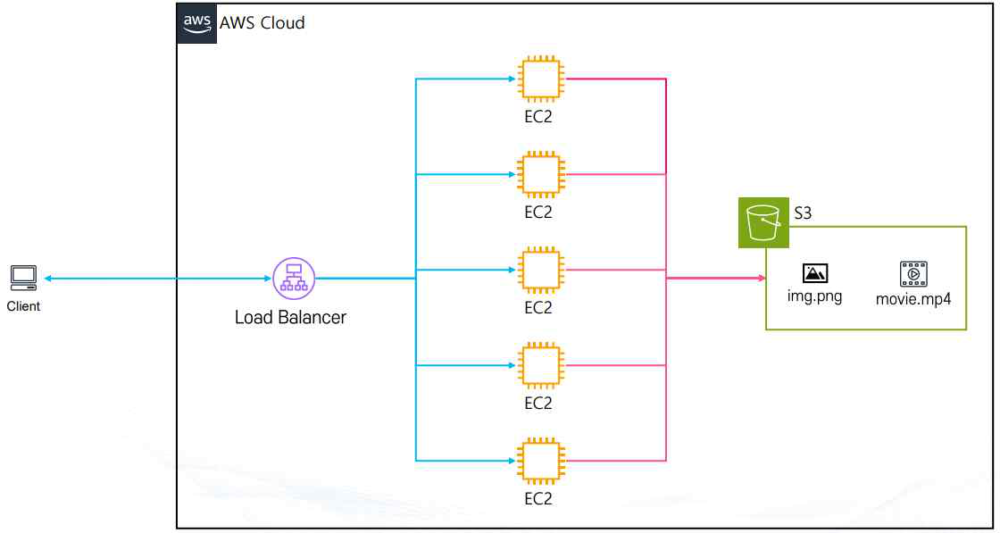

# AWS S3 (Simple Storage Service)

## 1. Amazon S3 개요

**Amazon S3(Simple Storage Service)**는 AWS에서 제공하는 객체 스토리지 서비스로, 데이터를 파일 단위(객체)로 저장하고 필요할 때 인터넷을 통해 어디서든 접근할 수 있다.

**주요 특징**

- **확장성**: 저장 용량에 제한이 없으며, 몇 개의 파일부터 수십억 개의 데이터까지 무제한으로 확장 가능
- **내구성**: 99.999999999%(일명 "11 9's") 내구성을 제공하도록 설계되어 데이터 손실 위험을 최소화
- **가용성**: 전 세계 리전(Region)에 걸쳐 높은 가용성을 제공
- **보안**: IAM, 버킷 정책, 암호화 기능을 통해 데이터 보안을 강화
- **비용 효율성**: 사용한 만큼만 지불하는 종량제(Pay-as-you-go) 모델
- **다양한 스토리지 클래스**: Standard, Intelligent-Tiering, Glacier 등 요구사항에 따라 비용/성능 최적화 가능

**활용 사례**: 웹사이트 정적 콘텐츠(HTML, 이미지, 동영상) 저장 및 배포, 백업 및 복구(Backup & Restore), 로그 저장 및 데이터 레이크(Data Lake) 구축, 빅데이터 분석 및 머신러닝 데이터 저장소, 애플리케이션과 모바일 앱의 파일 저장소

## 2. 파일 스토리지 vs 오브젝트 스토리지

| 구분 | 파일 스토리지(File Storage) | 오브젝트 스토리지(Object Storage) |
|---|---|---|
| 구조 | 계층적 구조(폴더/디렉토리)로 관리 | 오브젝트 단위(데이터 + 메타데이터 + 고유 ID)로 저장 |
| 접근 방식 | 경로를 통해 빠르게 파일을 찾고 업데이트 | 계층 구조가 아닌 ID(키)로 접근 (정확한 경로를 몰라도 접근 가능) |
| 확장성 | 제한적 (보통 수십 TB 수준) | 매우 뛰어남 (수십~수백 PB 이상 가능) |
| 예시 | 게임 설치 파일, PC 프로그램 등 (로컬 드라이브, NAS) | AWS S3, 구글 드라이브, 네이버 클라우드 |
| 비유 | 게임을 설치해서 실행할 수 있는 PC 저장소 | 구글 드라이브처럼 단순 저장/공유는 가능하지만 게임·프로그램 설치는 불가능 |

## 3. EC2와 S3를 활용한 아키텍처

로드 밸런서 뒤에 여러 개의 EC2 인스턴스가 있고 각 EC2가 웹페이지에서 제공할 이미지·동영상 파일을 직접 저장하는 경우, 모든 인스턴스마다 동일한 파일을 따로 보관해야 하므로 **중복 저장**이 발생하고 디스크 용량이 낭비된다. 또한 파일을 수정하려면 각 EC2에 일일이 업데이트해야 하므로 인스턴스 수가 늘어나면 관리가 매우 불편해진다.

이 문제를 해결하기 위해 AWS S3를 활용하면 모든 EC2가 중앙의 하나의 스토리지에서 파일을 공유하도록 구성할 수 있다. EC2에는 최소한의 웹 애플리케이션 코드만 두고, 이미지·동영상 같은 정적 파일은 S3 버킷에 저장하여 관리한다.



**장점**

- **파일 중앙화**: 모든 EC2가 하나의 S3 버킷에서 동일한 파일을 참조 (중복 저장 불필요)
- **확장성**: EC2 인스턴스를 수십, 수백 대로 늘려도 파일 관리 부담 없음
- **유지보수 용이성**: 파일을 S3에서 한 번만 업데이트하면, 모든 EC2가 동일하게 최신 파일을 서비스
- **비용 절감**: EC2 디스크에는 최소한의 웹 애플리케이션 코드만 두고, 정적 파일은 저렴한 S3에 보관

## 4. 버킷(Bucket)과 객체(Object)

### 버킷(Bucket)

- Amazon S3에서 데이터를 저장하는 가장 기본적인 단위로, 파일 시스템의 디렉토리/폴더와 유사한 개념이다. 모든 객체(Object)는 반드시 하나의 버킷에 속해 저장된다.
- **네이밍 규칙**: 버킷 이름은 전 세계에서 고유해야 한다. 특정 리전에 버킷을 생성하더라도 이름 자체는 글로벌하게 유일해야 하므로, "서울 리전"과 "도쿄 리전"에 같은 이름의 버킷을 만들 수 없다.
- **리전과의 관계**: 버킷을 만들 때 특정 리전을 선택해야 하며, 데이터는 해당 리전에 실제로 저장된다.
- **용량**: 최소 0 Byte ~ 최대 5 TB (객체 하나 기준), 버킷 자체의 저장 용량에는 사실상 제한이 없다.

### S3 객체(Object)의 구성 요소

| 요소 | 설명 |
|---|---|
| Owner(소유자) | 이 파일을 만든 사람 또는 계정 |
| Key(파일 이름) | 파일을 구분하는 고유한 이름 (폴더 안의 파일명 같은 개념) |
| Value(파일 데이터) | 실제 저장된 파일의 내용 (이미지, 동영상, 문서 등) |
| Version Id(버전 아이디) | 같은 이름의 파일이 여러 버전으로 저장될 때 각각을 구분하는 번호 |
| Metadata(메타데이터) | 파일 생성일, 파일 형식, 크기 등 추가 정보 |
| ACL(권한 설정) | 이 파일을 누가 읽거나 쓸 수 있는지 정하는 권한 정보 |
| Torrents(토렌트 정보) | 대용량 파일을 여러 사용자와 동시에 공유하는 기능 (현재는 잘 사용되지 않음) |

## 5. S3 보안 설정 기초

- **기본 접근 권한**: 새로 만든 S3 버킷은 기본적으로 **Private(비공개)** 상태다 — 만든 사람(소유자)만 접근할 수 있고 외부에서는 볼 수 없다. 필요하다면 설정을 바꿔 특정 사용자나 불특정 다수에게 공개할 수 있다(예: 웹 호스팅 시 이미지 파일 공개).
- **보안 단위**: 버킷 단위는 **Bucket Policy**로, 객체 단위는 **ACL(Access Control List)**로 접근 권한을 관리한다.
- **보안 기능**
  - **MFA 삭제 방지**: MFA(다중 인증)를 활성화하면 실수나 해킹으로 파일이 삭제되는 것을 방지할 수 있다.
  - **버전 관리(Versioning)**: 같은 이름의 파일을 여러 버전으로 보관 가능 (잘못 저장했을 때 이전 버전으로 복구 가능)
  - **액세스 로그 기록**: 누가, 언제, 어떤 요청을 했는지 로그로 남길 수 있다 (다른 버킷이나 계정으로 전송 가능)

## 6. S3 비용 종류

| 비용 유형 | 설명 | 예시(ap-northeast-2 기준) |
|---|---|---|
| 데이터 보관 비용(Storage Cost) | 저장한 데이터 용량(GB)에 따라 과금 | Standard 기준 약 $0.025/GB → 100GB 저장 시 월 약 2.5달러 |
| 데이터 요청 비용(Request Cost) | 업로드(PUT), 복사(COPY), 조회(LIST) 등 요청 단위로 과금 | 약 $0.0045~$0.01/1,000 requests |
| 데이터 전송 비용(Transfer Cost) | S3에서 인터넷으로 데이터를 꺼낼 때(OutBound) 과금 | GB당 약 $0.09, 단 같은 리전 내 EC2 ↔ S3 전송은 무료 |
| 기타 부가 비용 | 서버 측 암호화, 수명 주기 정책, 복제(Replication) 사용 시 추가 비용 발생 가능 | - |

## 7. S3 스토리지 클래스

S3는 저장 목적과 예산에 따라 **파일 저장 클래스(File Storage Classes)**와 **아카이브 클래스(Archive Storage Classes)**로 나뉜다.

### 파일 저장 클래스 (실시간 서비스 운영용)

데이터를 밀리초 단위로 바로 읽고 쓸 수 있으며, 다중 AZ에 복제 저장되어 높은 내구성과 가용성을 보장한다. `S3 Express One Zone → S3 Standard → S3 Standard-IA → S3 One Zone-IA` 순으로 우측으로 갈수록 저렴해진다.

| 클래스 | 저장 방식 | 최소 저장 용량/기간 | 저장 비용(GB당) | 특징·사용 사례 |
|---|---|---|---|---|
| **S3 Standard** | 3개 이상 AZ 분산 | 제한 없음 | 약 $0.025 | 가용성 99.99%, 자주 접근하는 데이터 (웹/모바일 서비스 파일) |
| **S3 Standard-IA** | 3개 이상 AZ 분산 | 128KB / 30일 | 약 $0.0138 | 저장은 저렴, 조회 시 비용 큼(요청 비용 약 $0.01/1000) — 백업·재해복구용 |
| **S3 One Zone-IA** | 단일 AZ | 128KB / 30일 | 약 $0.011 | AZ 장애 시 데이터 손실 가능, 가장 저렴한 IA 옵션 — 쉽게 재생성 가능한 썸네일 등 |
| **S3 Express One Zone** | 단일 AZ의 Directory Bucket | - | 약 $0.16(us-east-1) | 응답 속도 약 10배(밀리초 단위), 요청 비용 Standard 대비 50% 저렴, 서울 리전 미지원 |
| **S3 Intelligent-Tiering** | 자동 티어링 | - | Standard/IA 자동 전환 | 머신러닝 기반으로 Standard ↔ IA 자동 전환, 접근 패턴을 예측하기 어려운 데이터에 적합 |

### 아카이브 클래스 (장기 보관용)

저장 비용이 매우 저렴한 대신, 데이터를 꺼내려면 검색 요청 과정이 필요하다(몇 분~수 시간). `S3 Glacier Instant Retrieval → S3 Glacier Flexible Retrieval → S3 Glacier Deep Archive` 순으로 우측으로 갈수록 저렴해진다.

| 클래스 | 최소 저장 용량/기간 | 접근 속도 | 저장 비용(GB당) | 사용 사례 |
|---|---|---|---|---|
| **S3 Glacier Instant Retrieval** | 128KB / 90일 | 밀리초 단위(즉시) | 약 $0.005 | 의료 이미지, 뉴스 아카이브 등 드물게 쓰지만 즉시 조회가 필요한 데이터 |
| **S3 Glacier Flexible Retrieval** | 40KB / 90일 | 분~시간 단위 | 약 $0.0045 | 장애 복구용·백업 데이터 등 긴급 상황에만 필요한 데이터 |
| **S3 Glacier Deep Archive** | 40KB / 180일 | 12~48시간 | 약 $0.002 | 오래된 로그, 법적 규제로 보관해야 하는 문서 등 (S3 클래스 중 최저가) |

**전환 시 유의사항(Waterfall 모델)**: 시간이 지남에 따라 데이터를 점점 더 저렴한 티어로 이동하는 것(Standard → IA → Glacier → Glacier Deep Archive)은 가능하지만, 반대로 다른 클래스에서 Standard로 되돌리는 것은 불가능하다. 128KB 미만 파일은 Standard-IA, Intelligent-Tiering, Glacier Instant Retrieval로 이동할 수 없다.

## 8. S3 권한 (IAM 정책 · 버킷 정책 · ACL)

S3 권한은 누가 어떤 작업을 어떤 객체나 버킷에 대해 수행할 수 있는지를 정의하는 보안 메커니즘이며, 크게 세 가지로 나뉜다.

| 방식 | 적용 대상 | 설명 |
|---|---|---|
| **IAM 정책** | IAM 사용자, 그룹, 역할 | 예: "이 사용자는 S3 버킷 안에서 파일을 읽기만 할 수 있다" |
| **버킷 정책(Bucket Policy)** | 버킷 자체 | 특정 사용자·계정이 해당 버킷을 읽거나 쓸 수 있도록 허용/거부. 예: "협력사 계정만 이 버킷 안 파일을 다운로드할 수 있다" |
| **ACL(Access Control List)** | 객체·버킷 단위 | 옛날 방식의 권한 부여. 지금은 거의 쓰지 않고 IAM 정책·버킷 정책을 주로 사용 (AWS 비권장) |

### S3 주요 액션(Action) 분류

| 분류 | 대표 액션 | 설명 |
|---|---|---|
| Get 계열(조회) | `s3:GetObject`, `s3:GetBucketAcl`, `s3:GetBucketPolicy`, `s3:GetLifecycleConfiguration` | 객체 다운로드, ACL/정책/수명주기 조회 등 |
| Put 계열(생성·수정) | `s3:PutObject`, `s3:PutBucketPolicy`, `s3:PutLifecycleConfiguration`, `s3:PutEncryptionConfiguration` | 객체 업로드, 정책·수명주기·암호화 설정 변경 |
| Delete 계열(삭제) | `s3:DeleteObject`, `s3:DeleteBucket`, `s3:DeleteBucketPolicy` | 객체·버킷·정책 삭제 |
| List 계열(목록) | `s3:ListBucket`, `s3:ListAllMyBuckets`, `s3:ListBucketVersions` | 버킷 안 객체 목록, 계정 내 전체 버킷 목록 조회 |
| Create 계열(생성) | `s3:CreateBucket`, `s3:CreateAccessPoint`, `s3:CreateJob` | 버킷, Access Point, Batch Operations 작업 생성 |
| Update 계열(갱신) | `s3:UpdateAccessPoint`, `s3:UpdateJobPriority` | Access Point 속성, Batch Operation 우선순위 변경 |

### ARN(Amazon Resource Name) 표기 예시

- `arn:aws:s3:::my-bucket/*` — 버킷 안의 모든 객체
- `arn:aws:s3:::my-bucket/upload/*` — 버킷 안에서 Key가 `upload/`로 시작하는 모든 객체(=폴더처럼 취급되는 접두사)

## 9. S3 버킷 정책 실습

버킷 정책은 버킷 단위로 부여되는 리소스 기반 정책(Resource-based Policy)으로, 리소스의 계층 구조(Key 경로)에 따라 세부적으로 권한을 부여할 수 있다. 모든 S3 버킷은 기본적으로 Private이므로, 정책을 설정하지 않으면 외부에서 접근할 수 없다.

### Principal 지정 방법

| 의미 | Principal 값 |
|---|---|
| 전 세계 모든 사용자에게 허용 | `"*"` |
| 특정 계정(root + 모든 User/Role) 전체 | `arn:aws:iam::123456789012:root` |
| 특정 계정의 특정 IAM 사용자만 | `arn:aws:iam::123456789012:user/admin` |
| 특정 계정의 특정 IAM 역할만 | `arn:aws:iam::123456789012:role/RoleName` |

### 예시 1 — 모든 사용자에게 객체 다운로드 허용

```json
{
  "Version": "2012-10-17",
  "Statement": [
    {
      "Sid": "StatementAllow",
      "Effect": "Allow",
      "Principal": "*",
      "Action": "s3:GetObject",
      "Resource": "arn:aws:s3:::my-bucket/*"
    }
  ]
}
```

이 정책은 "모든 사람이 `my-bucket` 버킷 안에 있는 파일을 다운로드할 수 있다"는 의미이며, 정적 웹 호스팅에서 흔히 사용하는 패턴이다.

### 예시 2 — 실습: 나만의 S3 홈 디렉토리 만들기

IAM 사용자별로 자신의 이름과 동일한 하위 경로(`home/사용자이름/`)에만 접근할 수 있도록 버킷 정책의 `${aws:username}` 변수를 활용할 수 있다.

```json
{
  "Version": "2012-10-17",
  "Statement": [
    {
      "Sid": "ListSpecificBucket",
      "Effect": "Allow",
      "Principal": "*",
      "Action": "s3:ListBucket",
      "Resource": "arn:aws:s3:::my-bucket",
      "Condition": {
        "StringLike": {
          "s3:prefix": [
            "",
            "home/",
            "home/${aws:username}/*"
          ]
        }
      }
    },
    {
      "Sid": "FullAccessToUserHome",
      "Effect": "Allow",
      "Principal": "*",
      "Action": "s3:*",
      "Resource": [
        "arn:aws:s3:::my-bucket/home/${aws:username}",
        "arn:aws:s3:::my-bucket/home/${aws:username}/*"
      ]
    }
  ]
}
```

- 첫 번째 Statement: 버킷 목록 조회(`ListBucket`) 시 조회 가능한 경로(prefix)를 최상위, `home/`, 로그인한 사용자 이름과 동일한 경로로 제한한다.
- 두 번째 Statement: `home/${aws:username}` 경로(및 그 하위)에 대해서만 모든 S3 작업(`s3:*`)을 허용한다 — 즉 IAM 사용자마다 자신의 홈 디렉토리에만 전체 권한을 갖는다.

## 10. S3의 계층 구조 (Key)

AWS S3 콘솔에서는 마치 디렉토리(폴더) 구조처럼 보이지만, 내부적으로는 계층 구조가 존재하지 않고 단순히 **키(Key) 문자열**로 관리된다.

- S3 객체는 항상 버킷 안에 저장되며, 각 객체는 고유한 키(Key) 값을 갖는다.
- 키 안에 `/` 문자가 있으면 콘솔에서 디렉토리처럼 표시될 뿐, 실제 폴더는 아니다.
- 예시: `s3://mybucket/world/southkorea/seoul/guro/map.json`
  - 버킷명: `mybucket`
  - 키(Key): `world/southkorea/seoul/guro/map.json` (단일 문자열)
  - 콘솔에서는 `/` 기준으로 `world → southkorea → seoul → guro → map.json` 구조처럼 보일 뿐이다.

## 11. S3 버전 관리 (Versioning)

S3 객체의 변경 이력을 여러 버전으로 저장하는 기능이다. 같은 Key 이름의 객체를 다시 업로드해도 기존 객체를 덮어써서 없애는 것이 아니라, 새로운 Version ID를 가진 객체 버전으로 저장한다. 객체를 삭제해도 실제 데이터가 바로 삭제되는 것이 아니라 **Delete Marker**가 생성되어 현재 객체가 삭제된 것처럼 보일 뿐이다.

**활성화 조건과 제약**

- 버킷 단위로 설정하며 기본값은 비활성화 상태다.
- 한 번 활성화하면 완전히 비활성화 상태로 되돌릴 수 없다(필요하면 **Suspend** 상태로 전환 가능). Suspend 상태에서는 기존 버전은 유지되지만 이후 새 버전 생성은 중지된다.
- 버전 관리 활성화 이전에 저장된 기존 객체는 별도의 Version ID가 없는 `null` 버전으로 존재할 수 있다.
- 동일한 Key라도 버전별로 각각 저장 공간을 차지하므로, 버전이 많아질수록 저장 비용이 증가한다 — 예를 들어 10GB 객체의 버전이 5개면 실제 사용량은 50GB로 계산되어 과금된다.

**동작 예시 (test.jpg)**

1. **파일 생성**: `test.jpg` 최초 업로드 → 버전 ID `11111` 생성, 최신 버전
2. **파일 업데이트**: 같은 키로 재업로드 → 새 버전 `22222` 생성, `11111`은 과거 버전으로 남음
3. **파일 삭제**: 삭제 마커(Delete Marker)가 최신 버전으로 추가됨 — 실제 데이터는 삭제되지 않고 `22222`, `11111` 그대로 보존
4. **삭제 마커 제거**: 삭제 마커만 제거하면 바로 아래 버전(`22222`)이 다시 최신으로 복원
5. **최신 버전 조회**: 버전 ID를 지정하지 않으면 항상 최신 버전 반환, 과거 버전은 Version ID를 명시해야 조회 가능
6. **특정 버전 삭제**: Version ID를 지정해 과거 버전 하나만 영구 삭제 가능 (최신 버전이 아니면 사용자에게 보이는 결과는 그대로)
7. **롤백**: 최신 버전(`22222`)을 삭제하면 바로 아래 버전(`11111`)이 자동으로 최신이 되어 롤백된 것과 같은 효과
8. **MFA Delete**: 버전 삭제·삭제 마커 제거 같은 민감한 작업에 MFA 토큰을 요구하도록 설정하면 오남용·계정 탈취로 인한 대량 삭제를 방지할 수 있다 (일반 콘솔 설정이 아니라 버킷 소유자 Root 계정 + AWS CLI/API로만 설정 가능)

**Lifecycle 연동**: 오래된 이전 버전을 다른 스토리지 클래스로 자동 이동하거나, 일정 기간이 지난 이전 버전·삭제 마커를 자동 삭제하도록 Lifecycle 규칙과 연동할 수 있다 (예: 90일 지난 이전 버전을 Glacier로 이동).

## 12. S3 객체 잠금 (Object Lock)

S3 객체를 삭제하거나 덮어쓰지 못하도록 보호하는 기능으로, **WORM(Write Once, Read Many)** 모델을 지원한다 — 한 번 저장한 객체를 지정된 기간 동안 변경·삭제하지 못하도록 보호한다. 랜섬웨어, 실수로 인한 삭제, 내부자의 악의적인 삭제로부터 중요 데이터를 보호할 수 있다.

- **활성화 조건**: Versioning이 활성화된 버킷에서만 사용 가능하며, 객체의 특정 버전을 보호하는 방식으로 동작한다.
- **사용 목적**: 규제 준수(법률/규정상 데이터 보존 기간 충족), 데이터 보호(랜섬웨어·내부자 위협 방지), 감사 및 기록 보존

**보호 방식 두 가지**

| 방식 | 설명 |
|---|---|
| **Retention Mode** | 지정된 기간(Retain Until Date) 동안 객체를 삭제하지 못하도록 보호 |
| **Legal Hold** | 종료 날짜 없이 Hold가 해제될 때까지 무기한 보호. Retention Mode와 독립적으로(동시에도) 적용 가능 |

**Retention Mode의 두 유형**

- **Compliance Mode**: 가장 강력한 보호 방식. 보존 기간이 끝날 때까지 삭제 불가, 보존 기간 단축·잠금 해제 불가 — **Root 사용자를 포함해 누구도 우회할 수 없다**. 금융 거래 기록 7년 보관, 의료·감사 기록 등 엄격한 법적 규제 환경에서 사용.
- **Governance Mode**: 일반 사용자·관리자는 삭제가 제한되지만, `s3:BypassGovernanceRetention` 권한을 가진 사용자는 보존 설정을 우회할 수 있다. Compliance Mode보다 유연하며 내부 데이터 보호 정책이나 테스트 환경에 적합하다.

## 13. Amazon S3 수명주기 (Lifecycle)

많은 버전과 오래된 파일이 쌓이면 관리가 어려워진다. S3 수명 주기를 활용하면 일정 기간이 지난 객체에 대해 자동으로 상태를 변경하거나 삭제할 수 있다.

### 전환 작업(Transition actions)

일정 기간 이후 객체의 스토리지 클래스를 더 저렴한 티어로 자동 변경한다. 예: 30일 후 Glacier로 이동, 50일 후 Standard-IA로 이동. 수명 주기 규칙은 기존에 저장된 오래된 객체에도 소급 적용된다.

### 만료 작업(Expiration actions)

일정 기간이 지나면 객체를 자동으로 삭제한다. 예: 업로드 후 90일 지난 로그 파일 자동 삭제.

- **버전 관리 비활성화 버킷**: 객체가 비동기(async) 방식으로 영구 삭제된다.
- **버전 관리 활성화 버킷**: 현재 버전이 delete marker가 아니면 새 delete marker를 추가해 최신 버전으로 표시하고, 이미 delete marker 상태라면 아무 동작도 하지 않는다.
- 삭제 날짜가 되어도 즉시 삭제되지 않고 일정 지연이 발생할 수 있으며(이 지연 동안 추가 비용은 없음), UTC 기준으로 실행되어 첫 규칙 수행까지 최대 약 48시간 걸릴 수 있다.

### 수명 주기 필터링 조건

| 필터 유형 | 설명 | 예시 |
|---|---|---|
| Prefix(접두사) | 객체 키의 시작 문자열 기준 | `/log/production` 경로만 정책 적용 |
| Tag | 객체 태그(Key=Value) 기준, AND 조건 결합 가능 | `Environment=Dev` 태그 객체만 삭제 |
| 객체 크기 | 파일 크기 기준 | 5MB 이상 파일만 IA로 이동 |

필터는 조합해서 사용할 수 있다 — 예: `/image` 경로에 있으면서 크기가 5MB 이상이고 `Archive=True` 태그가 있는 객체만 Glacier로 전환.

## 14. S3 정적 웹 호스팅

### 정적 콘텐츠 vs 동적 콘텐츠

| 구분 | 정적 콘텐츠(Static) | 동적 콘텐츠(Dynamic) |
|---|---|---|
| 정의 | 사용자·요청 조건과 무관하게 동일한 내용 제공 | 사용자, 시간, 입력값, DB 상태에 따라 내용이 달라짐 |
| 처리 방식 | 저장된 파일을 그대로 전달, 서버 연산 없음 | 서버가 프로그램 실행·DB 조회 후 결과 생성 |
| 예시 | HTML, CSS, JS, 이미지, 동영상 | 로그인 정보, 게시판·댓글, 쇼핑몰 장바구니, 실시간 재고 |
| 장점 | 빠른 응답, 서버 자원 소모 적음, CDN 연계 쉬움 | 사용자 맞춤형·실시간 데이터 반영 가능 |
| 단점 | 변경 시 파일을 직접 수정·재배포해야 함 | 서버 부하 증가, 응답 속도 저하 가능 |

### Amazon S3 Static Hosting

S3 버킷을 이용해 정적 웹 콘텐츠를 별도의 서버(EC2 등) 없이 직접 웹 사이트처럼 호스팅하는 기능이다.

- **장점**: AWS가 관리하는 서비스라 고가용성 보장, Serverless 구조로 유지비 절감, 파일만 업로드/수정하면 즉시 반영
- **제약사항**: 기본적으로 도메인 주소 변경 불가·HTTPS 불가 — Route 53(도메인 서비스)이나 CloudFront(CDN)와 연동하면 도메인 연결과 HTTPS 적용이 가능하다. 단, Route 53으로 도메인을 연결하려면 **버킷 이름과 도메인 이름이 동일해야 한다.**
- **사용 사례**: 대규모 접속이 예상되는 이벤트/사전 예약 페이지, 단순 홍보용 랜딩 페이지, 회사 소개 웹사이트

### 정적 호스팅용 버킷 정책

퍼블릭 액세스 차단을 해제한 뒤, 모든 사용자에게 객체 다운로드만 허용하는 정책을 적용한다.

```json
{
  "Version": "2012-10-17",
  "Statement": [
    {
      "Sid": "Statement1",
      "Effect": "Allow",
      "Principal": "*",
      "Action": "s3:GetObject",
      "Resource": "arn:aws:s3:::my-bucket/*"
    }
  ]
}
```

## 15. S3 기타 기능과 실습

### Amazon S3 액세스 로깅 (Access Logging)

특정 버킷에 대한 접근 기록(누가, 언제, 어떤 요청을 했는지)을 남기고, 이 로그를 **다른 S3 버킷**에 저장하는 기능이다. 기록 대상 버킷과 로그 저장 버킷을 반드시 분리해야 한다 — 같은 버킷에 로그를 저장하면 로그가 로그를 남기는 무한 생성 문제가 발생할 수 있다.

- **로그 내용**: 요청 시간, 요청자 IP, 요청 방식(GET/PUT 등), 성공/실패 여부
- **활용**: 보안 감사(의심스러운 접근 탐지), 트래픽 분석, 오류 발생 시 원인 추적. 로그는 일반 텍스트로 저장되어 Athena, CloudWatch, ELK 등과 연동 가능

### Amazon S3 이벤트 알림 (Event Notification)

S3 버킷 안에서 객체가 생성·삭제·수정되는 이벤트가 발생했을 때, 이를 자동으로 감지해 다른 AWS 서비스(SNS, SQS, Lambda 등)로 알림을 보내는 기능이다.

**실습: Lambda를 이용한 이미지 자동 리사이징**

S3에 이미지가 업로드되는 이벤트를 트리거로 Lambda 함수를 실행해, 원본 이미지를 리사이징한 뒤 같은 버킷의 `resized/` 경로에 다시 저장하는 구성이다.

```js
const { S3Client, GetObjectCommand, PutObjectCommand } = require('@aws-sdk/client-s3');
const sharp = require('sharp');

const s3Client = new S3Client();
// Lambda 배포 전 의존성 설치: npm install --platform=linux --arch=x64 sharp

exports.handler = async (event) => {
    const srcBucket = event.Records[0].s3.bucket.name;
    const srcKey = decodeURIComponent(event.Records[0].s3.object.key.replace(/\+/g, " "));

    const typeMatch = srcKey.match(/\.([^.]*)$/);
    if (!typeMatch) return;

    const imageType = typeMatch[1].toLowerCase();
    if (imageType !== "jpg" && imageType !== "png") return;

    const origImageResponse = await s3Client.send(new GetObjectCommand({ Bucket: srcBucket, Key: srcKey }));
    const origImage = await streamToBuffer(origImageResponse.Body);

    const width = parseInt(process.env.width) || 200;
    const height = parseInt(process.env.height) || 200;
    const buffer = await sharp(origImage).resize(width, height).toBuffer();

    await s3Client.send(new PutObjectCommand({
        Bucket: srcBucket,
        Key: "resized/" + srcKey,
        Body: buffer,
        ContentType: "image"
    }));
};

const streamToBuffer = async (stream) => new Promise((resolve, reject) => {
    const chunks = [];
    stream.on('data', (chunk) => chunks.push(chunk));
    stream.on('end', () => resolve(Buffer.concat(chunks)));
    stream.on('error', reject);
});
```

- S3 버킷의 **이벤트 알림** 설정에서 `PUT`(객체 생성) 이벤트가 발생하면 이 Lambda 함수를 호출하도록 트리거를 등록한다.
- 리사이징에 사용한 `sharp` 라이브러리는 네이티브 바이너리를 포함하므로, 로컬 개발 환경과 Lambda 실행 환경(Linux x64)이 다르면 `npm install --platform=linux --arch=x64 sharp`로 Lambda용 바이너리를 별도 설치해야 한다.
- 원본과 리사이징 결과를 같은 버킷의 다른 경로(`resized/`)에 저장하면, 원본 삭제 없이 썸네일만 별도로 제공할 수 있다 (단, 같은 버킷에 다시 업로드하면 동일 이벤트가 재귀적으로 트리거되지 않도록 접두사 필터를 반드시 설정해야 한다).

**다른 활용 예시**: 새 파일 업로드 시 Lambda로 바이러스·무결성 검사, SNS로 관리자에게 알림 전송, 대량 업로드 이벤트를 SQS 큐에 쌓아 후속 애플리케이션에서 순차 처리.
