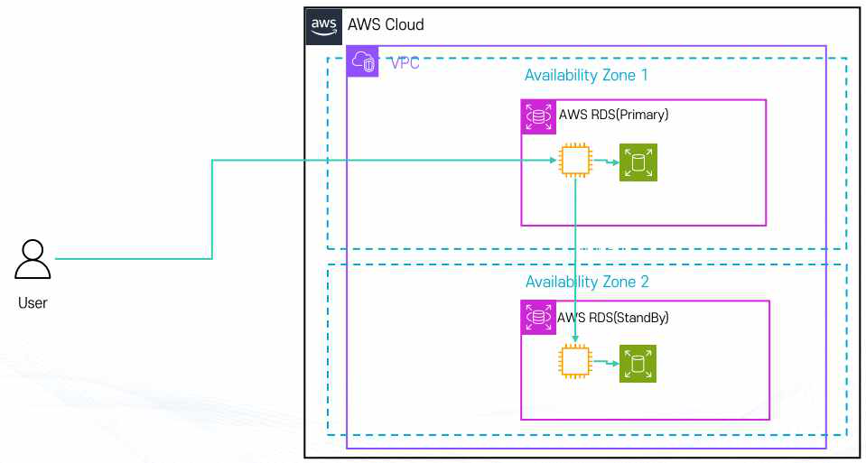
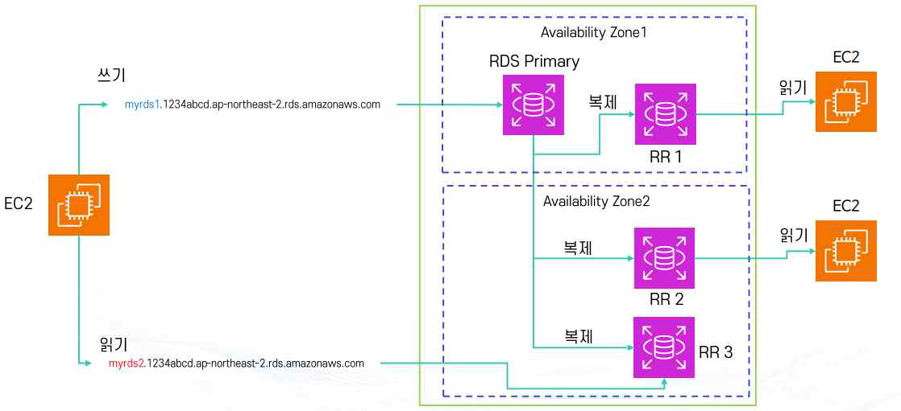
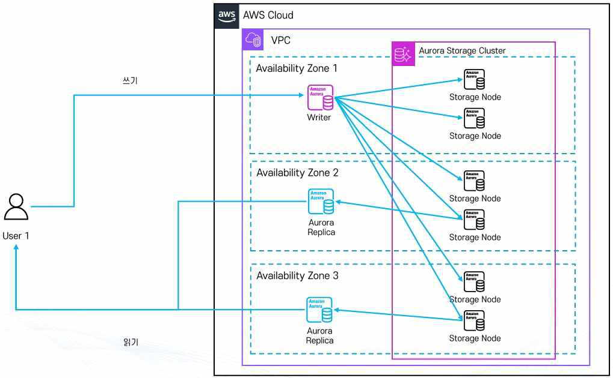

# AWS RDS (Relational Database Service)

## 1. RDB (Relational DataBase) 개요

**RDB(관계형 데이터베이스)**는 데이터 간의 관계에 집중하는 데이터베이스로, 사전에 정의된 구조(스키마)에 따라 데이터를 저장한다. 엑셀처럼 행(Row)과 열(Column) 형태로 구성된 테이블 단위로 데이터를 관리한다.

**특징**

- **스키마 기반 저장**: 데이터의 형식(숫자, 문자, 날짜 등)을 미리 정의하고, 정의된 형식에 맞는 데이터만 입력 가능
- **테이블 간 관계 정의**: 여러 테이블을 연결(Join)해서 데이터 활용 가능 (예: 회원 테이블 + 주문 테이블로 어떤 회원이 어떤 상품을 샀는지 확인)
- **고유한 키(Primary Key)**로 각 행을 구분
- **트랜잭션 지원 (ACID)**: 원자성(Atomicity, 전부 성공 또는 전부 실패), 일관성(Consistency, 정의된 규칙 항상 준수), 격리성(Isolation, 동시 접근에도 충돌 없음), 지속성(Durability, 저장된 데이터는 장애에도 보존)

**장단점**

| 장점 | 단점 |
|---|---|
| 데이터 구조가 명확하고 신뢰성 높음 | 유연성이 떨어짐(스키마 수정 필요) |
| SQL 표준 언어로 검색·추가·수정·삭제 가능 | 대규모 데이터(빅데이터) 처리 시 속도가 느릴 수 있음 |
| 안정적이고 중요한 데이터 처리에 적합 | - |

**대표적인 관계형 DBMS**: Oracle(대규모 기업용), MySQL(오픈소스, 웹 서비스에 많이 사용), PostgreSQL(강력한 기능, 오픈소스), MS SQL Server(마이크로소프트 환경 최적화), Amazon RDS(AWS 관리형 RDB 서비스). Oracle·MS SQL Server는 RDS 사용료에 라이선스 비용이 추가로 과금된다.

## 2. AWS RDS 개요

**RDS(Relational Database Service)**는 AWS에서 제공하는 관리형 관계형 데이터베이스 서비스로, 사용자가 직접 서버를 설치·운영하지 않고도 클라우드에서 DB를 생성·설정·운영·확장할 수 있다. MySQL, PostgreSQL, MariaDB, Oracle, SQL Server, Amazon Aurora 등 다양한 DB 엔진을 지원한다.

**RDS의 장점**

| 항목 | 설명 |
|---|---|
| 운영 자동화 | 하드웨어 프로비저닝, OS 패치, DB 설치, 보안 패치, 백업 등을 AWS가 자동 처리 |
| 비용 효율성 | 사용한 만큼 지불(Pay-as-you-go), 운영·관리 인력 비용 절감 |
| 확장성 | 인스턴스 크기·스토리지 용량 변경 가능, 읽기 전용 복제본(Read Replica)으로 읽기 성능 향상 |
| 고가용성 | Multi-AZ 배포 시 자동 장애조치(Failover), 자동 백업·스냅샷으로 시점 복구(Point-in-Time Restore) |
| 보안 | 데이터 암호화(KMS), TLS 전송 암호화, IAM 통합 접근 제어 |

**특징**: 관계형 데이터베이스(SQL) 기반이며 NoSQL(DynamoDB, DocumentDB 등)과 대비된다. 가상 머신 위에서 동작하지만 직접 시스템에 로그인할 수 없다 — OS 관리·패치는 AWS가 담당한다. RDS 자체는 서버리스가 아니며(Amazon Aurora만 별도로 Aurora Serverless 제공), 암호화·자동 백업 기능이 기본 제공된다.

## 3. RDS와 EC2

Amazon RDS는 내부적으로 EC2 인스턴스 위에서 동작한다 — 직접 EC2에 DB를 설치하지 않아도 AWS가 대신 EC2 + DB 환경을 관리해주는 형태다.

- **동작 환경**: VPC(가상 네트워크) 안에서 실행되며, 기본적으로 Public IP가 없으면 외부 접근이 불가하다. 접근하려면 반드시 서브넷과 보안 그룹 설정이 필요하다.
- **EC2 타입과 스토리지**: RDS도 EC2 인스턴스 타입 지정이 필요하다(예: `db.t3.micro`, `db.m5.large`). 스토리지는 EBS를 사용하며 종류(범용 SSD, 프로비저닝 IOPS SSD 등)와 용량을 선택할 수 있다.
- **운영**: 중지 가능하지만 **중지 후 7일 이내에 다시 시작해야 하며, 7일이 지나면 자동으로 다시 시작된다.**
- **백업**: 자동 백업 및 스냅샷 생성 가능
- **비용 최적화**: 온디맨드(사용한 만큼 지불) 또는 리저브드 인스턴스(1년/3년 약정 시 최대 70% 할인)

**사용 사례**: 기업용 ERP·CRM, 온라인 쇼핑몰·금융 서비스, 온라인 게임(회원·결제 관리), 데이터 분석 및 BI 도구 연계

## 4. RDS 고가용성 아키텍처 (Multi-AZ)

RDS 데이터베이스를 두 개 이상의 가용 영역(AZ)에 걸쳐 배포하는 방식이다. 하나는 **Primary DB(주 DB)**, 다른 하나는 **Standby DB(대기 DB)**로 구성되며, 두 DB는 자동으로 동기화되어 같은 데이터를 유지한다.



- **Primary DB**: 사용자가 직접 접속하는 메인 데이터베이스로, 모든 읽기/쓰기 요청을 처리한다. 흔히 "RDS 인스턴스"라고 부르는 것이 바로 이 Primary DB다.
- **Standby DB**: 별도의 AZ에 위치하며, 평상시에는 사용자 요청을 처리하지 않고 Primary DB의 변경 사항을 실시간 동기화만 한다. **직접 접근이 불가능**하다(읽기/쓰기 불가) — 즉 성능 향상이 아니라 안정성·가용성 보장이 목적이다.
- **장애 발생 시**: Primary DB에 장애가 생기면 AWS가 자동으로 Standby DB를 승격(Promotion)한다. 사용자는 동일한 DB 접속 주소(엔드포인트)로 접속하므로 별도 조치가 필요 없다 — 이 과정을 **자동 Failover**라고 한다.

**장점**: 장애 발생 시 서비스 중단 최소화(자동 Failover), 실시간 동기화로 데이터 손실 위험 감소, 기업용 서비스의 안정성 확보

## 5. 읽기 전용 복제본 (Read Replica)

RDS에서 원본 데이터베이스(Primary)의 **읽기 전용 복제본**을 생성하는 기능이다. Multi-AZ의 Standby DB와 달리, Read Replica는 **비동기(Async) 방식**으로 복제되므로 원본과 복제본 간에 약간의 지연(Lag)이 있을 수 있다.



- **동작 방식**: 쓰기(Write) 작업은 반드시 원본 DB에서 처리하고, 읽기(Read) 작업은 복제본에서 처리할 수 있다 — 여러 복제본을 두면 읽기 요청을 분산해 성능을 향상시킨다.
- **목적**: 안정성보다는 **성능(읽기 처리량 향상, 워크로드 분산)**이 목적이다. 원본 DB에 장애가 나면 복제본을 직접 승격시켜 원본으로 사용할 수 있지만, 이 경우 DNS 주소 변경을 **수동**으로 해줘야 한다(Multi-AZ의 자동 Failover와 다른 점).
- **장점**: 읽기 요청이 많은 애플리케이션(뉴스 사이트, 전자상거래 상품 조회 등)에 유리, DB 부하 분산으로 응답 속도 개선, 여러 리전에 복제본을 두면 전 세계 사용자에게 빠른 응답 제공 가능

## 6. Amazon RDS 접속

**RDS 생성 시 IP 종류**

- **Private IP(기본 할당)**: VPC 내부 리소스가 RDS에 접속할 때 사용, RDS가 위치한 서브넷에 따라 IP Range 결정
- **Public IP(옵션)**: 퍼블릭 접근 허용을 선택했을 경우에만 할당 (RDS가 Private 서브넷에 있으면 할당되지 않음)

RDS의 IP는 고정되지 않는다 — 인스턴스 중지 후 재시작, DB 인스턴스 교체, AWS 점검, OS 패치, DB 엔진 버전 업데이트 등으로 바뀔 수 있다. 그래서 **IP로 직접 접속하지 말고 DNS(엔드포인트 주소)를 이용해야 한다** — RDS 엔드포인트는 AWS가 자동으로 연결된 IP를 갱신해주므로 안정적이다.

**Production 환경 접속 방법**: 실제 운영 DB는 보안상 프라이빗 서브넷에 두는 경우가 많다. 외부에서 접속하려면 다음 방법을 사용한다.

- **Bastion Host**: 퍼블릭 서브넷에 점프 서버를 두고, 이를 통해 프라이빗 서브넷의 RDS에 접속
- **EC2 Instance Connect Endpoint(무료)**: AWS 제공 기능으로 원격 접속 가능. 단, 3389 포트만 활용 가능
- **VPN / Direct Connect**: 회사 내부망과 AWS VPC를 연결하여 안전하게 접근

## 7. Amazon RDS 인증 방식

| 방식 | 설명 |
|---|---|
| **Username/Password** | 가장 기본적인 인증. 비밀번호는 AWS Secrets Manager에 안전하게 저장·관리할 수 있으며, 코드에 직접 넣지 않아도 되고 주기적 자동 로테이션도 가능하다. |
| **IAM DB 인증** | IAM을 활용해 약 15분 유효한 임시 토큰을 발급받아 접속하는 방식. 비밀번호를 저장하지 않아도 되어 보안성이 높다. 토큰 생성에는 `rds-db:connect` 권한이 필요하며, DB 유저 계정에도 IAM 인증 허용을 설정해야 한다. |
| **IAM 조건부 인증** | IAM 정책에 시간·날짜·위치·리소스 태그 등의 조건을 걸어 세밀한 접근 제어. 예: "인턴은 `type:devonly` 태그가 붙은 RDS 인스턴스에 회사 IP로 1월 1일~16일 오전 8시~오후 6시에만 접속 가능" |

**IAM DB 인증 사용자 생성 예시**

```sql
-- IAM 인증 전용 사용자 생성 (일반 비밀번호 없이 AWS 토큰으로만 로그인)
CREATE USER 'testuser' IDENTIFIED WITH AWSAuthenticationPlugin AS 'RDS';

-- 기존 admin 계정도 IAM 인증으로 전환할 경우
ALTER USER 'admin'@'%' IDENTIFIED WITH AWSAuthenticationPlugin AS 'RDS';

-- 권한 부여
GRANT ALL PRIVILEGES ON my-db.* TO 'testuser'@'%';
```

**IAM 인증 토큰 발급 및 접속 흐름**

1. IAM 자격 증명(Access Key 또는 IAM Role)에 `rds-db:connect` 권한이 있는지 AWS가 확인한 뒤, 약 15분간 사용 가능한 임시 인증 토큰을 발급한다.

   ```bash
   aws rds generate-db-auth-token \
     --hostname <RDS 엔드포인트> \
     --port 3306 \
     --region ap-northeast-2 \
     --username testuser
   ```

2. 발급받은 토큰을 비밀번호 자리에 그대로 입력해 접속한다.

   ```bash
   mysql -h <RDS 엔드포인트> -u testuser -p
   # 비밀번호 입력란에 발급받은 토큰 문자열을 붙여넣는다
   ```

3. RDS는 토큰이 AWS에서 정상 발급됐는지, 위조되지 않았는지, 만료(15분)되지 않았는지, 해당 IAM 사용자/Role이 해당 DB 계정으로 접속할 권한이 있는지를 확인한 뒤 접속을 허용한다.

## 8. Amazon Aurora 개요

**Amazon Aurora**는 AWS가 클라우드 환경에 맞게 직접 설계한 완전 관리형 관계형 데이터베이스 서비스다. MySQL 및 PostgreSQL과 호환되며, 기존 애플리케이션과 드라이버를 비교적 적은 변경으로 사용할 수 있다.

- 고성능·고가용성·자동 확장에 초점을 맞춘 구조이며, **DB 인스턴스와 스토리지를 분리**하고 여러 DB 인스턴스가 하나의 분산 스토리지를 공유하는 방식으로 동작한다.
- 기존 MySQL 대비 최대 5배, PostgreSQL 대비 최대 3배 수준의 처리량을 제공하도록 설계되었다.

**주요 특징**

- 스토리지는 데이터 증가에 따라 최소 10GiB부터 자동으로 확장되며(엔진 버전에 따라 최대 128TiB 또는 256TiB), 관리자가 직접 디스크 크기를 늘릴 필요가 없다.
- Reader 인스턴스를 최대 15개까지 구성해 읽기 트래픽을 분산할 수 있다.
- 자동 백업과 Point-in-Time Recovery를 제공한다.
- Writer 장애 시 Reader를 Writer로 승격해 자동 Failover가 가능하다.
- 여러 AZ에 데이터를 분산 저장해 높은 내구성과 가용성을 제공한다.

## 9. Aurora 분산 스토리지 구조

Aurora는 컴퓨팅 영역과 스토리지 영역을 분리한 구조를 사용한다. DB 인스턴스는 SQL 처리·사용자 연결 관리·메모리 처리·트랜잭션 처리를 담당하고, 실제 데이터는 Aurora 전용 분산 스토리지인 **Cluster Volume**에 저장된다. 여러 DB 인스턴스가 각자 별도의 디스크를 쓰는 것이 아니라 하나의 Cluster Volume을 함께 사용하므로, DB 인스턴스에 장애가 발생해도 실제 데이터는 그대로 유지되고 다른 인스턴스가 Writer 역할을 이어받을 수 있다.



**복제본 배치**: 기본적으로 **3개의 AZ**에 데이터를 분산 저장하며, 각 AZ마다 2개씩 총 **6개의 복제본**을 유지한다 (리전에 AZ가 4개 이상 있어도 8개 이상 생성되지 않는다). 일부 복제본에 장애가 발생해도 서비스는 계속된다 — **최대 2개 손실 시에도 쓰기 가능, 최대 3개 손실 시에도 읽기 가능**.

**Quorum 방식**: 쓰기 시 6개 복제본이 모두 응답할 때까지 기다리면 느린 복제본 하나 때문에 전체가 느려질 수 있으므로, Aurora는 일정 개수 이상만 성공하면 완료로 판단한다 — **쓰기는 6개 중 4개 이상 성공 시 완료**로 처리된다.

**Self-Healing**: 손상되거나 누락된 스토리지 복제본을 Aurora가 자동으로 검사하고, 정상 복제본의 데이터를 이용해 자동 복구하는 기능이다. 관리자가 직접 디스크를 복구할 필요가 없다.

> Quorum(장애 중에도 읽기/쓰기를 계속 수행하는 방식)과 Self-Healing(손상된 복제본을 복구하는 기능)은 서로 다른 개념이다.

## 10. Aurora Cluster와 장애 복구

Aurora는 단일 DB 서버가 아니라 **Cluster** 단위로 운영된다. 하나의 Aurora Cluster는 다음으로 구성된다.

- **Primary(Writer) 인스턴스**: 1대, Read/Write 모두 가능 — `INSERT`, `UPDATE`, `DELETE` 등 쓰기 작업 담당
- **Aurora Replica(Reader)**: 최대 15대, `SELECT` 전용 조회만 처리 — 읽기 트래픽을 여러 서버로 분산
- **Aurora 전용 분산 스토리지(Cluster Volume)**

Writer에서 발생한 변경 사항은 스토리지를 통해 Reader에게 **비동기(Async)** 방식으로 전달된다.

**장애 복구(Failover) 과정**

1. Writer 장애 감지
2. 승격 가능한 Reader 선택
3. 선택된 Reader를 새로운 Writer로 승격
4. Cluster Endpoint가 새로운 Writer를 가리키도록 변경
5. 애플리케이션이 새로운 Writer로 다시 연결
6. 서비스 재개

이 과정은 관리자가 직접 서버를 교체하지 않아도 자동으로 수행된다. Reader가 여러 개면 **Failover Priority**로 승격 우선순위를 지정할 수 있고, Reader를 Writer와 다른 AZ에 배치하면 Writer의 AZ 장애 시에도 다른 AZ의 Reader가 승격될 수 있다. 애플리케이션은 특정 Writer 인스턴스 주소보다 **Cluster Endpoint**를 사용하는 것이 좋다 — Writer가 바뀌어도 Endpoint 주소는 그대로 유지되고 자동으로 새 Writer를 가리키게 된다.

> Reader가 없는 단일 인스턴스 구성에서는 승격할 대상이 없어 새 DB 인스턴스를 생성해 복구해야 하므로, Reader가 있는 구성보다 복구 시간이 더 길어질 수 있다.

## 11. Aurora Global Database

여러 리전에 데이터베이스를 복제하여 운영하는 구조다. 하나의 리전을 Primary로 설정하고, 다른 리전에는 Secondary 복제본을 생성한다.

**사용 목적**

1. **해외 사용자 응답 속도 개선** — 사용자와 가까운 리전의 DB를 사용해 지연 시간 감소
2. **재해 복구** — 메인 리전 장애 시 보조 리전으로 즉시 전환
3. **글로벌 시스템 구축** — 여러 국가 지사의 데이터를 하나로 관리

**안정성 지표**

| 지표 | 의미 | Aurora Global DB 기준 |
|---|---|---|
| **RPO** (Recovery Point Objective) | 장애 시 허용 가능한 최대 데이터 손실 시간 | 거의 실시간 복제되므로 RPO ≈ 0에 가까움 |
| **RTO** (Recovery Time Objective) | 장애 후 서비스 복구까지 걸리는 시간 | 자동 전환 구조라 RTO ≈ 1분 이내 |

## 12. Aurora 백업과 클론 (Clone)

**백업**: Aurora는 자동 백업 기능을 기본 제공하며, 데이터는 지속적으로 백업되어 최대 **35일**까지 S3에 보관된다. Point-in-Time Recovery로 특정 시점 복구가 가능하고, 수동 스냅샷으로 장기 백업도 할 수 있다.

**데이터베이스 클론(Clone)**: 운영 중인 DB를 그대로 복사해 새 DB를 빠르게 생성하는 기능으로, 주로 개발·테스트·검증 환경을 만드는 데 사용된다.

- 일반적인 DB 복사는 전체 데이터를 새로 복사하므로 생성 시간이 오래 걸리고 저장 공간을 많이 쓴다.
- Aurora Clone은 **Copy-on-Write** 구조를 사용한다 — 처음에는 원본과 데이터를 공유(공용 스토리지)하다가, Clone 쪽에서 데이터 수정이 발생하면 **그 부분만** 새로 복사해 Clone 전용 영역으로 분리한다. 예를 들어 원본이 `A B C D` 블록으로 구성되어 있을 때 Clone에서 `B`만 수정하면 Clone은 `A B' C D`가 되고, 나머지(`A C D`)는 계속 공유된다.
- 실제 활용: 개발/테스트 환경, 기능 검증 서버, 장애 재현 환경. 일반적으로 실서비스 운영 DB로는 사용하지 않는다.

## 13. Aurora Backtrack

**Backtrack**은 Aurora **MySQL**에서만 제공하는 기능이다(PostgreSQL에서는 사용 불가). Point-in-Time Recovery처럼 새로운 DB Cluster를 생성해서 복원하는 방식이 아니라, **현재 Cluster 자체를 과거 시점으로 되돌린다** — 그래서 일반적인 백업 복원 방식보다 훨씬 빠르다.

**사용 예**: 관리자가 `WHERE` 조건 없이 `DELETE FROM users;`를 실행해 전체 데이터가 삭제된 경우, Backtrack으로 실수 발생 직전 시점으로 Cluster를 되돌릴 수 있다.

**동작 구조**: Backtrack은 로그(Redo Log, Undo 정보, Flashback Log) 기반으로 동작하며, 이 로그를 이용해 과거 상태를 재구성한다 — 따라서 로그 저장을 위한 충분한 디스크 공간이 필요하다.

**Backtrack Window**: 현재 시점에서 얼마나 과거까지 되돌릴 수 있는지를 나타내는 시간 범위로, 두 가지 값으로 관리된다.

- **Target Backtrack Window**: 관리자가 미리 설정하는 목표 시간 (예: 24시간)
- **Actual Backtrack Window**: 현재 시스템이 실제로 보관 중인 변경 기록을 기준으로 Aurora가 자동 계산하는 실제 가능 범위 (예: 실제로는 약 20시간). 데이터 변경량·트랜잭션이 많을수록 변경 기록이 빠르게 쌓여 Actual Window가 짧아질 수 있다 — 단, 단순 조회(SELECT) 위주 트래픽은 큰 영향을 주지 않는다.
