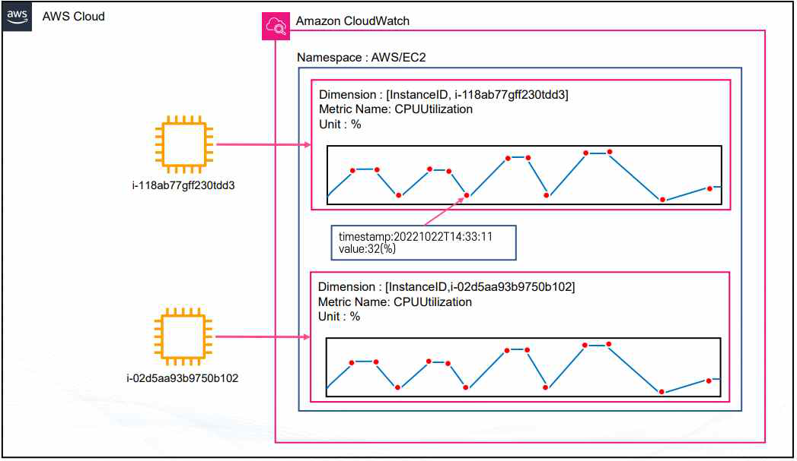
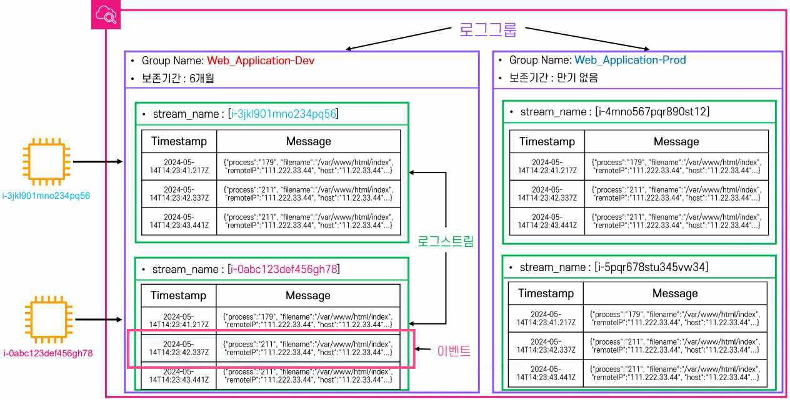
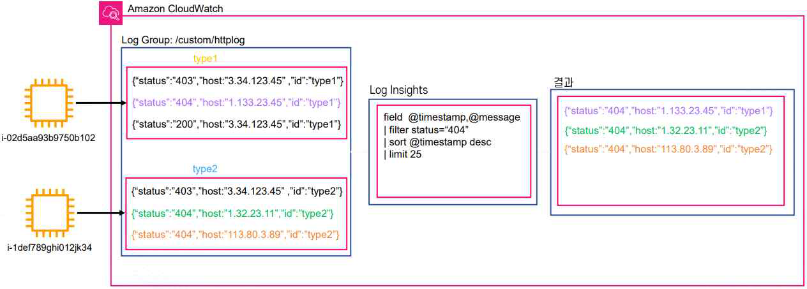
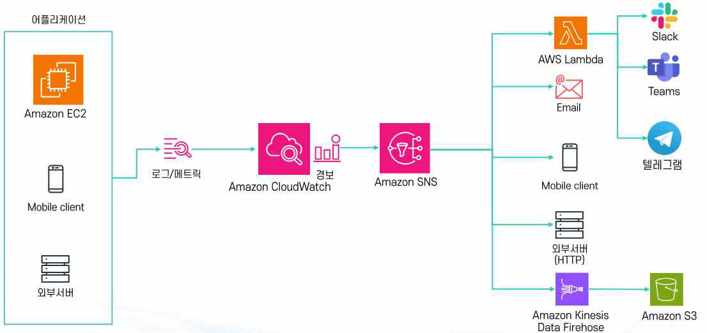

# AWS 모니터링 (CloudWatch · CloudTrail · KMS)


> 실습(EC2 커스텀 지표·404 알람 구성, CloudTrail 계정 활동 추적)은 [CloudWatch 모니터링 실습](g09-cloudwatch-monitoring.md)에서 다룬다.


## 1. Amazon CloudWatch 개요

**Amazon CloudWatch**는 AWS가 제공하는 대표적인 모니터링 서비스로, DevOps 엔지니어·개발자·SRE(사이트 안정성 엔지니어)·IT 관리자가 시스템과 애플리케이션의 성능을 확인하고 운영 상태를 안정적으로 유지하기 위해 사용한다.

- 애플리케이션 상태를 모니터링하고 시스템 전체의 성능 변화에 대응하며, 리소스 사용률을 최적화할 수 있도록 운영자에게 실행 가능한 통찰력을 제공한다.
- **Public 서비스**이므로 인터넷을 통해 접근하거나, VPC 내부에서는 Interface Endpoint로도 접근할 수 있다.
- 로그·지표·이벤트 같은 운영 데이터를 수집해 시각화·분석하고, 수집된 데이터를 기반으로 경보를 생성해 자동화된 대응을 실행할 수 있다.
- AWS 대부분의 서비스와 기본적으로 연동되기 때문에 추가 설정 없이도 활용 범위가 넓다(예: EC2의 CPU 사용률, RDS의 디스크 사용률, Lambda의 실행 속도 등).

**요금 및 프리 티어(월 단위)**

| 항목 | 프리 티어 |
|---|---|
| 기본 모니터링 지표 | 10개 |
| 대시보드 | 3개 |
| 경보 | 10개 |
| 로그 저장 | 5GB |

프리 티어를 초과하면 로그 저장량·분석량·실시간 로그 조회(Live Tail) 사용량, 지표 개수와 커스텀 지표 생성량, 경보 개수, 대시보드 사용량을 기준으로 요금이 부과된다.

**정리**: CloudWatch는 지표(Metric)·로그(Logs)·경보(Alarm)·대시보드를 하나의 서비스로 제공하는 AWS의 중앙 모니터링 허브이며, 문제를 얼마나 빨리 감지하느냐가 장애 대응의 핵심이라는 점에서 CloudWatch의 역할이 중요하다.

## 2. CloudWatch 지표 (Metric)

**지표(Metric)**는 시간 순서대로 정리된 데이터의 집합이며, 여러 개의 **데이터 포인트(Data Point)**로 구성된다. AWS 대부분의 서비스는 기본적으로 지표를 제공하며(EC2 CPU 사용률, 네트워크 트래픽, 디스크 I/O 등), 사용자가 원하는 데이터 포인트를 직접 전송하는 **커스텀 지표**도 만들 수 있다 — 예를 들어 EC2 메모리 사용량은 기본 제공 지표가 아니므로 CloudWatch Agent로 별도 수집해야 한다.

- **리전 단위 관리**, 최대 **15개월** 보관되며 이후 새 데이터가 들어오면 오래된 데이터는 자동 삭제된다(영구 보존되지 않는다).
- **네임스페이스(Namespace)**: 지표를 논리적으로 묶는 컨테이너. AWS 기본 네임스페이스 형식은 `AWS/{서비스명}`(예: `AWS/EC2`, `AWS/RDS`)이며, 커스텀 지표는 네임스페이스를 반드시 직접 지정해야 한다(디폴트 없음).
- **지표 이름(Metric Name)**: 네임스페이스 안에서 지표를 구분하는 세부 이름으로 필수 항목이다.
- **차원(Dimension)**: 지표를 구분하기 위한 Key-Value 형태의 태그. 최대 30개까지 지정 가능하며 조합도 가능하다(예: `InstanceID`로 인스턴스별 구분, `Server=prod, Domain=Seoul`처럼 여러 차원 조합).
- **단위(Unit)**: 지표 값이 어떤 의미를 가지는지 표현하는 척도. `%`(CPU·디스크 사용률), `Bytes`(네트워크·디스크 I/O), `Seconds`(지연 시간·실행 시간), `Count`(요청 수·오류 횟수) 등이 있다.

**데이터 포인트(Data Point)**

- 지표를 구성하는 시간-값 단위 데이터로, 초 단위까지 기록된다(예: `2025-10-31T23:59:59Z`). 통계·알람 활용을 위해 UTC 기준 사용을 권장한다.
- **해상도(Resolution)**: 데이터 수집 주기. 기본은 60초 단위이며, High-Resolution 모드는 1초 단위까지 수집할 수 있다. 조회는 1, 5, 10, 30초 또는 60초 배수 단위로 가능하다.
- **기간(Period)**: 집계 기준 시간 단위(얼마나 긴 구간을 묶어 보여줄지)로, 1초~86,400초(1일) 범위에서 설정할 수 있다. 60초 미만은 High-Resolution 모드 전용이다.

**보관 정책**: 작은 단위 데이터는 보관 기한 이후 자동으로 더 큰 단위로 합쳐진다.

| 수집 단위 | 세부 데이터 보관 기간 |
|---|---|
| 60초 미만 (High-Resolution) | 최대 3시간 |
| 60초 단위 | 15일 (이후 5분 단위로만 확인 가능) |
| 300초 단위 | 63일 |
| 1시간 단위 | 455일(15개월) |

> 2주 이상 업데이트가 없는 지표는 콘솔에서 자동 숨김 처리되지만, CLI로는 계속 확인할 수 있다.



**기타 기능**: 여러 지표를 동시에 그래프로 비교 분석할 수 있고, **Metric Insight**로 `SELECT AVG(CPUUtilization) FROM SCHEMA("AWS/EC2", InstanceId)`처럼 SQL 형식으로 지표를 조회할 수 있다. 일부 리전에서는 "EC2 인스턴스 중 네트워크 아웃이 가장 높은 인스턴스 보여줘" 같은 자연어 쿼리도 지원한다.

**정리**: 지표는 네임스페이스·지표 이름·차원·단위로 구성된 시계열 데이터이며, 해상도(수집 주기)와 기간(집계 단위)에 따라 보관 기간과 조회 가능 범위가 달라진다는 점이 실무에서 자주 놓치는 부분이다.

## 3. CloudWatch 로그 (Logs)

**CloudWatch Logs**는 AWS 서비스와 온프레미스 애플리케이션의 로그를 중앙에서 수집·저장·관리·조회할 수 있는 서비스다(Lambda, API Gateway 등 AWS 대부분 서비스와 기본 연동). 로그 집계·보관·실시간 모니터링·쿼리 분석이 가능하며, 로그 수명 주기(아카이빙/삭제) 관리도 지원한다.

**로그의 주요 구성요소**

| 구성요소 | 설명 |
|---|---|
| 로그 그룹(Log Group) | 로그 관리 단위. 동일한 애플리케이션/서비스별로 그룹화하며(예: `application-dev`, `lambda-function-A`), 보존 기간·접근 권한 같은 설정의 기본 단위가 된다. |
| 로그 스트림(Log Stream) | 같은 소스에서 순차적으로 수집되는 로그의 모음(예: EC2 인스턴스 단위로 수집된 웹 서버 로그). |
| 로그 이벤트(Log Event) | 실제 로그 데이터. 타임스탬프 + 메시지 형태로 기록된다(예: `2025-09-02T09:00:01Z GET /index.html 200`). |
| 보존 기간(Retention Period) | 로그 자동 삭제까지의 기간을 지정할 수 있으며, 무한정 보관 설정도 가능하다. |



**로그 클래스(Log Class)**

- **Standard(기본)**: 실시간 모니터링이 필요하거나 자주 조회되는 로그.
- **Infrequent Access**: 자주 쓰이지 않고 비용 효율적 저장만 필요한 로그. 단, Subscription Filter·Metric Filter·Insight 같은 일부 기능은 사용할 수 없다.
- 로그 그룹을 생성한 뒤에는 클래스를 변경할 수 없다.

**CloudWatch Logs Insights**: 대화형 쿼리 기반 로그 분석 서비스로, JSON 기반 로그를 쿼리할 수 있고 한 번에 최대 20개 로그 그룹을 동시에 조회할 수 있다. S3나 OpenSearch로 별도 분석 파이프라인을 구성하지 않아도 CloudWatch 안에서 바로 분석할 수 있으며, 쿼리를 저장하거나 대시보드로 시각화할 수 있다.



**Metric Filter (로그 기반 지표화)**: 로그에서 특정 패턴을 필터링해 CloudWatch 지표로 변환하는 기능이다. 정규식 및 비교식을 적용할 수 있으며, **필터가 적용된 시점부터 지표화가 시작된다**(과거 로그는 소급 적용되지 않는다).

```text
{ $.eventType = "*" && $.sourceIPAddress != 123.123.* }
```

**로그 관련 기타 기능**

- **Live Tailing**: 콘솔/CLI에서 실시간 로그 스트리밍을 확인한다.
- **이상 탐지**: ML 기반으로 로그 패턴의 이상 징후를 탐지한다.
- **Log Subscription**: 로그를 다른 서비스/계정/S3/OpenSearch로 전달한다(필터링 후 전달도 가능하며, 분석·백업·전송 용도로 활용).

**정리**: CloudWatch Log(수집/저장/조회/보관) → Log Insights(분석/시각화) → Metric Filter(로그 기반 지표 생성) → Log Subscription(외부 전달)까지, 로그 하나가 어떻게 지표·알람·외부 시스템으로 이어지는지 순서대로 이해하는 것이 핵심이다.

## 4. CloudWatch 경보 (Alarm)

**경보(Alarm)**는 수집된 지표 값이 설정한 임계치(Threshold)에 도달하거나 초과/미달할 때 이벤트를 발생시키는 기능이다.

**경보 상태 (3가지)**

| 상태 | 의미 |
|---|---|
| OK | 정상 상태 — 지표 값이 임계치 조건을 만족하지 않음 |
| ALARM | 경보 상태 — 지표 값이 설정된 조건을 초과/미달하여 알람 발생 |
| INSUFFICIENT_DATA | 경보 상태를 판단할 충분한 데이터가 없음(지표가 수집되지 않거나 부족한 경우) |

**알람 평가 주기**는 지표의 Resolution에 따라 달라진다 — 기본은 60초 단위, High Resolution 모드는 1초 단위까지 가능하며, 그 외에는 반드시 60초의 배수 단위로만 평가된다.

**대응 방법**: SNS로 알림 발송, Lambda 실행을 통한 자동 복구·조치, 이메일/슬랙/챗봇 등 외부 시스템 연동(예: 웹 서버의 500 오류 발생 횟수가 일정 수치 이상일 때 알림 전송).



**정리**: 장애 대응에서 가장 중요한 것은 얼마나 빨리 문제를 알아채느냐다 — 장애를 1분 만에 고칠 수 있어도 10시간 후에야 알게 되면 이미 피해가 커진 뒤이므로, 빠르게 고치는 것 못지않게 빠르게 감지하는 것이 중요하다. CloudWatch 알람은 자동화된 환경에서 문제 대응을 시작하는 첫 번째 트리거 역할을 한다.

## 5. 결합 경보 (Composite Alarm)

**Composite Alarm**은 여러 개의 경보를 Boolean 연산(AND, OR, NOT)으로 조합해 하나의 경보 조건을 만드는 기능이다.

- 많은 경보를 효율적으로 관리하고 전달할 수 있다.
- **Suppressor Alarm**을 설정하면 특정 조건일 때 Composite Alarm의 알림을 일시적으로 중단할 수 있다(예: 배포 중에는 관련 알람을 억제).

**활용 예시**

| 조합 조건 | 알림 대상 |
|---|---|
| (EC2 CPU 사용량 경보 AND 네트워크 사용량 경보) | 웹팀에 알림 |
| (NOT 웹서버 CPU 사용량 경보 AND RDS CPU 사용량 경보) | DB팀에 알림 |
| (500 에러 경보 OR 400 에러 경보) AND 네트워크 사용량 경보 | 사용자 피크 트래픽 알림 |

**정리**: 개별 경보를 하나씩 알림으로 보내면 사소한 지표 변동에도 알림이 폭주할 수 있다. Composite Alarm은 여러 조건을 AND/OR/NOT으로 묶어 "진짜 문제 상황"일 때만 알림이 가도록 걸러내는 역할을 한다.

## 6. AWS CloudTrail

**AWS CloudTrail**은 AWS 계정에서 누가, 언제, 어떤 작업을 했는지 기록하는 서비스다 — 쉽게 말하면 AWS 계정 활동을 기록하는 CCTV 역할을 한다(예: 누가 EC2를 종료했는지, 누가 S3 버킷을 생성/삭제했는지, 누가 IAM 사용자를 변경했는지, 누가 콘솔에 로그인했는지).

**계정 활동 기록 대상**: AWS Management Console, AWS CLI, AWS SDK, AWS 서비스 간 API 호출 — 이런 작업들이 모두 이벤트로 기록된다.

**기록되는 정보**: 누가 실행했는지, 언제 실행했는지, 어떤 작업을 했는지, 어떤 리소스에 작업했는지, 성공/실패 여부, 어떤 IP에서 요청했는지.

**활용 목적**: 보안 감사, 문제 원인 추적, 규정 준수, 비정상적인 활동 확인.

**저장**: CloudTrail의 Event history에서는 최근 **90일**의 관리 이벤트를 조회할 수 있다. Trail을 만들면 이벤트 로그를 S3에 저장해 장기간 보관할 수 있고, CloudWatch Logs와 연동하면 로그를 모니터링하고 경보를 설정할 수 있다.

**활용 예시**

- EC2가 갑자기 삭제된 경우 — CloudTrail에서 누가 `TerminateInstances` 작업을 실행했는지 확인
- S3 버킷 설정이 변경된 경우 — CloudTrail에서 누가 설정을 변경했는지 확인

**정리**: CloudTrail은 "무엇이 잘못됐는가"보다 "누가, 언제, 무엇을 했는가"를 추적하는 서비스다 — CloudWatch가 시스템 상태(성능·에러율)를 보는 도구라면, CloudTrail은 계정 활동(누가 어떤 API를 호출했는지)을 보는 도구라는 차이를 구분해서 이해해야 한다.

## 7. CloudTrail Trail과 Event 종류

**Trail**은 CloudTrail 이벤트를 계속 수집해서 저장하도록 만드는 설정이다.

- **CloudTrail** = AWS 활동을 기록하는 서비스 자체
- **Trail** = 기록한 로그를 어디에 저장하고 관리할지 정하는 설정

Trail을 생성하면 로그를 S3에 장기 저장할 수 있다. 동작 구조는 "AWS 활동 발생 → CloudTrail Event 생성 → Trail이 이벤트 수집 → S3 버킷에 저장" 순서다.

- **단일 리전 Trail**: 특정 리전에서 발생한 이벤트만 기록한다.
- **다중 리전 Trail**: 여러 리전에서 발생한 이벤트를 한 곳에 수집한다 — 일반적으로 다중 리전 Trail을 많이 사용한다.

**다른 서비스와의 연동**

| 서비스 | 역할 |
|---|---|
| CloudWatch Logs | CloudTrail 이벤트를 CloudWatch Logs로 전달해 로그 검색·모니터링 |
| Metric Filter | 특정 이벤트를 찾아 숫자 형태의 지표로 변환 |
| CloudWatch Alarm | 특정 이벤트가 발생하면 경보 발생 |
| EventBridge | 특정 AWS 이벤트가 발생하면 자동 작업 실행 (예: EC2 종료 → CloudTrail 기록 → EventBridge 감지 → Lambda 실행) |

**CloudTrail Event**는 AWS에서 발생한 하나의 작업 기록으로, JSON 형식으로 기록된다(예: `eventName: TerminateInstances`, `userIdentity`, `eventTime`, `sourceIPAddress`). CloudTrail Event는 크게 3가지로 구분된다.

| 종류 | 설명 | 예시 | 특징 |
|---|---|---|---|
| **Management Event** | AWS 리소스를 생성·변경·삭제·관리하는 작업 기록 (AWS 인프라를 관리한 기록) | EC2 시작/중지/삭제, VPC 생성/삭제, IAM Role 생성/삭제, 보안 그룹 변경, Trail 생성/삭제 | 누가 리소스를 만들었는지/설정을 변경했는지/삭제했는지 확인하는 용도 |
| **Data Event** | 리소스 안에 있는 데이터에 접근하거나 작업한 기록 (리소스 내부 데이터 사용 기록) | S3 객체 다운로드(`GetObject`)/업로드(`PutObject`)/삭제(`DeleteObject`), Lambda 함수 호출, DynamoDB 데이터 접근 | Management Event보다 훨씬 많은 로그가 발생할 수 있어 기본적으로 별도 설정이 필요하고, 추가 비용이 발생할 수 있음 |
| **Insight Event** | 평소와 다른 비정상적인 API 활동 패턴 탐지 (이상 행동을 찾아주는 기능) | 짧은 시간에 API 호출 급증, 평소보다 삭제 작업 급증, 실패/거부 API 요청 급증 | 별도 활성화가 필요하고, 추가 비용이 발생할 수 있음 |

**정리**: Management Event는 "인프라를 다뤘는가", Data Event는 "데이터 자체를 다뤘는가", Insight Event는 "평소와 다른 패턴인가"를 기록한다는 차이로 구분하면 세 종류를 헷갈리지 않는다.

## 8. AWS KMS (Key Management Service)

**AWS KMS**는 AWS에서 사용하는 암호화 키를 생성하고 관리하는 서비스다. AWS 서비스의 데이터를 암호화할 때 사용하는 키를 중앙에서 관리할 수 있으며, 대표적으로 다음 서비스와 연동해서 사용한다.

- Amazon EBS 볼륨 암호화
- Amazon S3 객체 암호화
- Amazon RDS 데이터 암호화
- Amazon EFS 파일 암호화

KMS를 사용하면 사용자가 암호화 키 파일을 직접 서버에 저장하지 않고도 AWS가 안전하게 관리해준다. KMS에서 생성하는 키를 **KMS Key**라고 하며, 실제 데이터를 암호화하거나 데이터 키를 보호하는 데 사용된다.

실제 KMS 키 ID는 `1234abcd-12ab-34cd-56ef-1234567890ab`처럼 기억하기 어려운 형태이므로, 보통 `my-app-key`, `rds-key`, `s3-encryption-key`처럼 사람이 알아보기 쉬운 **별칭(Alias)**을 붙여서 사용한다.

**정리**: KMS는 모니터링 서비스는 아니지만, CloudWatch·CloudTrail로 수집·기록되는 로그와 데이터 자체가 안전하게 암호화되어 저장되도록 뒷받침하는 보안 인프라라는 점에서 함께 알아두는 것이 실무에 도움이 된다.
